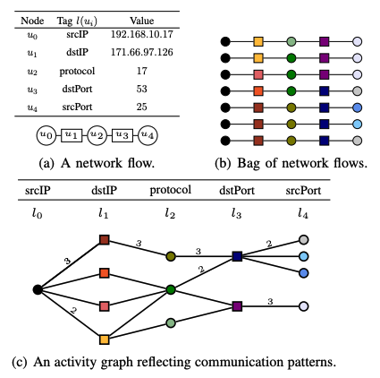
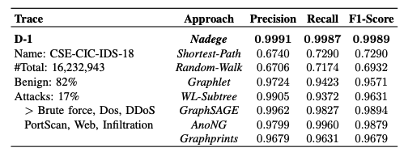
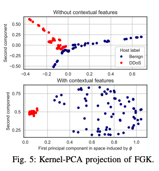

## [Nadege: When Graph Kernels meet Network Anomaly Detection](https://ieeexplore.ieee.org/document/9796978)

* Hicham Lesfari, Fre ́de ́ric Giroire, Hicham Lesfari, Fre ́de ́ric Giroire Universite ́ Coˆte d’Azur, CNRS, Inria, France

* INFOCOM 2022

* Code not provided

### Motivation and Problem Formulation

* What is the high-level problem?
  * Anomaly detection in the graph-based network, by monitoring the traffic

* What are the challenges?
  * Low-rate attacks vs. high-rate attacks (traffic volume)
    * Traditional methods consider statistical variations are convenient for **high-rate attacks**
    * **Low-rate attacks**, e.g., link-flooding, are not visible in a large network

  * Correlation between hosts
    * Volume-based techniques are inadequate for detecting correlations in communications between hosts, and cross-host anomalous activities

  * Context-aware anomaly detection
    * Whether a network flow is triggered with or without other anomalous flows

* Previous works
  * Graph kernels, mostly belong to (i) the R-convolutional frameworks, or (ii) geometric approaches
    * **Cons:** base kernels are not guaranteed to be positive semi-definite
  * Graph-based anomaly detection
    * Two branches: graph similarity measures, machine learning
    * AnoNG (2019): Combine shortest-path graph kernel with DNN
      * **Cons:** Shortest-paths only capture local patterns, no global context; computation complex
    * Graphprints (2016): Graph-mining techniques
      * **Cons:** Only build single-host graphs

### Method

* What they propose to solve the problem?

  * The first to formulate a graph kernel (network fingerprint) based on network flows

    * Use activity graph
    * The fingerprint is generated by a random walk from a source node
    * Capture temporal patterns, and local + global patterns

    

  * Develop an approximate version of computing contextual fingerprint with speedup

  * Anomaly detection can be done after (i) formulating a graph kernel, (ii) use SVM as learning model for anomaly detection

### Evaluations

* Datasets: 6 network traces
* Baselines:
  * **Graph kernel-based methods:** Shortest-Path kernel, Random Walk kernel, Graphlet kernel, WEisfeiler-Lehman subtree kernel
  * **Representative inductive learning-based method:** GraphSAGE
  * **Anomaly-based methods:** AnoNG, Graphprints

* Metric: true positives, true negatives, false positives and false negatives
* Results
  * Nadege outperforms the baselines on all 6 datasets
    
  * Parameter sensitivity analysis
  * Kernel-PCA projection: with contextual features, the normal flows and anomalies are more separable in the feature space
    

### Pros and Cons (Your thoughts)

* Pros:
  * Very nice writing in the related works
  * The idea of formulating a fingerprint for graphs is interesting
* Cons:
  * Some questions remain, e.g., centralized detection vs. distributed detection
  * The proposed method is based on collecting network traces, which might not be responsive?
  * The execution time performance is not evaluated
* Something I learned from the paper:
  * GNNs are less expressive than the k-Weisfeiler-Lehman isomorphism tests hierarchy
  * **SVM is the state-of-the-art kernel method**, which finds an optimal separating hyperplane specified by a subset of the training data points, known as support vectors