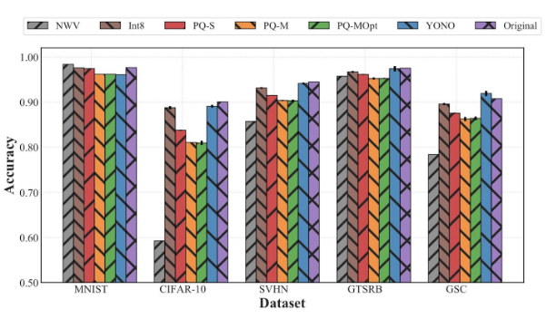
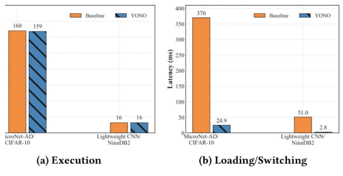

## [YONO: Modeling Multiple Heterogeneous Neural Networks on Microcontrollers](https://arxiv.org/abs/2203.03794)

* Young D. Kwon, Jagmohan Chauhan, Cecilia Mascolo
* Cornell University
* IPSN 2022
* Code Not Provided

### Motivation and Problem Formulation
* **Motivation**
    * Existing federated learning systems only work on local data from a single modality, which limits the scalability of the systems.
    * This paper proposed a multimodal and semi-supervised federated learning framework that trains autoencoders to extract shared or correlated representations from different local data modalities on clients.
* **Related works**
    * The common techniques is to compress individual models separately using pruning and quantization, but the model compression techniques are limited and since models are trained independently, they cannot benefit from potential knowledge transfer between different tasks. 
    * Another researcher proposed multi-task learning based approaches to achieve robustness of multiple tasks but compressing multiple heterogeneous networks has not been fully examined. 
    * Prior works also attempts to solve this problem by sharing weights of multiple models via virtualization but this method is so complex and the compression ratio is constrained., which limit the type of IoT devices on which it can operate.
* **Key Challenge:**
    * Multiple dissimilar tasks that are based on different forms of data need to co-exist in the same framework. However conventional multi-task learning approaches cannot address multiple heterogeneous networks effectively.
    * IoT devices based on microcontroller units are extremely resource-constrained. Only limited memory can be used.
    * Due to the limit of overhead and on-chip memory space, some models have to reside in external storage devices that would increase the overall latency, exacerbate the usability and responsiveness of the system.
* **Key Assumption:**
    * We need a method that can maximize the compression rate but at the same time minimize external disk accesses.

### Method
* **Proposed solution to aforementioned challenges**
    * YONO, a product quantization based approach that compresses multiple heterogeneous models and enables in-memory model execution and model switching for dissimilar multi-task learning on MCUs.
* **Why this works?**
    * They apply PQ to one or multiple neural networks while only sharing a pair of the learned codebooks to maximize the compression ratio. Through making the number of layers to be finetuned be less or equal to three in most cases, they retain the accuracy of its compressed model.
* **Solution**
    
    * They apply PQ to one or multiple neural networks while only sharing a pair of the learned codebooks to maximize the compression ratio.
    * They first concatenate weights of all the models of different tasks. Then, they construct two weight matrices, W1 and W2, so that YONO takes into account spatial information of convolutional layer kernel. For W1, they combine convolutional layers with a kernel size of 3x3. Then for W2, they concatenate convolutional layers with kernel size 1x1 and fully connected layers. After that, W1 and W2 will be given as an input to learn codebooks, C1 and C2, for different kernel sizes.
    * In terms of their code, in the fine tuning stage, they select the first and last layer of a model and finetune them. The finetuning step largely recovers the accuracy of the original model by re-adjusting the first and last layer of the model according to the different weights induced by the codebooks. 
    * However, a simple extension of PQ cannot ensure high accuracy due to the increased weight differences between original models’ weight matrices and reconstructed models’ weight matrices. So they introduce an optimization process to improve the performance of the decompressed models. As shown after the eighth line. They iteratively adjust the weights drifts by reassigning indices on the updated weights from finetuing as E-step and by finetuning several selected layers as M-step. They do not update codewords in their learned codebooks since they want their codebooks to be generalizable to compress unseen models and dataset during the codebook learning procedure.
    * In summary, through the optimization, YONO identifies a layer with the highest weight difference per parameter. After than, YONO finetunes the identified layer using the network optimization process until the reconstructed model’s accuracy is recovered to the target accuracy.

### Evaluations

* **Evaluation Setup**
    * Dataset: They generally choose 4 types of datasets to apply or train with their algorithm which are Image, Audio, IMU and sEMG.
    They check the compression efficiency of the heterogeneous MTL systems trained with five datasets of two types.
    
    * The second figure check the inference accuracy of the heterogeneous MTL systems trained with five datasets pf two types.
    
    * The third figure shows compared to the baseline, YONO has much lower latency.
    

### Pros and Cons
* Pros:
    * They provide sufficient data and test to support their argument. Ex, they show compression efficiency under five datasets of two types and seven datasets of four types, respectively. Which I thik make it more convincible.
    * PQ, product quantization is not the idea they first propose, but they well combine the advantage of PQ with their ideas and algorithms.
* Cons:
    * They did not give enough information to introduce the technique they use
