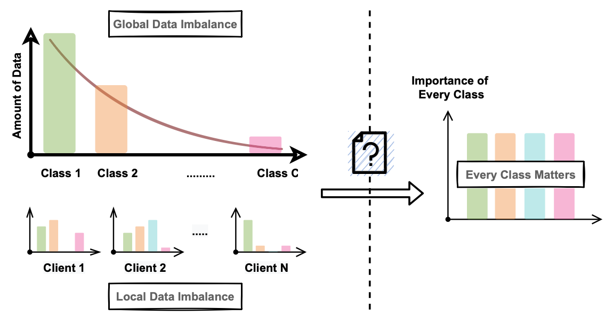
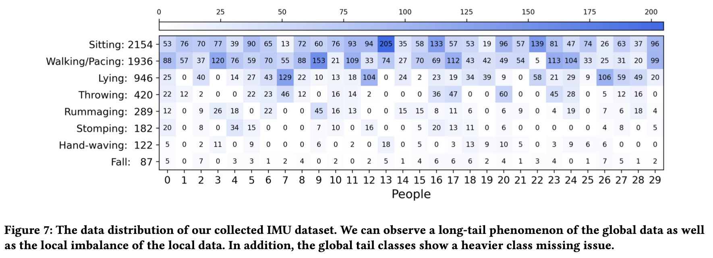

## [BalanceFL: Addressing Class Imbalance in Long-Tail Federated Learning](https://conferences.computer.org/cpsiot/pdfs/IPSN2022-6R1M30NXCSXmbVKUqzz1Of/962400a259/962400a259.pdf)

* Xian Shuai, Yulin Shen, Siyang Jiang, Zhihe Zhao, Zhenyu Yan, Guoliang Xing
* The Chinese University of Hong Kong
* IPSN 2022
* Link to code: https://github.com/sxontheway/BalanceFL

### Motivation and Problem Formulation

* **Motivation:** the *global and local data imbalance* in Federated Learning. 

  

  * If training directly, there could be performance drop of classification accuracy on minority tail classes. However, those minority classes play a much more important role especially in safety-relate scenarios.
  * Two separate cases for local data imbalance: **class missing and imbalance local class distribution**

* **Previous works**
  * Centralized training: add a compensation term to either the loss or the prediction results for the tail classes, based on the training data distribution. But in FL, the global data distribuiton is unobservable.
  * Recent works in FL: either require uploading the number of local samples per class to server, or relying on a global validation dataset, both violating privacy in FL
  * A most related area is **personalized FL**, which considers the personalized data distribution on clients. However, these approaches do not consider the global data imbalance or the distribution mismatch between the local training and testing data

* **Key Challenge:** balance training without access to local data (distribution)

* **Key Assumption:** they mainly focus on addressing the global class imbalance issue when the number of clients is relatively small and each client can participate in the training for multiple times. Among the two settings of cross-device vs. cross-silo, this paper focuses on the *cross-silo* scenarios.

### Method

* Case study: **catastrophic forgetting** under missing classes. After local training, the classfication on local missing classes drop to near zero -> local knowledge about the missing class is forgotten

* What they propose to solve the problem?
  * To address **missing class**, they propose **knowledge inheritance**: add a knowledge distillation loss for absent classes on client to prevent catastrophic changes to the model weights
  
  * To address local imbalanced class, they propose balanced sampling, feature-level data augmentation, smooth regularization
    * **Balanced sampling** increases the probability of data from tail classes to be chosen to equilibrate the response of all classes during training
    * **Feature-level data augmentation** implicitly enriches the diversity of classes with a small number of samples to avoid the over-fitting due to over sampling
    * **Smooth regularization** penalizes the over-confident predictions for better balancing and representation learning
  
  * The overall loss function includes three terms: the knowledge inheritance loss, the cross entropy loss and the smooth regularization loss
  
    

### Evaluations

* **Only simulation:** they implement BalanceFL on a cloud server equipped with 32 virtual CPU cores and 4 NVIDIA TiTAN Xp GPUs. They use multiprocessing to simulate the multiple nodes in federated learning. The code is written in PyTorch.

* How they evaluate their method?
  * Dataset: Long-tail version of CIFAR-10 and Speech commands, self-collected IMU datasets of 6137 training ssamples from 30 people.
  
    
  
  * Baselines: FedAvg, FedProx, Centralized Training, BAlanced Softmax, Local Training, Personalized-FedAvg
  
  * Metrics: Accuracy, communication and compute overhead
  
  * **Imbalance ratio:** they use this metric to evaluate how imbalance the dataset is.  We can define the global imbalance ratio as the quotient between the total sample number of the majority class across all nodes and that of the minority class
  
* What are the key results?
  * On CIFAR10-LT, their approach improves the absolute accuracy over all classes of FedAvg from 37.2% to 58.3%.
  * The accuracy over all classes compared to FedAvg is up to 39.5% and 18.5% on Speech Commands-LT and self-collected IMU respectively.

### Pros and Cons (Your thoughts)

* Pros: why you think this is a good paper?
  * Good writing and nice motivation discussion
* Cons:
  * **Weak theoretical support:** nothing more than stating the assumptions and math definitions
  * Did not use the standard LEAF datasets which is typically imbalanced
  * **Concerns regarding feature-level augmentation:** to augment tail classes, they add perturbation to features in latent space. However, no one knows whether this Gaussian perturbation is a reasonable way to add noises (out-of-distribution data). In other words, it is possible that these perturbed features do not match with any real samples...
  * **Privacy violation:** why BalanceFL do not require sending local number of samples to the cloud, nor having a global validation dataset, it requires the node to share which classes they have been observed and which they have not. Though very weak, they still violate the privacy requirements of FL.

### Takeaways

* **Typical methods to address class imbalance in machine learning**
  * Re-sampling (over-sampling the minority classes or under-sampling the majority classes)
  * Loss re-weighting
  * Knowledge transfer from head to tail classes
* **A typical way of doing research:** when you solve a big problem, you can first separate the new scenarios into different cases (for example, the class missing and imbalance local class in this paper), and address each case separately