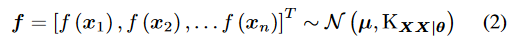
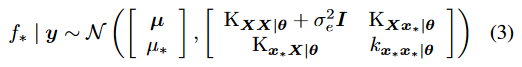
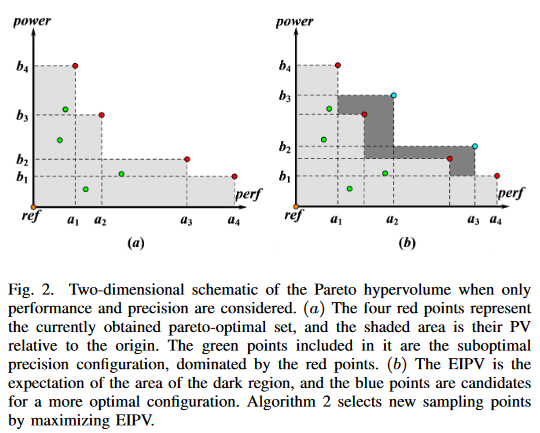
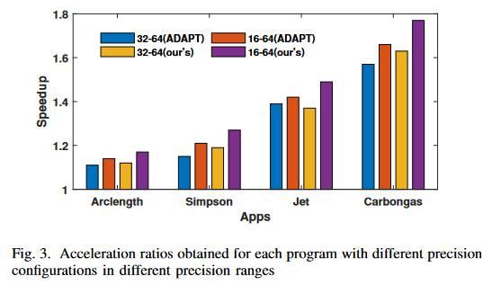
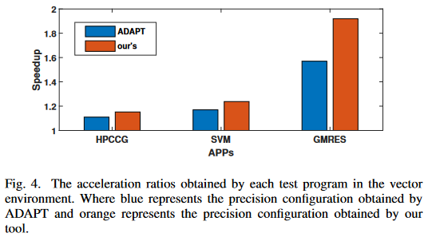

## [Multi-objective optimization for Floating Point Mix-Precision Tuning](https://madsys.cs.tsinghua.edu.cn/publications/ISLPED2023-li.pdf)

* Zeqing Li (Tsinghua University), Yongwei Wu (Tsinghua University), Youhui Zhang (Tsinghua University)

* ISLPED 2023

* No code available

### Motivation and Problem Formulation

* **Problem**:
   * Mantissa length reduction as optimization target BUT missing using performance and power consumption for mixed precision programs on the hardware platforms.
* **Importance**:
   * Higher floating point precision → improve output accuracy BUT increases program runtime, energy consumption, and memory access pressure.
* **Challenges**:
   * Point mentioned before → How to find the correct balance between accuracy, runtime, energy and memory access?
   * Mixed precision codes require deep understanding of the numerical behavior of the algorithm.
* **Major Contributions**: 
   * Method to model accuracy, performance and power consumption.
   * Sampling on the hardware platform with AD (Automatic Diferentiation) and GP (Gaussian Process).
   * Multi-objective Bayesian optimization algorithm to explore the search space → optimal precision configuration with precision threshold.
* **Previous Works**:
   * Analyze floating-point codes to find unstable numerical computation.
      * Give tight bounds on the rounding error based on Taylor expansions → Only use the number of variable bits as feedback for the optimization.
      * Examples: Precimonius, Nhut (variables), **ADAPT** (analyzes variable precision with automatic differentiation).
   * **MISSING**: Modeling the performance power consumption by taking into account the hardware + Not considered the additional overhead at the hardware level.
* **Assumptions**:
   * Only consider the mantissa for optimization (like previous papers).
   * Incorporate domain knowledge and manually prune the sampling space (initial dataset).
   * Output error is linear (as the difference between the input and actual values increases, the error increases).

### Method:

* Sample the precision space using active learning and domain knowledge.
* Tested on real hardware or simulator to obtain power consumption and performance → dataset.
* Model accuracy with AD (Automatic Differentiation)  and performance with GP (Gaussian Process).
* Apply Multi-objective Bayesian Optimization algorithm to search for better precision vectors → add those to datasets.
* After several iterations → find Pareto Efficient Set → optimal precision configuration.

* Sections:
   * Sampling:
      * Specify original sampling points
      * Apply TED algorithm (looks for neighboring points and construct distance matrix and maximizes this for representative points)
   * Error model:
      * Error model is approximate using first-order Taylor series.
      * Following $\bigtriangleup y \approx \left | f'(a)^{T}\overline{\bigtriangleup x} \right |$ shows how difference between error output and input is linear.
   * Performance/Power Models:
      * Gaussian Process models, which provides a prior over a value function as shown in the formula: $f(x) \sim GP(\mu, k_{\theta })$ where $\mu$ = mean value and $k$ is a kernel function (specifically an ARD Matern 5/2 kernel).
      * Using prior, able to construct Gaussian distribution of the functions as ahown in the following formula:
        
        
        
      * You are able to find f* for new x* → able to get y*

        

   * Multi-objective optimization:
      * Trying to find the Pareto hypervolume → Transform the problem from optimizing 3 objectives to maximizing super volume.
      * Larger PV = Better configuration.
      * Bayesian optimization to get this maximization.

      
 
### Evaluations

* Datasets: 7 different programs seen in graphs
* Baselines: ADAPT
* Metrics: Speedup (Compared to full-precision version)
* Takeaways:
  
     

   * Better precision configuration in the vast majority of cases. With 2% better speedup ration than ADAPT on scalar programs.
   * Average speedup ratio of 42.5% when precision options expanded.

   
   
   * In vector environments: Better performance improvement and power reduction but worse convergence speed.

### Pros and Cons

* Pros:
   * Well written and nice speedups.
* Cons:
   * Decrease in number of bits of variables not necessarily equate to faster speed.
      * Compiler can implicitly add data type conversions which causes overhead.
   * Not fully automated → still needs human knowledge, manual pruning in the dataset and vectorization in the apps.
   * Only show results for simulator (state better performance overall on hardware), but no graphs in hardware.
   * Search overhead due to sampling time → domain knowledge is important to decrease the time it takes to get a good dataset.
