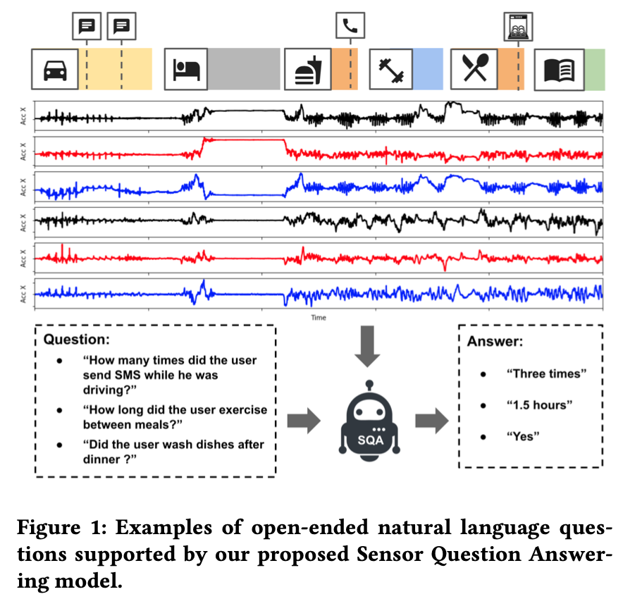
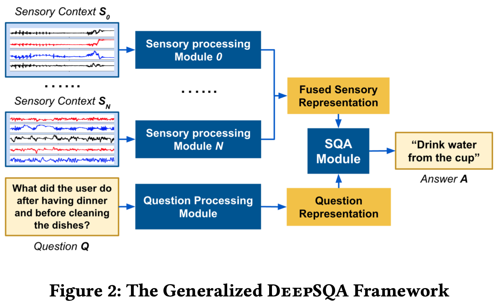
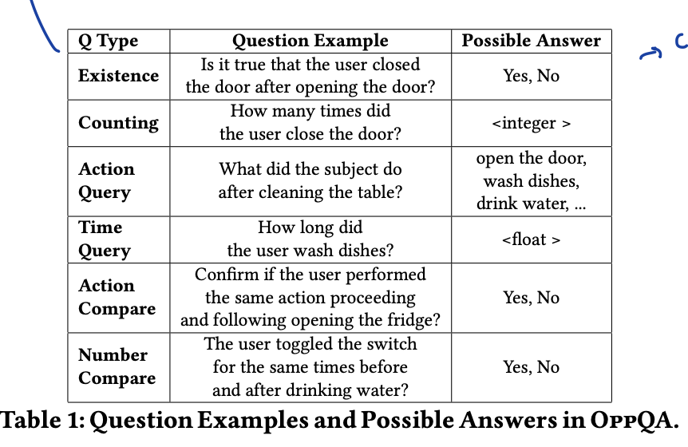
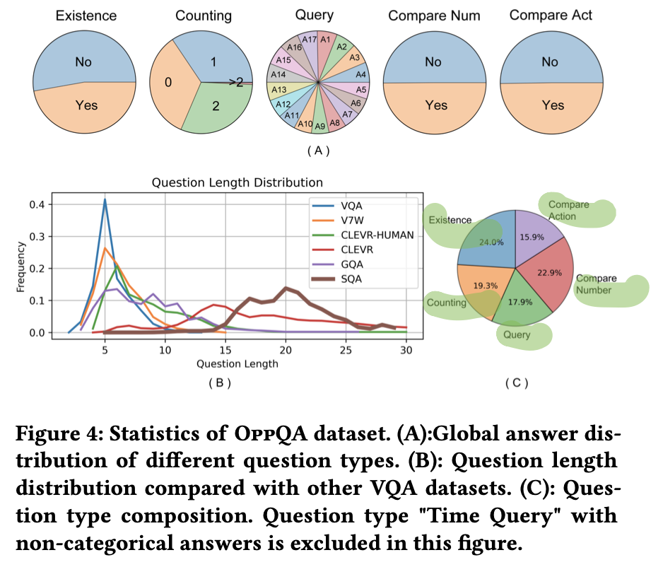
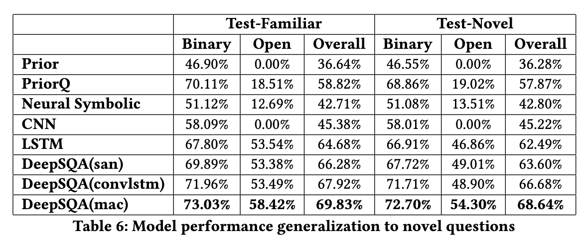

## [DeepSQA: Understanding Sensor Data via Question Answering](https://dl.acm.org/doi/10.1145/3450268.3453529)

* Tianwei Xing, Luis Garcia, Federico Cerutti, Lance Kaplan, Alun Preece, Mani Srivastava
* IoTDI'21
* https://github.com/NESL/DeepSQA

### Motivation and Problem Formulation

* What is the high-level problem?
  * Sensor Question Answering (SQA)
  * Answering natural language questions about raw sensory data

* Why is it important?
  * The users can extract a variety of inferences from sensory data, by asking arbitrary questions (but they did not achieve)

* What are the challenges?
  * Human cannot interpret raw time series sensory data

* What is missing from previous works?
  * Existing ML for sensory data focus on fixed predefined tasks
  * Most QA works focus on static data rather than time series, and it is unclear whether they work on hard-to-interpret multimodal sensors
  * Semantic parsing is another approach for QA, which maps a natural-language sentence into a logical form. However, the authors claim that it is impossible to define such an informative semantic space for opaque sensor data

* What are the key assumptions?
  * Time series sensory data

### Method

* **DeepSQA**: the general framework for SQA, with 3 key features
  * Process multimodal time series sensory data
  * Analyze the question (NLP)
  * Spatial-temporal reasoning on the data

* **SQA-GEN**: SQA dataset generation tool
  * Motivation: cannot use human answers
  * Scene representation: extract activity type, duration and start time
  * 6 question families, balanced sampling

* **OPPQA dataset** from human activity recognition datasets
  * Evaluate DeepSQA across several SOTA QA models on OPPQA. 
  * Code is open-source

### Evaluations

* **Metric:** Formulate the SQA tasks as a multi-class classification problem, using the top 27 answers as the classification labels
* **Dataset:** the generated OPPQA dataset
* **Baselines:** 
  * using only question
  * using only sensory data
  * Neural-Symbolic: use hard-coded logic rules to analyze classification results

* **SOTA methods:**
  * DeepSQA-ConvLSTM: use elementwise multiplication to fuse the question and sensory representation
  * DeepSQA-SA: use Stack Attention to fuse
  * DeeqSQA-CA: use Compositional Attention for multi-step reasoning over the sensory and question data

* **Main results:** DeepSQA-CA work the best
* Performance under various question complexity, controlled by question length, number of query operations
* Performance under various sliding window length
* Generalization to new questions
  * Training set covers 80% of sensory contexts, 50% of all the unique question queries
  * Testing set contains the rest 20% of the sensory contexts, all the unique question queries

### Pros and Cons (Your thoughts)

* Pros: why you think this paper could get in?
  * First paper attempting Sensor QA
* Cons:
  * The formulation of classification problem makes DeepSQA a multi-task learning problem, thus is largely limited
  * Questions are limited (limited format)
  * While they claim SQA should be able to handle arbitrary questions, and do spatial-temporal reasoning on sensory data, they did not achieve this
  * The exp of generalization to new questions is suspicious - generalization means training on one distribution, but testing on another. However, in their experiments, the training and testing distributions are the same. It is only that some queries do not appear in the training set. In this way, the testing performance should not be bad as the underlying distribution is the same. One should experiment on new questions families.
  * Why one needs the baselines of only using sensory data and only using question?