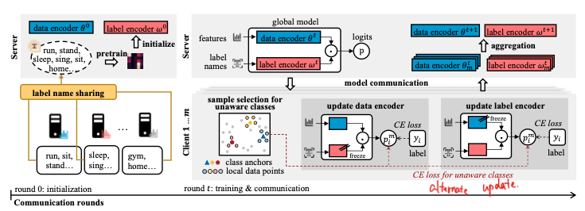
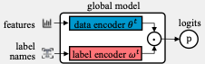
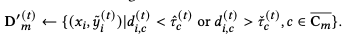
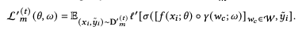
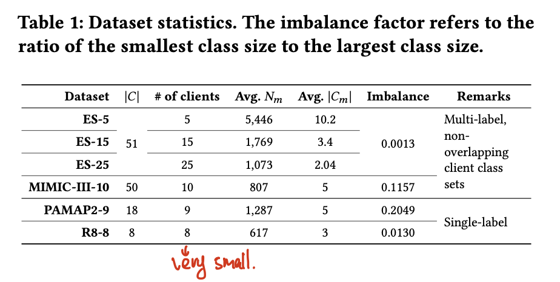
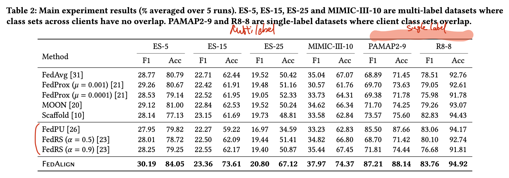
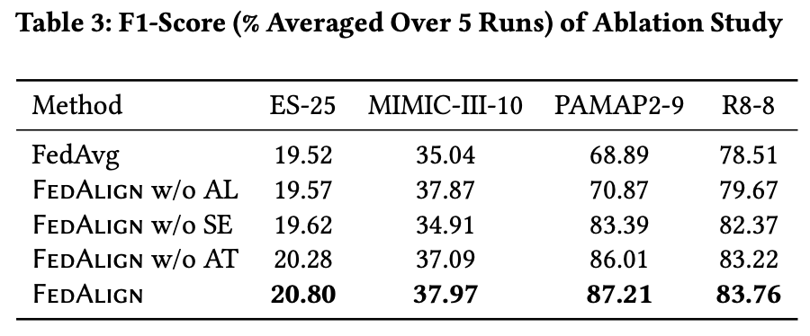

## [Navigating Alignment for Non-identical Client Class Sets: A Label Name-Anchored Federated Learning Framework](Navigating Alignment for Non-identical Client Class Sets: A Label Name-Anchored Federated Learning Framework)

* Jiayun Zhang, Xiyuan Zhang, Xinyang Zhang, Dezhi Hong, Rajesh Gupta, Jingbo Shang, UCSD

* KDD 2023

* https://github.com/jiayunz/FedAlign

### Motivation and Problem Formulation

* What is the high-level problem?
  * **Non-identical client class sets** in FL
    * *Locally-unaware classes:* not covered on the local client

  * Formulate the problem as multi-label classification, where partial label exists

* What are the challenges?
  * Local encoders at different clients may operate in different and even independent latent spaces

* What is missing from previous works?
  * Previous works with similar problem formulation exist:
    * FedRS [KDD 2021]: each client owns data from certain classes
    * FedPU [ICML 2022]: client label a small portion of their datasets, and there exist unlabeled data from both positive and negative classes
    * Both works only consider single-label classification

* What are the key assumptions?
  * Label name sharing
  * Fixed local data and label set

### Method

* FL problem formulation
  * Single-label vs. multi-label classification

* FedAlign
  
  
  * Data encoder and label encoder, alternate training

  * Label Name-Anchored Matching
    * Dot product between label and data embeddings
      
    
  * Anchor-Guided Alignment for Locally-Unaware Classes
    * Re-sample a subset of local dataset, featuring similar and dissimilar samples to the locally unaware classes (similar to coreset selection)
      
    
      
    
    * Add a regularization term using the local dataset
    
    * The idea is also similar to boosting
    
  * A piece of theoretical proof, showing the effect of alignment

### Evaluations

* Datasets: 
  * ExtraSensory: context prediction in HAR
  * MIMIC: Medical Core Prediction
  * PAMAP2: HAR
  * R8-8: Text classification
    
* Baselines
  * Non-IID FL: FedAvg, FedProx, MOON, Scaffold
  * Missing classes: FedRS, FedPU
* NN model: data encoder - Transformer, label encoder - single hidden layer NN
* Metrics: accuracy, F1-score
* Major results: FedAlign outperforms all baselines
  
* Ablation study: All components of alignment for locally-unaware classes (AL), semantic label name sharing (SE), and alternate training (AT) contribute
  * AT contributes the least
    

* Sensitivity analyses, t-SNE visualization, confusion matrix

### Pros and Cons (Your thoughts)

* Pros and Cons (Your thoughts)
  * Pros: why you think this paper could get in?
    * Easy to read
    * Ideas are straightforward
    * Missing classes is an important issue in Federated Lifelong Learning -> could be the base for a potential design on Fed LL
  * Cons: 
    * Too few clients - considering missing classes and multi-label classification, the problem will become much more challenging under more clients, and more sparse dataset
    * It is not clear whether the gain comes from enabling multi-label classification, or from semantic label matching… The techniques change both the formulation and the source of “supervision”