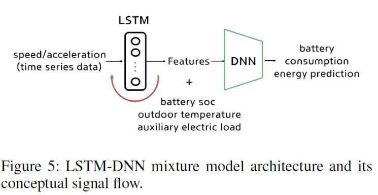
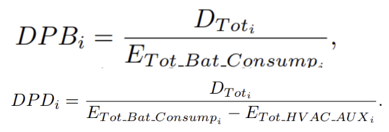
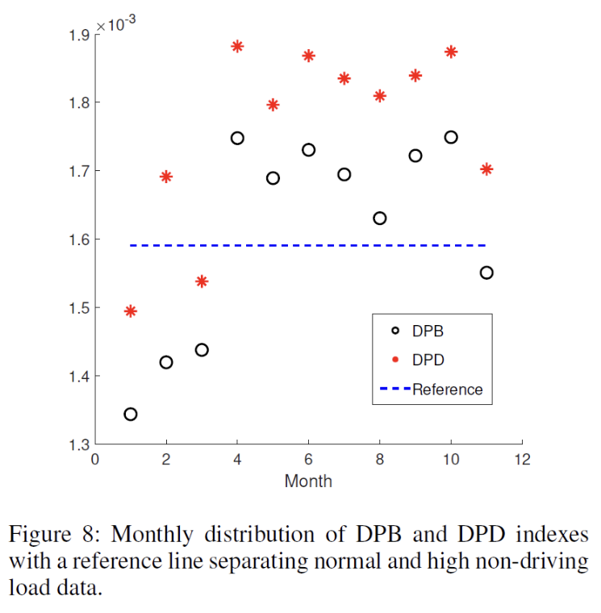
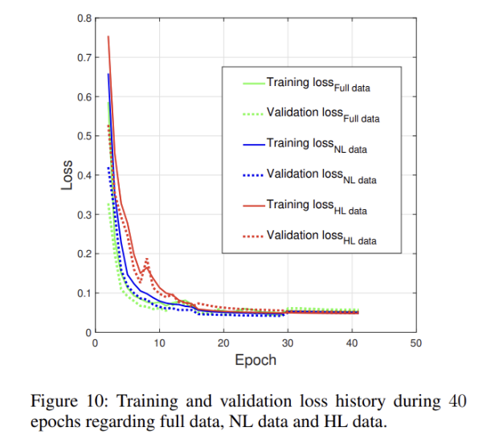
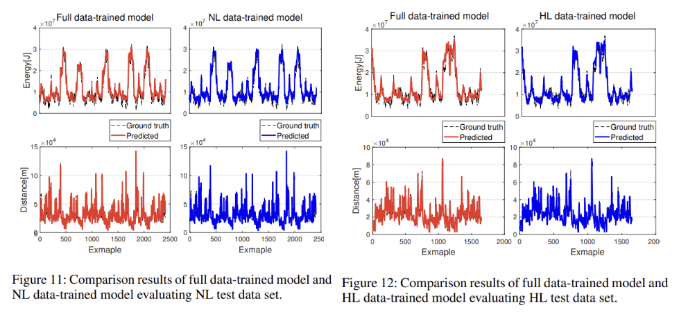

## [A Machine Learning Method for EV Range Prediction with Updates on Route Information and Traffic Conditions](https://ojs.aaai.org/index.php/AAAI/article/view/21525)

* Dohee Kim, Hong Gi Shim, Jeong Soo Eo
* Automotive R&D Division, Hyundai Motor Group
* AAAI 2022
* Code Not Provided

### Motivation and Problem Formulation
* **Motivation**
    * Current driving range prediction models are physics-based. They only consider car itself but ignore factors of weather, road condition, temperature and navigator
* **Previous Works**
    * The method of (Sun et al. 2019) was validated by small numbers of sample data with only one-day length
    * The method of (Zhao et al. 2020) shows a series of 10-sec preview range predictions, with somewhat a short prediction window to indicate the entire performance validation
    * What is missing: they don't take the outside factor into consideration
* **Challenges**
    * Coordinate the complex dynamic states to make more accurate predictions
### Method
* **Proposed solution to aforementioned challenges**
    * They propose an energy balance relation between vehicle-related signals and battery charging/discharging measurements.
* **Solution**
    * Usual model to estimate the energy prediction for a car
        * The energy relation is realized by a big databased ML model. Its input signals contain driving-related signals such as speed, acceleration and non-driving-related signals like battery state of charge, outdoor temperature, and auxiliary electric load, to generate battery consumption energy through the ML model. 
        * The trained ML model plays a role as a prediction model that can yield battery consumption, energy prediction once the input sets with the same structure are given.
        
        
    * The team optimizes the prediction model with integrating the navigation platform
        * The input consists of the preview dynamics information to be received by communication with the navigation platform and the battery related vehicle states measured in real time, and the output is the battery consumption energy.
        * The ML model of Fig. 4 trains the energy relation by using one-year data set. The dataset that was collected by driving Hyundai Kona EV during about 1000 hours, about 160, 000 km.
        
    * The input data for the ML model is the preview dynamics information given from the current location to a destination and the vehicle states. In terms of speed and acceleration data, the information connected by order and continuity is quite critical since the speed and acceleration are all time-related.
        * Therefore, they configure the ML model to a recurrent neural network (RNN), which can obtain feedback of the previous value within the loop while considering order and flow.
        * Although RNN has the advantage like consecutively predict a relation of neighboring data, it is unstable to exploit long-term dependency that can retain characteristics of nonadjacent data. Therefore, a LSTM (Long short-term memory) network can be used to effectively predict the battery consumption energy as capturing long-term dynamics given by the speed and acceleration data to an endpoint. That’s what they are trying to show in figure 5.
        
    * The LSTM network is trained by the time-series profiles containing the speed and acceleration data to a destination. Then, with outdoor temperature and auxiliary electric load, the output features of the LSTM network make another input set for a deep neural network to predict the battery consumption energy.
        * They design the input data structures to be in a window size of 40 min so that the features of the speed and acceleration profiles are extracted effectively, and the input window has a shifting size of 3min to represent a proper correlation between the adjacent data windows, as shown in Fig. 6.
        * The input structure for the DNN has three inputs with the same shifting size. The outputs of the LSTM network, which are linked to the DNN, are determined by a number of neurons for the LSTM network, designed as 72. The final output will be the battery consumption energy computed in the same window size, which has the same shifting size as the input one.
### Evaluations
* **Evaluation Setup**
    * Dataset:
        * Before they verify their solution is valid, they introduce two variables. DPB distance driven per battery energy consumption and DPD distance driven per driving energy consumption, excluding the auxiliary energy from the battery consumption energy. 
        
        * From the data collected here, they infer that the driving in the low temperature experienced low energy efficiency resulting from chemical characteristics of battery cells and accordingly the low energy efficiency provided negative effects to the range efficiency. Therefore, they decide to separate the data set by DPB index and training the model by the respective data sets to offer more accurate battery consumption prediction.
        
        * They use three respective dataset to train the LSTM-DNN mixture model: one is a full data set of one year, another is a NL data set above the reference line, and the other is a HL data set below the reference line. To equally compare the three trained models, each model holds the same training conditions, which include one LSTM layer with 72 neurons, 40 epochs. In Fig. 10, the loss values (denoted as mean absolute errors) converge to a stable area when epoch increases.
        
        * In Table 2 and Fig. 11, 12, the HL data-trained model shows results with 6.8 % better than the full data-trained model.
        
        

### Pros and Cons
* Pros:
    * Logic is easy to understand
* Cons:
    * Not mention much about rount and traffic information in their paper
