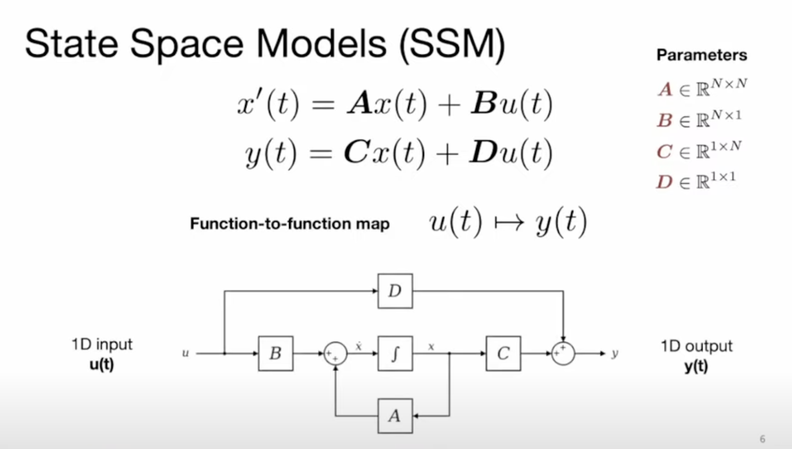
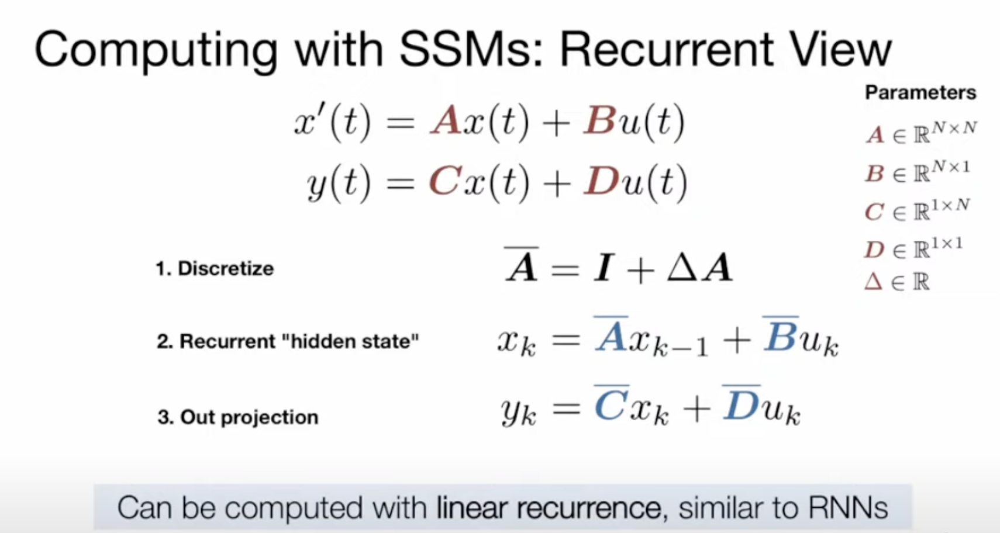
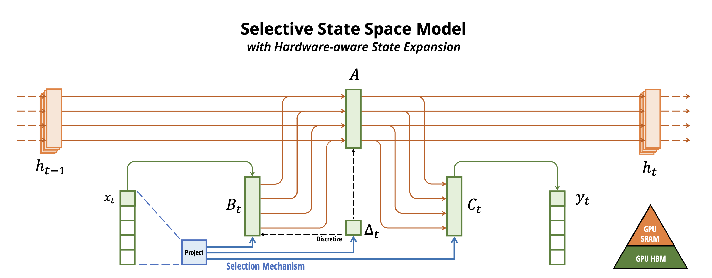
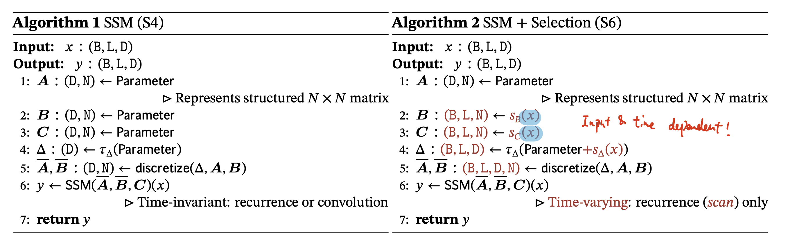
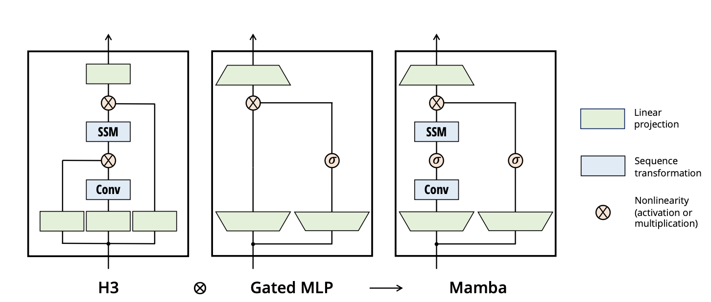
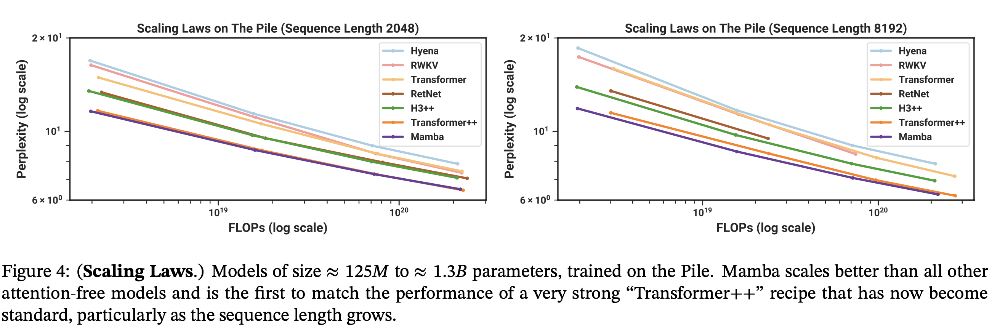
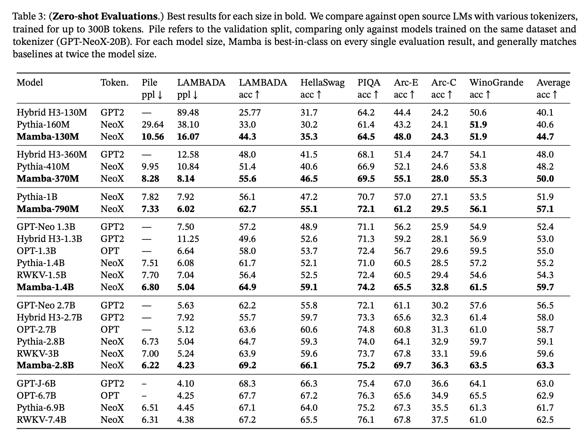

## [Mamba: Linear-Time Sequence Modeling with Selective State Spaces](https://arxiv.org/abs/2312.00752)

* Albert Gu and Tri Dao. 

* arXiv'23

* https://github.com/state-spaces/mamba

### Motivation and Problem Formulation

* What is the high-level problem?
  * Learning on long sequences, e.g., language, audio, genome

* What are the challenges?
  * Transformers are inefficient to compute O(N^2), and is hard to scale to long sequences

* **What is the contribution/impact of Mamba**
  * People view Mamba as a potential replacement for Transformers
  * Mamba achieves good empirical results on real data up to million-length sequences
  * Mamba enjoys fast inference (5x higher throughput than Transformers) and linear scaling in sequence lengths

* Missing from previous works (complete list of related works and discussion in the paper)
  * S4 [ICLR’22]: the first structured SSM, describing diagonal structure and diagonal plus low-rank (DPLR)
  * H3 [ICLR’23]: SSM sandwiched by two gated connections, with a standard local convolution
  * S5 [ICLR’23]: most similar to this work
  * **Missing:** Generally SSM is more efficient than Transformers; But, the classical drawback of SSM is, they have been less effective at modeling discrete and information-dense data such as text
    * Poor in input-dependent reasoning
    * Trade-off between effectiveness and efficiency

* What are the key assumptions?
  * Implicit assumption: they are talking about models with billions of parameters
  * When they talk about hardware-aware algorithm -> running on A100 GPUs

* Other resources on YouTube: [HiPPO](https://www.youtube.com/watch?v=EvQ3ncuriCM), [FlashAttention](https://www.youtube.com/watch?v=gMOAud7hZg4&t=1803s)

### Method

* Background

  * What is State Space Models?

    * General state space models:
      * Markov decision processes

      * hidden Markov models

      * Kalman filters

    * Very different way from CNNs in modeling time sequence

    

    

* What are the major contributions?

  * Mamba has three contributions

    * **Selection Mechanism:** select data in an input-dependent manner
    * **Hardware-aware Algorithm:** utilize the GPU memory hierarchy
    * **Architecture:** simplify deep sequence model architectures by combining the design of prior SSM with the MLP block of Transformers into a single block

    

* Selection Mechanism

  * **Key intuition: a fundamental problem of sequence modeling is compressing context into a smaller state**
    * Attention: effective but inefficient
      * It explicitly does not compress context at all
      * Linear inference time and quadratic training time

    * Recurrent models: efficient (because of a finite state), but ineffective
      * Effectiveness is limited by how well this state has compressed the context
      * Constant inference time and linear training time

  * **Key proposal:** How to enable effective compression in SSM?
    * -> the context-aware ability, to focus on or filter out inputs into a sequential state

  * Discussion about Linear Time Invariance (LTI)
    * LTI: the models dynamics (parameters of A,B,C, \Delta) are constant through time
    * Mamba: break LTI while overcoming the efficiency bottlenecks

  * What they do
    

* Hardware-aware algorithm

  * **Intuition:** we want to maximize the hidden state dimension without paying speed and memory costs
  * **Three techniques**
    * Kernel fusion: Perform discretization and recurrence in SRAM of GPU, and then write the final outputs back to HBM (High Bandwidth Memory) of GPU
    * Parallel scan, follow a paper in 2018 and 2023
    * Recomputation to reduce the memory requirements

* The complete architecture that combines SSM and MLP block of Transformers

  * More insights and discussions in the paper

  

### Evaluations

* Three different tasks: 

  * Language model pretraining (scaling laws), and zero-shot downstream evaluation
  * DNA sequence pretraining, and finetuing on a long-sequence classification task
  * Audio waveform pretraining, and the quality of autoregressively generated speech clips

* Language model

  * Dataset: Pile dataset
  * Models: GPT3 with similar number of weights
  * Metric: perplexity, lower is better

  

  * Zero-shot evaluations

  

* More results in the paper

### Pros and Cons (Your thoughts)

* Pros: why you think this paper could get in?
  * Very interesting paper to read
  * Comprehensive evaluation
* What do you learn from the paper?
  * More potential large scale applications: DNA, audio
  * Don’t be restricted to Transformers