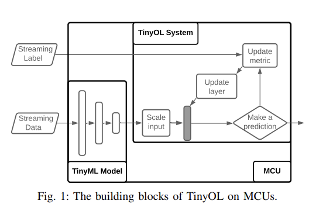

## [TinyOL: TinyML with Online-Learning on Microcontrollers](https://arxiv.org/pdf/2103.08295.pdf)

* Haoyu Ren, Darko Anicic,  Thomas A. Runkler
* Technical University of Munich
* IJCNN 2021
* Code Not Provided

### Motivation and Problem Formulation
* **Motivation**
    * The current Tiny Machine Learning solutions are based on batch/offline setting and support only the neural network’s inference on Microcontrollers
* **Key Challenge:**
    * The embedded devices work in a distributed environment. Some devices are installed at remote and hardly accessible places. Considering the great amount of edge devices, updating the model in each of them is costly. 
    * Every machine is different, even if they are of the same type and from the same manufacturer. The model trained using the dataset from one machine might not work for another machine. 
    * The embedded devices have limited possibility to store field data. Transmission of field data back to the data center is expensive and subject to delay.
    * The environment is constantly changing, the ML model’s performance will drop if the input data distribution evolves, known as concept drift. The model’s flexibility is constrained because MCUs can only execute the program’s pre-defined routine.

### Method
* **Proposed solution to aforementioned challenges**
    * They propose a new system called TinyOL (TinyML with online-learning). TinyOL is implemented in C++, and it can be attached to an arbitrary existing network as an additional layer in MCUs.
* **Why this works?**
    * Aside from just inferencing with the existing model, TinyOL can also learn from new data one by one and update the layer’s weights in an online learning setting. Upon user request, TinyOL can train the layer or modify the layer structure to accommodate new data classes. With incremental learning, there is no need to store historical data for training. The model is always up to date and can thus deal with the concept drift.
* **Solution**

    
    * The core component of TinyOL is the additional layer marked in black in Fig. 1. This extra layer consists of several neurons, which can be customized, initialized, and updated on the fly. 
    * After applying the system on top of other existing networks, the additional layer becomes a part of the NN as a new output layer. Because the existing NN are uploaded as a C array to MCU’s Flash, they are treated as a frozen graph and cannot be modified afterward. 
    * However, the neurons in the additional layer can be trained since TinyOL runs in the RAM. This concept is similar to transfer learning, where a part of a pre-trained model is fixed, and fine-tune happens at the last few layers.
    * With the online learning architecture, the additional layer can learn with streaming data.
        * At each time, a new sample data first flows through the existing NN and fed into TinyOL. Depending on the tasks, the accumulated mean and variance will be updated. 
        * And then, the system will run an inference. If it finds an existing label, it will adjust its weights using their algorithms. Once the neurons are updated, the sample pairs can be discarded effectively. *  
        * Generally, only one data pairs of the stream will stay in the memory. They use it and then just throw it away so that there is no need to store the historical data. Compared to the offline training setting, TinyOL can be trained with minimal resource usage, making on-device training on massive streaming data possible.

### Evaluations

* **Evaluation Setup**
    * Setup: To evaluate the concepts, they conduct experiments using an Arduino Nano 33 BLE board and a USB fan. The fan is used to simulate an industrial rotating machine.
    
    * Dataset: They use the board to read three different vibration patterns from the USB fan: regular operation, the fan is stuck, and the fan is tilted and let pre-trained autoencoder classify the fan modes at runtime.
    * They train model for several iterations on the streaming vibration data from one class, then we switch the fan to a different mode and train the model again for a few runs sequentially. They use F1-score and macro F1-score to evaluate the model on a pre-collected test dataset, where macro F1-score is the unweighted mean of F1-scores for all classes. 
    
    * The result shows the online model performs better when it is trained on more streaming data, for example, like more than 400 datasets. The F1-score on the normal class is always higher than the other two abnormal classes.
    * Then they compare macro F1-score of online learning (upper) and offline learning (lower), we observe that offline batch learning outperforms online learning if the amount of data is enough and the model is trained for more than 50 epochs
    * However, performing offline training needs more computational resources since the model is trained on the whole dataset at each epoch. Considering the online model is trained incrementally with limited shuffling, the result is overall competitive.

### Pros and Cons
* Pros:
    * Nice work in explaning why applying TinyOL to Microcontroller, especially three challengs
* Cons:
    * Their dataset is not strong enough to explain why their method works
