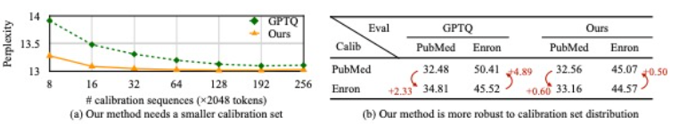
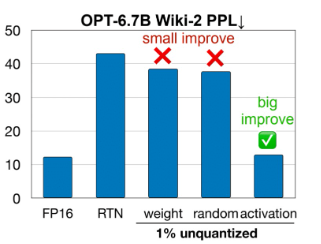
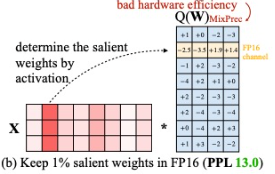
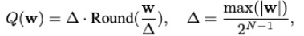
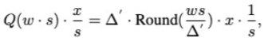
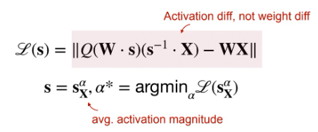

## Paper Title (with link)

* Authors and Affiliation
    * Ji Lin, Jiaming Tang, Haotian Tang, Shang Yang, Wei-Ming Chen, Wei-Chen Wang,
Guangxuan Xiao, Xingyu Dang, Chuang Gan, Song Han

* Conference and year
    * MLSys, 2024

* Link to the code (if any)
   * https://github.com/mit-han-lab/llm-awq 

### Motivation and Problem Formulation

* What is the high-level problem?
    * Running large language models on edge devices

* Why is it important?
    - Promises reduced latency and improved user experience 
    - Aligns with the increasing need for user privacy
    - Allows data processing to happen locally

* What are the challenges?
    - The astronomical model sizes of modern LLMs and constraints of the edge devices, primarily in terms of memory size and bandwidth, poses deployment challenges
* What is missing from previous works?
    - **Round to the nearest baseline (RTN) approach**
        - Limitations: vanilla approach, vanilla in performance and resources
    * **GPTQ which is the closest to the AWQ:**
    - Limitations: 
        - Reconstruction of GPTQ leads to an over-fitting issue to the calibration set, and may not preserve the generalist abilities of LLM of other models and domains.
        - Requires a reordering trick to work for some models

### Method

* What are the major contributions?
    - Doesn’t rely on any regression or back propagation 
    - Minimal reliance on calibration set since only measuring the average magnitude per channel, thus preventing overfitting
    - Requires fewer data for the quantization process and can preserve LLM’s knowledge outside of the calibration set’s distributions
    

* What is the technical problem? What are the input and output of the problem?
    - LLMs are too big to fit on small devices.
    - Deployment is hard to realize in certain speedup settings
* What they propose to solve the problem?
1. Find salient weight
     - Using activation magnitude, it can significantly improve the performance despite keeping only 0.1-1% of channels in FP16
    - Observed that we can find 1% of the salient weights in LLMs based on the activation distribution (middle) 
    
    
2. TinyChat for Deployment
    - Parallel computing techniques 
    - Memory footprint is expensive, computing is cheaper.
    - W4A16 have different data types for memory access and computation. So they decoded the INT4 weights into FP16 and avoid writing it to DRAM by fusing dequantization kernels with the matrix multiplication kernel
    - Platform-specific weight packing tailored to the bit width of a device’s SIMD units to further decrease on-the-fly dequantization

* Why this works?
1. Why the first part works
    - Consider the weight w, y = wx, and the quantized counterpart is y = Q(w)x. N is the number of quantization bits and delta is the quantization scalar determined by the absolute maximum value of w.
    
    - Now consider a weight element in w, if we multiply w with s > 1 and the inversely scale x, we will have
    
    - Expected error (Round(.)) does not change, w also doesn’t change the maximum value from the group w. 
    - Protecting salient weights by activation-aware scaling 
        - Scale s is only determined by the average activation magnitude (activation awareness).
        - Fast grid search to find optimal scaling factor → gradient descend in the future 
        - The search objective is mean square root error for the activation, not the weights themselves (as in GPTQ).
        

2. Why Tinychat is so fast
    - Parallel computing techniques 
    - Memory footprint is expensive, computing is cheaper.
    - W4A16 have different data types for memory access and computation. So they decoded the INT4 weights into FP16 and avoid writing it to DRAM by fusing dequantization kernels with the matrix multiplication kernel
    - Platform-specific weight packing tailored to the bit width of a device’s SIMD units to further decrease on-the-fly dequantization

### Evaluations

* Where did they implement their method? On what platform?
* How they evaluate their method?
    - Models: benchmarked their methods on LLaMA and OPT families.
    - Evaluations: quantized models on language modeling tasks (perplexity evaluation on WikiTest-2)
    - Baselines: vanilla round-to-nearest quantization (RTN) and GPTQ (w and w/o reordering trick)
    - Device: RTX 4090 GPU. We adopt an inference batch size of 1, catering for edge use cases, and implement the model in FP16 with NVIDIA FasterTransformer

* What are the key results?

### Pros and Cons (Your thoughts)

* Pros: why you think this is a good paper?
    - AWQ consistently outperforms existing quantization methods which is impressive
    - Very easy to implement since it doesn’t rely on back-prop 

* Cons: unrealistic assumptions, missing elements, missing experiments, etc.
    - In the video they said that in the future they would try to use gradient descend to find the optimal scaling factor. Why is it better than the current version and if so is the current version less efficient or less optimal?
