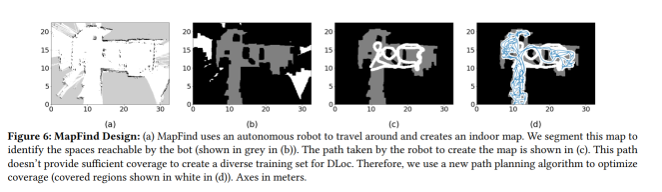
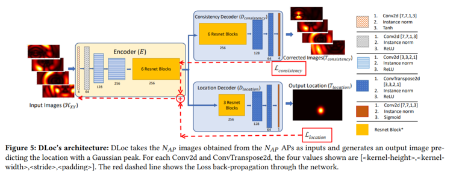
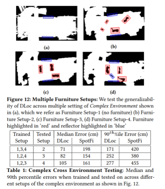

## [Deep Learning based Wireless Localization for Indoor Navigation](https://dl.acm.org/doi/pdf/10.1145/3372224.3380894)

* Roshan Ayyalasomayajula, Aditya Arun, Chenfeng Wu, Sanatan Sharma Abhishek Rajkumar Sethi, Deepak Vasisht, and Dinesh Bharadia

* UCSD and Microsoft

* Mobicom 2020

* Code and dataset no longer available

### Motivation and Problem Formulation

* **High level problem:** Indoor navigation based on WiFi access points is challenging because GPS does not work

* **Challenges:** 1. No indoor map; 2. WiFi signals (waves) could be randomly delayed (b) reflected (c), blocked (d) as shown in the below figure.

* **Contributions:** 
1. Incorporates domain knowledge in WiFi localization to deliver state-of-the-art localization performance
2. Correct for time-of-flight offsets without requiring additional instrumentation on client devices
3. First autonomous robot, which provides wireless channel state information with the map of the physical space using SLAM techniques
4. A large dataset consisting of 105k points

* **Previous works**

  * Did not have wireless channel state information, which is quintessential to achieving accurate indoor localization

  * Used heuristics to account for problems from the enviroment. This approach does not work when the direct path is blocked.
  * Other neural network based methods use complex-valued wireless channels as input, which is not suitable.
  * Previous works in machine learning community studied image transformations, but that was not applied to this field.

### Method

* **Technical problem 1:** automatic mapping
* Solution:
  

  * Use LIDARs (light detection and ranging), RGBD cameras, gyroscopes and odometers (ordinary equipments)
  * Algorithm builds on a couple of existing ones
  * White area represented channel state information being collected
  * Human guidance is provided until the last step. In the last step, robot automamtically tranverse the entire reachable space.

* **Technical problem 1:** automatic mapping
* Solution:
  
  * Input and Output
    * Input: heatmap of possibilities of distance in XY plane from each access point (AP)
      * Different from other works, argue that complex values are not suitable for neural networks.
      * Propose to transform raw input to heatmaps, and treat the problem as an image transformation task
    * Output: corrected heatmaps and a prediction of location

  * Two Parts of the Network
    * Upper Part: Consistency Decoder
      * Training data for corrected images are heuristic that take AP of least offset as ground truth
      * Neural Network is trained to learn to heuristically correct the offsets
    * Lower Part: Location Decoder
      * Trained to predict the position of client
    * Two parts jointly optimize the model
    * Loss function is sum of Loss of Location and Loss of Consistency
    
    

### Evaluations

* Location Prediction
  * Implementation: PyTorch
  * **Dataset:** Self generated datasets from their robot. Two spaces with simpler one being 500 sq.ft and harder one being 1500 sq.ft
  * **Baselines:** SpotFi, and some deep learning model
  * **Metrics: ** localization error in meters vs CDF, performance under unseen scenarios
  * Results
    * 2x better results compared to baseline
    * High robustness towards unseen scenarios

* Map Generation
  * Implementation: Quantenna onto the Turtlebot2 platform, Hokuyo UTM-30LX LIDAR, Astra Orbecc RGBD Camera
  * Results
    * Less traversed distance and better coverage compared to greedy algorithm

### Pros and Cons (Your thoughts)

* **Pros:** nice and complete paper that discusses a lot of details
* **Cons:**
  * Stated Limitations
    * Only support 2D map, but 3D should be extensible
    * Robot is slow (15cm/s)
    * Not tested on human-held devices, but authors claim that this should not affect results

  * (Un)stated Limitation
    * Some company’s product page that their ToF based product has accuracy within 50 cm. (https://www.inpixon.com/blog/what-is-the-best-system-for-achieving-blue-dot-indoors) The service provided is different than WiFi (it’s called Ultra WideBand), but from the words it looks like ToF seems to be a main contributor. So is this work really useful?
    * Performance from no furniture to with furniture is unclear.

### Takeaways

* Indoor Navigation based on channel state information and transformation from raw signals into images will improve the performance.