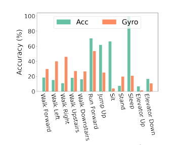
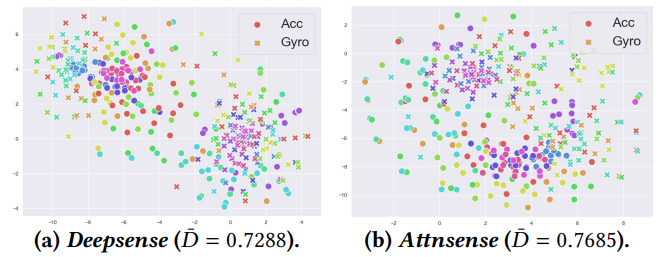
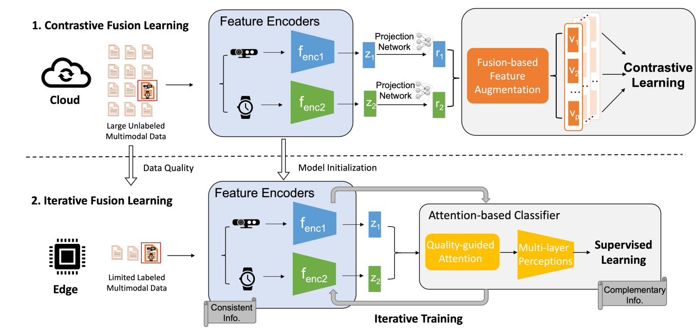
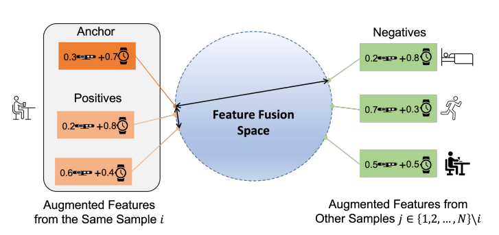
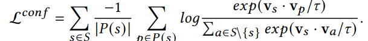
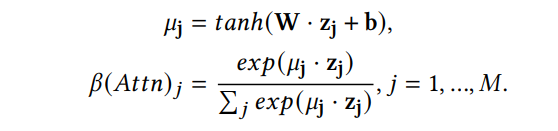
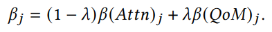
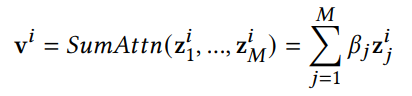
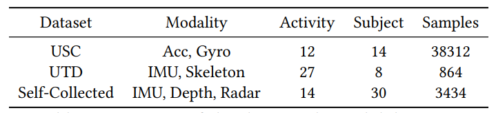

## [Cosmo: Contrastive Fusion Learning with Small Data for Multimodal Human Activity Recognition](https://dl.acm.org/doi/pdf/10.1145/3495243.3560519)

* The Chinese University of Hong Kong, Michigan State University, Li Po Chun United World College, Hong Kong, The Chinese University of Hong Kong, Shenzhen Institute of Artificial Intelligence and Robotics for Society

* MobiCom 2022

* Code not provided

### Motivation and Problem Formulation
* Motivation
  * Human Activity Recognition (HAR) data are hard to collect and often unlabelled.
  * Learning with limited HAR data is hard, particularly for current HAR SOTA methods which almost all assume a fully supervised setting.
  * Few work attempt to utilize the abandance of un-labelled HAR data which can be easily collected with sensors or wearable devices.
* Challenge
  * Work with limited unlabelled data.
  * Learn embedding from un-labelled data
* Main contrabutions
  * show that multimodal fusion should leverage both consistent and complementary information of different modalities simultaneously.
  * Proposed a fusion based contrastive learning method or consistent information and a noval quality-guided attention mechanism for complementary information between modalites.

### Consistent information and Complementary information in multimodal data

* Complementary Information
  * Different modality offers unique information, for example, for the above example, learning with single modality, Gyro provided more information on walking related activity where as Acc is goo for other activities.
  * Use the complementary information between modalities are essential in multimodal learning.

* Consistent Information
  * Features between modality are well aligned, consistent information between two modalities can be more robust to the noisy multimodal data.
* The consistent information from different data modalities helps align features, making the fusion more robust to noise.
* The complementary information from different data modalities, on the other hand, exploits the strength of different sensors and promotes fusion performance. 
* When there exists only limited labeled multimodal data, both consistent and complementary information should be learned and leveraged simultaneously to achieve more robust fusion performance in real-world HAR tasks.

### Method

* Over all design
  * Use large amount of unlabelled data to learn a embedding that uses consistent information.
  * On edgem use small amount of labelled data to learn a attention classifer that uses complementary information.

* Contrastive fusion learning for consistent information
  * Each modality data has a encoder (can be any neural network).
  * A multilayer perception after each encoder to align the dimensionality and norm the feature vector effectively make all encoded feature vectors lies on a D dimensional unit shpere.
  * Contrastive pairs can then be created:
    * Multimodal data argumented from same sample act as positive sample.
    * Multimodal data argumented from different sample act as negative sample.
    
    * Contrastive loss can be calculated.
    * This will result in an embedding space, where features from the same multimodal samples will be more closely aligned.
    * Minimizing the contrastive loss will maximize the lower bound of mutual information among positive features
    * Therefore, as introduced in Section 3, the feature encoders will learn more consistent information that extracts the common features from the unlabeled multimodal data.

* Attention for Complementary information
  * Explore the complementary information of different sensor modalities from the limited labeled data.
  * Dynamically give different attentions to different modality feature embeddings.
  
  * Z are deep features for trained the embedding.
  * u comes from a multilayer perceptron.
  * Use clusterability of unlabelled data, quality based fusion also be applied.
    * The rationale is that the clusterability of latent spaces is strongly correlated with their resulting classification accuracy
  
  * The weight for each modality feature can be calculated as a combination of attention and quality.
  * Additionally, to create final feature vector, modality of same nature can be averaged where as modality of different nature can be concanated.
   

### Results

* Proposed system are then evaluated on different HAR datasets.
* Baseline:
  * DeepSense: concat based multimodal fusion learning.
  * AttenSense: Attention based multimodal fusion learning.
  * Contrastive Predictive Coding (CPC): Contrastive learning method for HAR tasks.
  * Contrastive Multi-view Learning (CMC): Contrastive learning method for image based HAR tasks.

* Result
  * Cosmo works well even with samll number of labellled data.
  * Even with few labelled data, Cosmo outperformes attensense which use 100% of labelled data.

* Additionally, with contrastively learning encoders, Cosmo is able to converge much faster.

### Pro and Cons
* Pros
  * Interesting problem setting, uses the abandance of unlabelled HAR data.
  * Noval way of constructing contrastive pairs.
* Cons
  * The idea of consistent information is confusing.

