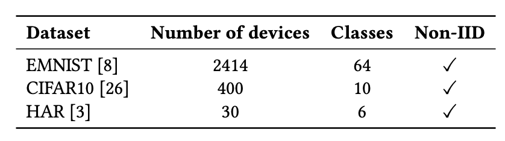

## [Hermes: An Efficient Federated Learning Framework for Heterogeneous Mobile Clients](https://sites.duke.edu/angli/files/2021/10/2021_Mobicom_Hermes_v1.pdf)

* Ang Li, Jingwei Sun, Pengcheng Li, Yu Pu, Hai Li, Yiran Chen. Duke University, Alibaba DAMO academy.

* MobiCom 2021

* Code not provided

### Motivation and Problem Formulation

* What is the high-level problem?
  * Two major challenges in FL: data heterogeneity and communication cost

* What is missing from previous works?
  * To address data heterogeneity: fine tuning, multi-task learning, contextualization
  * To address communication cost: quantization, sparsification, hybrid
  * Very few works address both
    * LG-FedAvg: two-step learning for personalization, only heuristic for model split
    * HeteroFL: adaptively allocation submodels, less flexible
    * SFSL: secure FL only for recommender system

* What are the key assumptions? 
  * (Implicit) All devices are connected online

### Method

* Hermes: simultaneously (1) reduce the communication cost, (2) improve the computation efficiency for inference, and (3) learn a personalized model for each participating device
* Key idea: model pruning
  * Inspired by “**lottery ticket hypothesis**”: an optimal substructure of the original network can be identified through pruning, and such a subnetworks can reach similar accuracy as the original network

* Key challenges and solution
  
  * How to learn personalized local model? → **structured pruning**
    * Add a lasso regularization loss, and identify all zero-valued parameters as “pruned”
      
    * Trade-off between accuracy and pruning ratio
      * Check if the current subnetwork can reach target accuracy. If so, check target pruning ratio. If target pruning ratio is not reached, increase pruning.

  * How to aggregate heterogeneous model at the server? → **only aggregate the overlap**

* Convergence analysis of Hermes

### Evaluations

* **Dataset:** EMNIST (VGG16), CIFAR-10 (VGG16), HAR (MLP)
  
* **Baseline:** only local training, FedAvg, Top-k, Per-FedAvg, LG-FedAvg
* **Metric:** 

  * For training performance: inference accuracy, communication cost
  * For runtime performance: memory footprint, inference latency, energy consumption

* **Implementation:** Google Pixel 3 as clients, a desktop as central server
* Convergence speed

  * Hermes outperforms the compared baselines, improving inference accuracy by 0.53%-32.17% and reducing communication cost by 1.92x-3.48x
    
    
    
    

* Hyperparameters of Hermes (ablation study)

  * Number of participating devices per round

  * Data volume and unbalance rate

  * Target pruning rate

    * Interestingly, with lower target pruning rate, the accuracy does not drop that much, but there is a significant saving on communication cost

    

* Runtime performance: 1.83x speedup in inference latency, 70% reduction on memory footprint and 1.8x savings on energy consumption
* **What is missing:** overhead on training

### Pros and Cons (Your thoughts)

* Pros: 
  * Very nice writing
  * Solid techniques and experiments
* Cons: 
  * Overhead on training is missing → **serious issue as the key is training not inference. And it seems the measurement should not be too hard to do**
  * Larger-scale of exp is required in recent FL submissions
* My own question: how to guarantee enough overlap?