## [InFi: End-to-end Learnable Input Filter for Resource-efficient Mobile-centric Inference](https://dl.acm.org/doi/10.1145/3495243.3517016)

* Mu Yuan, Lan Zhang, Xueting Tong and Xiang-Yang Li from University of Science and Technology of China and Fengxiang He from JD Explore Academy

* MobiCom 2022

* [Link to Github](https://github.com/yuanmu97/infi)

### Motivation and Problem Formulation

* They state that mobile-centric AI applications put forward high requirements for resource and efficiency of model inference in these edge-devices. 
* There have been approaches before to solve this issue but two main problems still remain which are:
   * Theoretical definitions of filterability of an inference workload
   * Solution with robust discriminability of feature embedding to allow input filtering to be widely effective in many tasks
* The challenge is that AI models with state-of-the-art accuracy are very computationally intensive, which we don’t want
* **SOLUTION** to this problem: Eliminate the redundancy of the deep model itself via accelerating and compressing techniques in the input, specifically two ways to do this
   * <ins>SKIP</ins>: where you filter input data that will bring useless inference results
   * <ins>REUSE</ins>: in this case you filter input whose results can reuse previous inference results
* Previous Works:
   * FilterForward: SKIP method for image input, they use a pre-trained MobileNet’s feature embedding and then train a binary “micro-classifier” to know when to skip.
    * FoggyCache: REUSE method for image and audio. It includes Low-level features and locality-sensitive hashing for embedding, followed by an L2 norm as the difference function. To compare new data with past observations.
    * Reducto: variant of SKIP for video input. It has a Low-level feature difference between successive frames.
    * **Missing**: Theoretical abstraction of the problem, they also split filtering task into sub-modules and they resolve each submodule individually, no optimal accuracy, missing input modalities like text and sensor signals, and lastly the features are poorly discriminative.

### Method

1) They’re first contribution is to formalize the input filtering problem and provide valid conditions of a filter.
   * Define a filter as “valid” is it’s accurate enough (surpases a certain threshold, this threshold is basically an acceptable inference accuracy) & it has a reduced overhead (which is mainly that the overall cost of the input filter is lower than the original cost without the filter)

     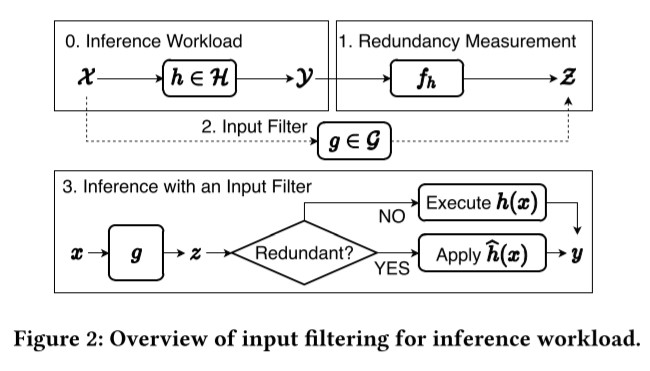

   * You can see Figure 2 the main process. Where $X$ = Input, $h$ = the function for the inference model from a hypothesis family $(H)$ which returns $Y$ = label space, then the output of $h$ is the input for $f_h$ = function the transforms $Y$ -> $Z$ (estimated redundancy measurement). From there you train an input filter $g$ from a hypothesis family $G$ which given $X$ can deduce the redundancy measurement $z$. Once the model is trained, you have input, pass it through the filter $g$, get redundancy measurement then you ask is it redundant enough, yes = you use Skip or reuse, no, then use the inference model to get a result.
   * They go to ask themselves Given an inference workload, is there a valid input filter $g$?
   * They first define that an inference workload is filterable if the complexity measurement of $G$ is smaller than $H$, where $h$ is part of this $H$ (Hypothesis family) and $f_h$ o $h$ = family of the input filter’s target concept is part of uppercase case G which is the hypothesis family of $g$.
 
     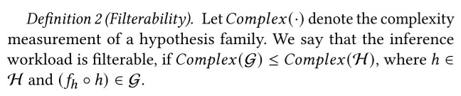
   
   * They go and do the filterability analysis for 3 workloads: 
      * First the test a binary classifier $h$ like speaker verification that return classification confidence or even a multi-class classifier and they determined that this is NOT filterable, the proof is on the next image.
     
        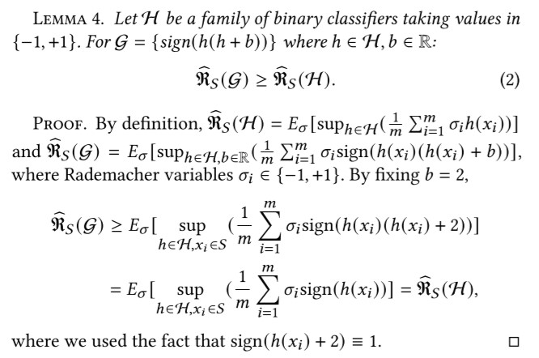
     
      * Then they test an inference model $h$ as a multi-class mono-label classifier like object detector on drone for traffic monitoring (in this example example you would only care about cars and pedestrians, trees and animals are redundant) and they conclude that this IS filterable.
      
        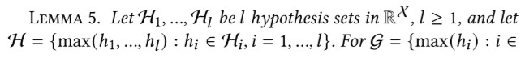
        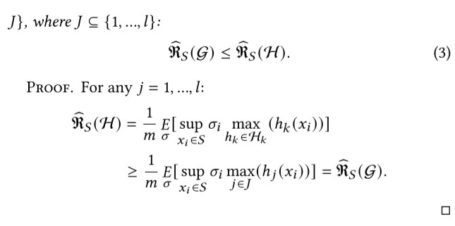
      
      * Lastly they test a bounded regression model $h$ like face authentication where the coordinates of the detected face have to be within a specific range and they conclude that this IS filterable.
      
        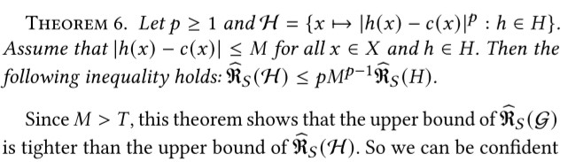
      
   * Assumptions: Identical distributions for both the input values for the inference workload and the input filter training + the same training samples, for the input filtering and inference workload.

2) The second contribution is InFi as the first end-to-end learnable input filtering framework for both SKIP and REUSE methods, it has advantages like:
   * Robust discriminability
   * Wider Applicability
   * Outperforms baselines in accuracy and efficiency.
    
     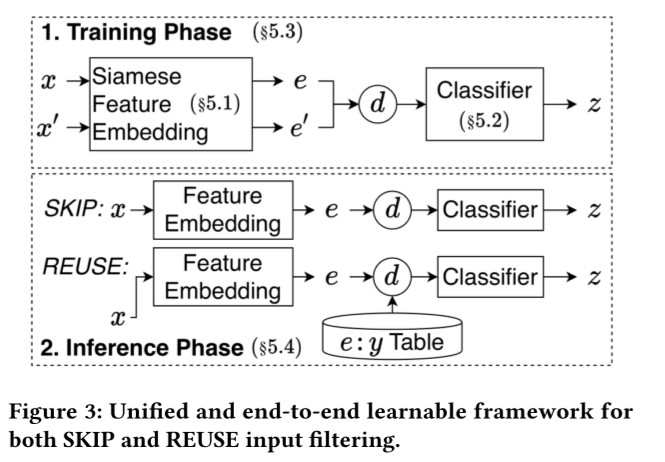
    
   * In training SKIP is treated as REUSE with a NONE output.
      * The key to REUSE is to measure the semantic similarity between the current input and previously cached ones. In Figure 3 you can see how $x$ and $x'$ is a pair of inputs and you have $d$ as the difference function on embeddings $e$ and $e'$. Then the classifier predicts $z$. Z in REUSE is distance between 2 inputs
      * SKIP is the same process but $z$ is the probability that $x$ is not redundant.
    * In inference
       * The same process for both methods but differ in the inputs for d. 
       * In SKIP you have a binary classifier to determine whether to skip or not depending on the redundancy score $z$. 
       * In REUSE $d$ takes into account the key-value table of the past data where the keys are the feature embedding and the values are the corresponding inference results. The distance between an input and past cached features ($z$) is calculated through KNN or some other classification algorithm.
     * Key components of InFi are: feature embedding, classifier, training mechanism and inference algorithm.
     * They opened the range of filterable workloads with 6 input modalities which are: text, image, video, audio, sensor signal and feature map.
     
       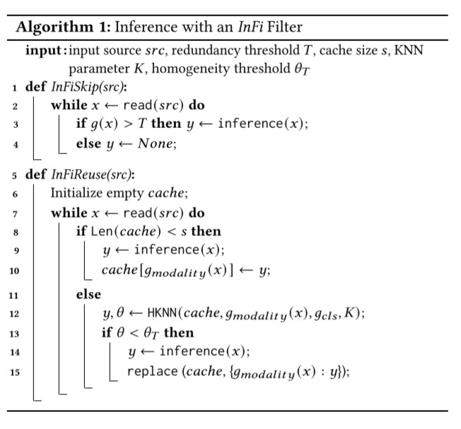
     
     * Training:
        * Infi-Skip: Training a binary classifier, and they use binary cross-entropy as the loss function.
        * Infi-Reuse: Train using contrastive loss, so given a set of input and their discrete inference results, the redundancy measurement is defined as the distance metric between a pair of inputs.
      * Inference:
         *  Infi-Skip: They use $T$ (threshold for redundancy) to determine whether to skip the current input in other words return NONE
         *  Infi-Reuse: Maintain a cache, they use Homogenized KNN algorithm to reuse cached results which in turn return homogeneity score. They use Homogenized instead of normal KNN due to the problem that a new input may not be similar to any past cached entries, and they use Least Frequently Used algorithm as the replace policy inside the cache.

### Evaluations

* Dataset: They use a bunch of datasets, like Hollywood2, Esc-10, UCI HAR, MoCap and City Traffic to have the variety of modalities and inference tasks as well which can be seen in the next table.

  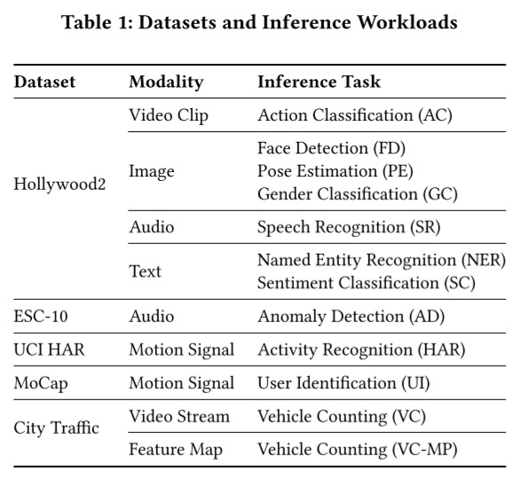

* Baseline:  FilterForward (FF), Reducto and FoggyCache(FC).
* Metrics:  
   * Filtering rate: for accuracy @ 90% inference accuracy, both for SKIP and REUSE methods. You can see is also tested against optimal results which is a computed metric by $(0.1) + r_N$ where $r_N$ = ratio of redundant inputs in the test dataset. Results as seen in Table 2 show that InFi-Skip outperforms FilterForward and Reducto on al 10 workloads. Similarly Infi-Reuse significantly outperforms FoggyCache on all 6 applicable REUSE workloads as seen in Table 3.
     
     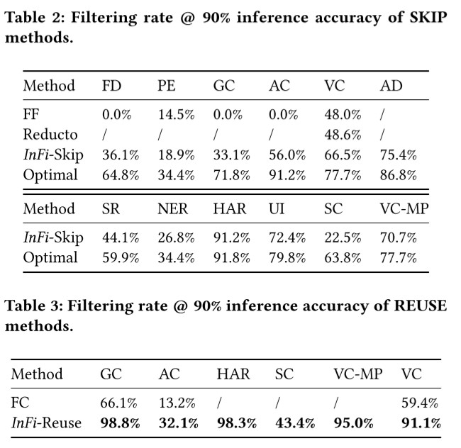
     
   * Computational complexity: They use Number of Parameters in the filter and number of float operations. They compare it to MobileNetV1 for efficiency and other standard CNN models, and as seen in Table 4, InFi reduces about 70% Float operations and 99.4% parameters.

     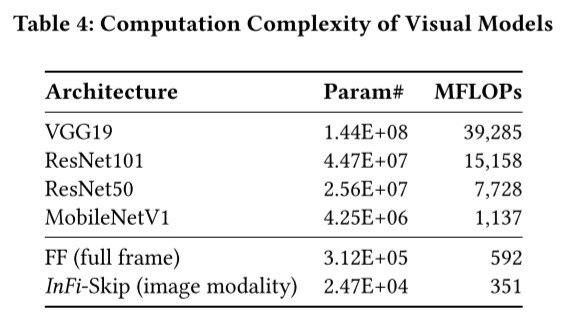

   * Latency and Energy: They tested their model against MobileNetV1 again, one the most efficient CNN models on mobile devices. As seen on Figure 12 InFi with the image feature network costs only about 12-25% runtime of MobileNetV1. The average energy costs are much lower than MobileNetV1 on the phone and smartwatch.
     
     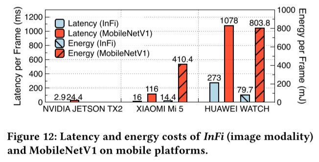

### Pros and Cons (Your thoughts)

* Pros: Raises the bar for input filtering algorithms and it does help with reducing energy consumption and is more computationally efficient once paired with good AI model for inference.
* Cons: Not tested with this added AI model for inference and we have seen how edge devices are gaining processing power quickly so efficiency is not really a problem anymore, something similar can be applied to this problem as well.
