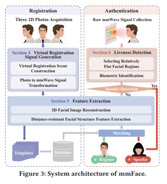
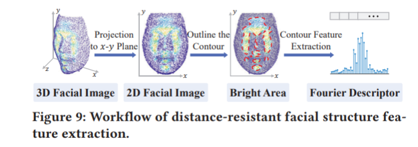
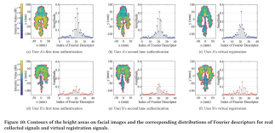
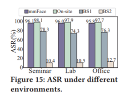
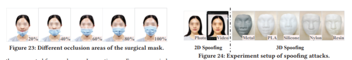
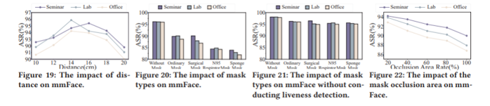

## [Mask Does Not Matter: Anti-Spoofing Face Authentication using mmWave without On-site Registration](https://dl.acm.org/doi/pdf/10.1145/3495243.3560515)

* Weiye Xu, Wenfan Song, Jianwei Liu, Yajie Liu, Xin Cui, Yuanqing Zheng, Jinsong Han, Xinhuai Wang, Kui Ren

* Zhejiang University, ZJU-Hangzhou Global Scientific and Technological Innovation Center, The Hong Kong Polytechnic University, Xidian University

* Mobicom 2022

* Code and dataset: not available

### Motivation and Problem Formulation

* **High level problem:** Camera-based face identification (face ID) does not work well with face occlusion (mask) and is vulnerable to spoofing attacks (3D-printed masks)

* **Challenges:** RF signal based face ID can penetrate mask and is sensitive to material, but three challenges remain from previous works
1. Registration overhead: on-site registration takes several minutes
2. Robust system: signals reflected from the same face are different with different distances
3. Complex geometric structure: existing RF material sensing methods require fixed structure (not the case for face ID)

* **Contributions:** 
1. mmWave-based face authentication system that solves challenge 2 & 3
2. virtual registration that solves challenge 1
3. prototyped their proposed solution on off-the-shelf product

### Method

* **Technical problem 1:** remote registration system
* Solution:
  * Require: Three 2D facial photos from different perspectives
  * High level idea: transform the photos into mmWave signals by building a theoretical model of mmWave signal propagation

* **Technical problem 2:** automatic mapping
* Solution:
  * Require: User stands in front of a RF antenna array for a few seconds
  * High level idea: first liveness detection, then reconstruct 3D face from RF signals and use distance-invariant features to find a match in database

  * Details:
    * Liveness detection
      * Multiple factors affect the amplitude of reflected signals (used to determine the reflection coefficient)
      * Use an algorithm to determine the relatively flat regions of face
      * Calculate the reflection coefficient of each flat region
      * Use 7 statistical features and SVM to determine whether it is human face
    
    * Face authentication
      * Reconstruct face from RF signals using range migration algorithm
      * But that requires same distance from registration to authentication
      * Work around: observation that contours are different (distance-invariant), as shown by the figure below
      * Some other tricks: adaptive threshold, remove discrete points from contour
    

### Evaluations

* Implementation: 
  * **Dataset:** Self collected data from 3 scenarios (seminar room, lab, office), 30 volunteers (5 randomly-chosen spoofers), 3600 authentication attempts over 6 months
  * **Baselines:** 
    * On-site: instead of generated mmWave signals from virtual registration, user does on-site registration
    * Baseline1 (BS1): only use Fourier descriptors, no removing discrete points
    * Baseline2 (BS2): no feature extraction (raw image)
  * **Metrics: ** six metrics to quantify the performance, but mainly ASR (authentication success rate)
  * Results
    * High authentication accuracy
    
    * Robustness towards distance differences and attacks
      * Test settings: 10-20 cm compared to ideal 15 cm, spoofing attacks in both 2D and 3D
      * For spoofing attacks, defense success rate >90%
      
      

### Pros and Cons (Your thoughts)

* **Pros:** 
  * Clear motivation
  * Detailed descriptions of the model with a theoretical explanation
* **Cons:**
  * No numerical comparison with other works
    * They only say that existing solutions do not work well, but they don’t show it

  * Is it really distance-robust?
    * 10-20cm as opposed to ideal 15cm is not significant?
    * We see that accuracy drops sharply when distance increase. So…

### Takeaways

* RF mmWave based face authetication is applicable in practical scenarios such as face occlusion and spoofing attacks.