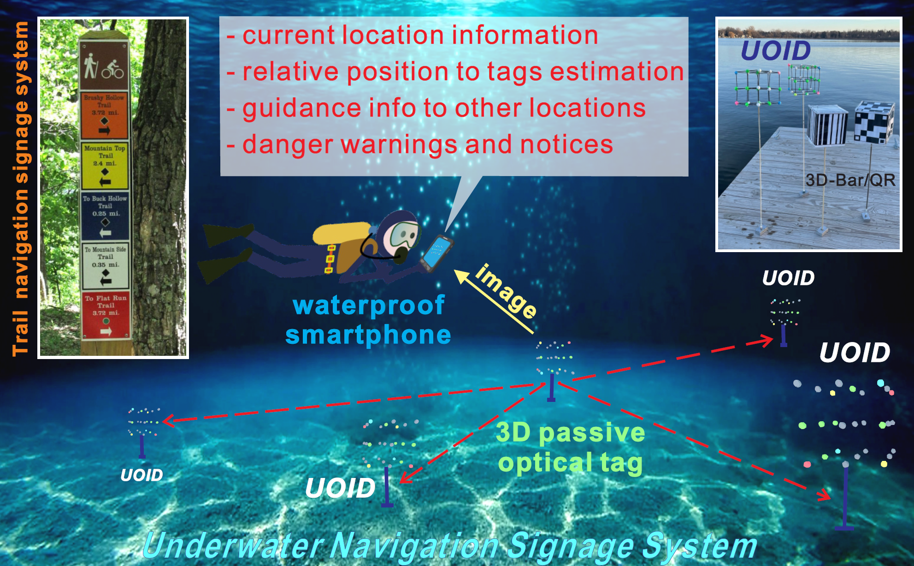
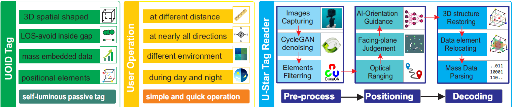
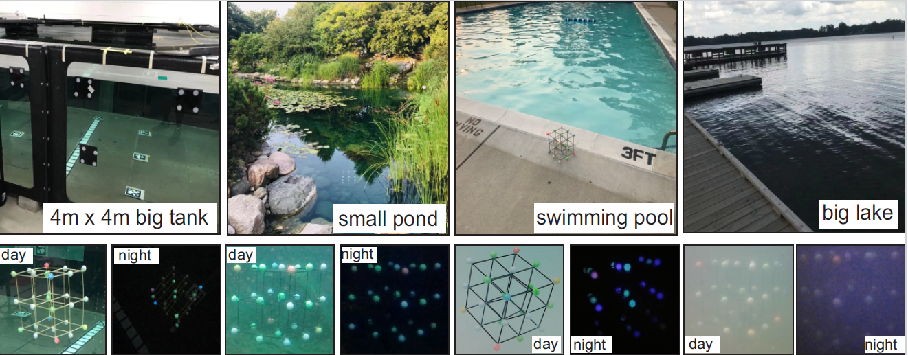
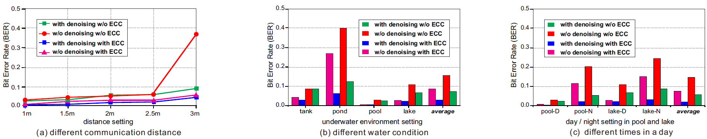

## [U-Star: An Underwater Navigation System based on Passive 3D
Optical Identification Tags]([https://dl.acm.org/doi/pdf/10.1145/3495243.3517019])

* Xiao Zhang, Hanqing Guo, James Mariani, Li Xiao (Michigan State University)

* MOBICOM 2022

* Code not provided

### Motivation and Problem Formulation

* What is the high-level problem?
  * How to make underwater navigation inexpensive and reliable to improve safety through increased spatial awareness.

* What are the challenges?
  * Power Consumption
  * Price of Equipment
  * Angle of Approach
  
* Previous works
  * Acoustic/RF
  * 2D Optical Tags

* Assumptions
  * <10m from surface
  * Reasonable water visibility
  * Pre-placement

### Method

* What they propose to solve the problem?
  * UOID-Underwater Optical Identification
    * Plastic Sticks
    * Colorful fluorescent balls
    * Anchored

  * Tag Reader
    * Smart phone or camera
    

  * Algorithm
    * CycleGAN denoising
    * CNN for relative positioning
    * 3-D restoring based-decoding
    

### Results

  *   
       
    

### Pros and Cons 

* Pros:
  * Novel usage of bar/QR codes
  * Inexpensive

* Cons:
  * Limited depth and feasible usage
  * Questionable reliability

* Something I learned from the paper:
  * An interesting 3D method to uniquely mark a location whether underwater or not.  
