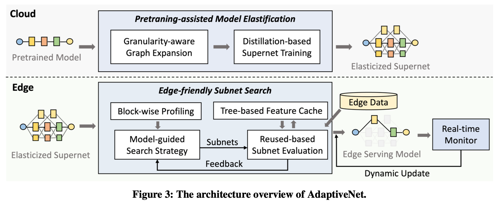
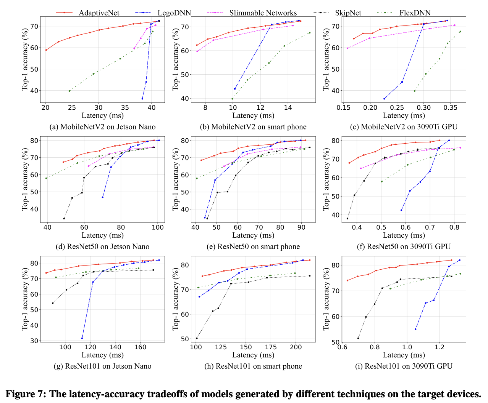
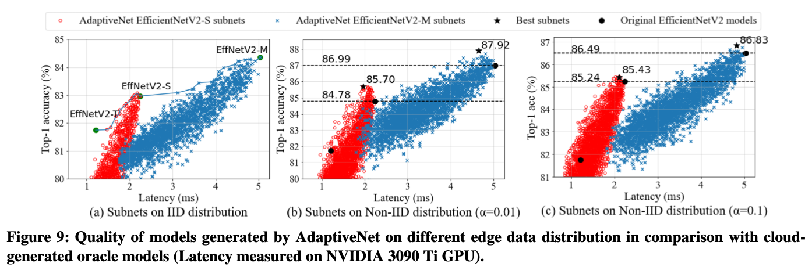
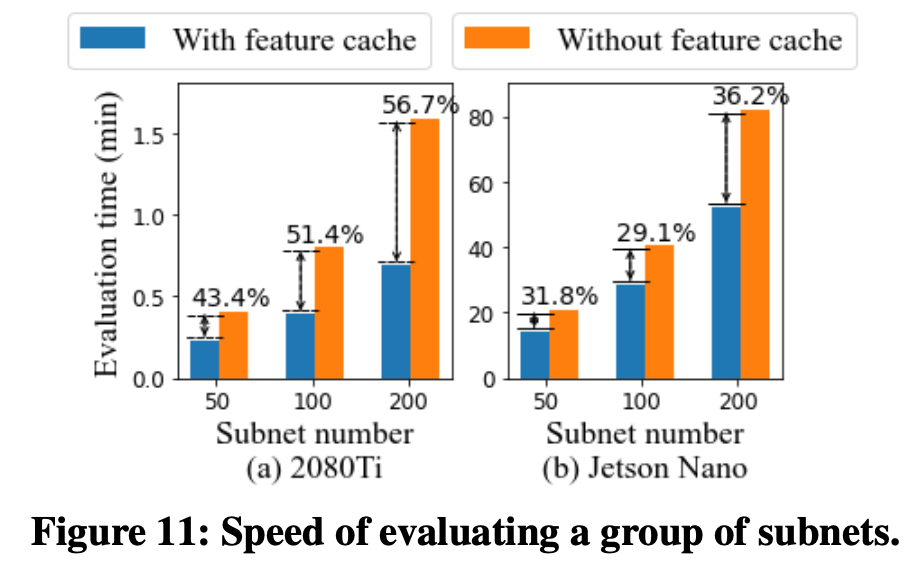

## [AdaptiveNet: Post-deployment Neural Architecture Adaptation for Diverse Edge Environments](https://arxiv.org/abs/2303.07129)

* Hao Wen, Yuanchun Li, Zunshuai Zhang, Shiqi Jiang, Xiaozhou Ye, Ye Ouyang, Ya-Qin Zhang, Yunxin Liu, Institute for AI Industry Research (AIR), Tsinghua University

* MobiCom 2023

* Link not provided yet (since they promise to make it open-source, maybe they all update it later)

### Motivation and Problem Formulation

* What is the high-level problem?
  * Generate NN model architecture for different conditions

* What are the challenges?
  * The diversity of edge environments and the demand for edge information -> generating the model search space for edge devices is difficult
  * The model search process can be time-consuming at the edge

* What is the major contribution of the paper?
  * They propose and develop the concept of on-device post- deployment neural architecture adaptation, and imple- ment it with an end-to-end system.
  * They introduce a pretraining-assisted model elastification method that can effectively and flexibly generate a model search space, as well as edge-tailored strate- gies to search the optimal model from the space and maintain it at runtime.
  * Our method achieves significantly better accuracy-latency tradeoffs than SOTA baselines according to experiments on various edge devices and common tasks. The tool and models will be open-sourced for edge AI developers to use
  * **Note: based on pretrained networks, different from online training**

* What is missing from previous works?
  * **Pre-deployment approach:** Neural Architecture Search (NAS)
    * Require collecting information (computational resources, runtime conditions, data distribution) from the target environments to guide the model arch search and training processes **in the cloud**

  * **Post-deployment approach:** 
    * Mobile community is mainly focused on model scaling
    * ML research mainly aims to deal with different data distributions or hard/easy samples
    * Prior works only shrink the model size through pruning or quantization, rather than changing the model arch (not NAS)

* What are the key assumptions?
  * Labeled data on the local device

### Method

The AdaptiveNet has two major designs:

* Model Elastification on cloud, to build the model candidates pool
  * Graph expansion to search possible branches
  * Distillation-based Supernet Training: finetune the weights of the new branch using knowledge distillation, i.e., inputs and outputs to the branch is given, distill the weights from another pretrained branch

* Model search on edge
  * Evolutionary-based search: candidate initialization and mutation
  * Store intermediate features and reuse in model evaluation
  * Dynamic model update based on latency profile

### Evaluations

* Three edge devices including an Android Smartphone (Xiaomi 12) with Snapdragon 8 Gen 1 CPU and 8 GB memory, a Jetson Nano with 4 GB memory, and an edge server with NVIDIA 3090 Ti with 24 GB GPU memory.

* How they evaluate their method?
  * Dataset  and ML models
    * **Image classification:** ImageNet2012 + MobileNetV2, ResNet50, ResNet101
    * **Object detection:** COCO2017 + EfficientDet with ResNet50 as backbone
    * **Semantic Segmentation:** CamVid + FPN with ResNet50 as encoder, pretrained on ImageNet2012
  * Baselines
    * Major baselines
      * **LegoDNN [Mobicom'21]:** pruning-based, block-grained technique for model scaling (open-source code: https://github.com/LINC-BIT/legodnn)
      * **NestDNN [Mobicom'18]:** generate multi-capacity DNN models using filter pruning and recovering methods (code is not released, and the authors claim that NestDNN underperforms LegoDNN, so they mainly compare with LegoDNN)
      * **EfficientNetV2 series [2019]:** state-of-the-art on-cloud NAS
    * Baselines for on-device model generation
      * **Simmable Networks [2018]:** model width an be flexibly changed without retraining
      * **FlexDNN [SEC'20]**: input-adaptive method that supports early exits
      * **SkipNet [ECCV'18]:** representative dynamic NN that can dynamically switch different routes for different inputs
  * Metrics: Trade-off between top-1 accuracy and latency
  
* What are the key results?

  * Major latency-accuracy trade-off on various pretrained architectures and target devices

    * AdaptiveNet finds better trade-offs

    

  * Impact of edge data distribution shift

    * Edge datasets simulated with Dirichlet distributions, which has also been used in FL papers
    * **Questions:** if EfficientNetV2 series is the state-of-the-art method for on-cloud NAS, then what is the key reason that it is worse than AdaptiveNet? Is it re-train when the data distribution changes? Why AdaptiveNet seems to lean towards lower latency and lower accuracy?

    

  * On-cloud training performance and on-device adaptation efficiency

    * AdaptiveNet saves up to 56.7% and 36.2% of search overhead compared to normal evaluation pipeline
    * However, what does "evaluation time" mean? Search over 200 subnets will cost 60 minutes, let alone thousands of subnets??

    

### Pros and Cons (Your thoughts)

* Pros: why you think this is a good paper?
  * Easy to read
  * Interesting contributions - on-device NAS can be an interesting problem, especially combining with online training
* Cons: unrealistic assumptions, missing elements, missing experiments, etc.
  * The motivation of doing on-device NAS, instead of on-cloud NAS: using edge data makes sense, but predicting cross-platform latency is a well-studied problem
  * As the authors mentioned in the discussion, assuming labeled data at the edge is not reasonable
  * The biggest concern is in the speed, as in the evaluations. Search the best model architectures for 60 minutes on a Jetson Nano is unacceptable, let alone more subnets.