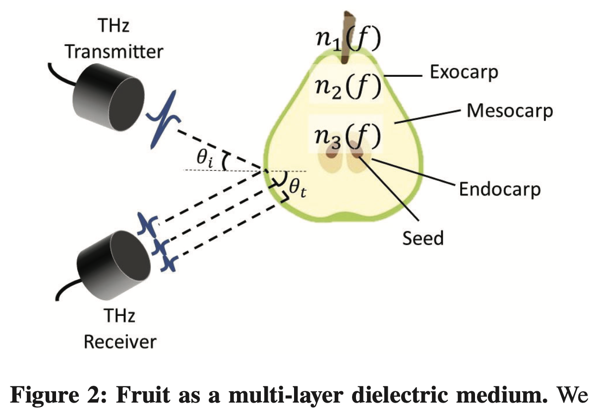
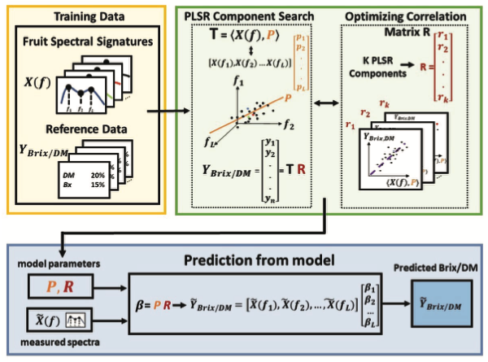
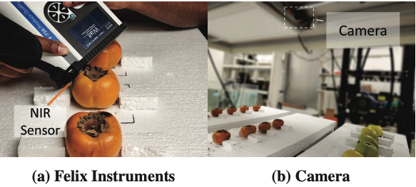
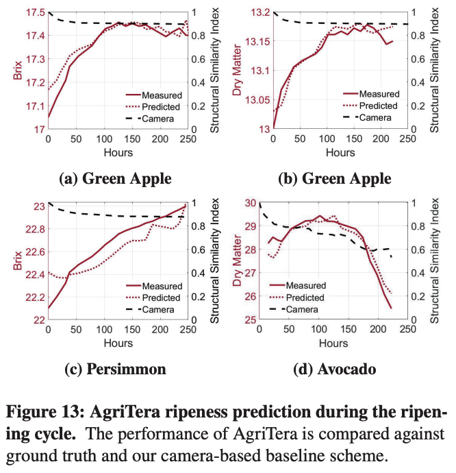
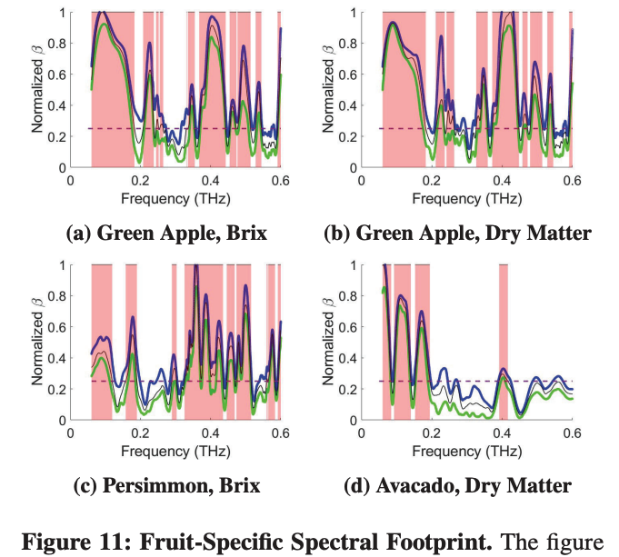

## [AgriTera: Accurate Non-Invasive Fruit Ripeness Sensing via Sub-Terahertz Wireless Signals](https://dl.acm.org/doi/10.1145/3570361.3613275)

* Sayed Saad Afzal (MIT), Atsutse Kludze (Princeton), Subhajit Karmakar (Princeton), Banveer Chandra (Microsoft), Yasaman Ghasempour (Princeton)

* MobiCom 2023

* No link to code

### Motivation and Problem Formulation

* What is the high-level problem?
  * Fruit ripeness monitoring after harvest

* Why is it important?
  * It can significantly reduce fruit waste

* What are the SOTA and the challenges?
  * Today’s quality control processes in sorting lines, distribution systems, and retailers are still mostly random samplingLimited accuracy, expensive labor cost and time overhead
  * Precise chemical measurement by analyzing fruit juice or ethylene gas
    * **Cons:** need fruit slice (invasive) or fruits to be placed in enclosed containers

  * Computer vision techniques using hyper-spectral imaging
    * **Cons:** limited sensitivity as fruit ripen from inside

  * Use wireless signals, such as CSI measurements at Wi-Fi frequencies
    * **Cons:** require exact phase measurement and strict calibration, low accuracy

* What are the key assumptions?
  * Focus on climacteric fruit (keep on ripening after harvest) ripeness

### Method

* What are the major contributions?
  * AgriTera is the first system that provides ripeness profile in sub-THZ

  * Non-invasive, contact-free, accurate

  * Why Sub-THZ (50-600 GHz)?
    * **Large bandwidth** offer higher sensing resolution than microwave and lower millimeter-save

    * **Penetration**: Sub-THZ signals can penetrate through the Peel and carry inference from the internal pulp, unlike light and camera-based techniques

    * **Water-sensitive:** Sub-THZ signals show high sensitivity to water and humidity, which correlates with fruit ripening

    * **Damage-free:** Sub-THZ signals are non-ionizing and does not damage the fruit under exposure

* Metrics (output as a regression task):

  * Dry Matter: the solid component without water
  * Brix: a measure of sugar or sweetness of fruits

* Challenges and solutions

  * **Challenge 1:** The total reflected power only provides a coarse-grained estimation

    * **Solution:** Model fruit as a 3-layer medium, use relative power variation across the wide band
    * Based on simulation, \theta_i = 45 degrees is the optimal position to balance penetration and reflection
      

  * **Challenge 2:** the sensitivity to a particular frequency is unknown, and may vary re. fruit type

    * **Solution:** AgriTera adopts a Partial Least Square (PLS) regression model, finding the most correlated frequency features with the ground-truth ripeness

    * Build different models for each fruit type

      

### Evaluations

* Experimental Setup

  * Implementation: TeraMetrix T-Ray transmitter and receiver
  * 3 types of fruits: **green apples, avocados and persimmons**
  * A total of 30 fruits, took measurements every 12 hours over 10 days, resulting in 200 measurements for each fruit category
  * 180 samples for training, 20 samples for testing
  * Ground truth: Felix Instruments F750 Food Quality Sensor
  * Baseline: Camera

    

* Key results

  * Ripeness estimation performance

  * AgriTera can accurately estimate Brix and Dry Matter in 3 different fruits with an avg normalized RMSE of 0.55%
    

  * Fruit-specific spectral signatures

    

  * Impact of bandwidth: Larger bandwidth brings higher  correlation

### Pros and Cons (Your thoughts)

* Pros: why you think this paper could get in?
  * Very novel idea
  * Solid research and well-motivated, well-explained choices
    * E.g. Why sub THz?
  * When I have questions during reading, they address my questions later
    * E.g., the design of PLS is exactly to address the variations on fruit or orientation
* Cons: unrealistic assumptions, missing elements, missing experiments, etc.
  * The camera baseline setup is suspicious - it seems like it is not SOTA with hyper-spectral imaging techniques