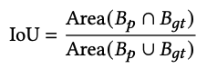

# AutoFed: Heterogeneity-Aware Federated Multimodal Learning for Robust Autonomous Driving

* Tianyue Zheng, Ang Li, Zhe Chen, Hongbo Wang, Jun Luo. NTU, University of Maryland, Fudan University

* MobiCom'23

* No code

### Motivation and Problem Formulation

* What is the high-level problem?
  * The vehicle detection problem in a FL setting
  * Important problem for autonomous driving

* What are the challenges?
  * Data heterogeneity across distributed AVs
    * **Annotation heterogeneity:** noise in labels
    * **Modality heterogeneity:** missing modalities
    * **Environment heterogeneity:** rain, foggy, snowy, etc
      

* What is missing from previous works?
  * Vehicle detection problem - multimodal sensor fusion problem
    * Fuse LiDAR data with other modalities, e.g., PointNet and voxelization
    * Cons: single device

  * FL: Some initial work in [BigDataService’21][AAAI’20]
    * Cons: not a comprehensive consideration on multimodal sensors 

  * What are the key assumptions?
    * Focus on the **bird eye view** of the **vehicle detection problem**
    * Only the modalities of LiDAR and radar

### Method

* Multimodal vehicle detection
  * the lidar, radar, and camera have 3D, bird’s eye-view and front view respectively

  * Difference from previous 2-stage pipeline: Add multimodal sensor alignment and fusion
    

  * RPN: region proposal network and Binary Cross-Entropy loss
    

  * Cross-attention across modality
    
    

* AutoFed
  
  * “AutoFed is the first FL system for multimodal vehicle detection under heterogeneous AV”

  * To address annotation heterogeneity
    * Modify the cross entropy loss to filter out the noisy annotations
      

  * To address modality heterogeneity
    * Use a lightweight autoencoder to impute missing modalities

  * To address environment heterogeneity
    * Smart client selection
      * Server constructs a k-d tree using the received model weights
      * Select the clients that have the min dist
        To its M-1 closest neighbors
      * Intuition: similar as kNN neighbors, select the "closest" clients
        

### Evaluations

* Dataset: the Oxford Radar RobotCar dataset, nuScenes (low-quality radar)
  * Use 50k samples in each dataset, 80% training 20% testing
  * No original ground truths for vehicle detectons, so they create rotate boxes by inspecting the point clcoud data using Scalabel

* 20 clients, each randomly selected 2k non-overlapping samples from the 40k training set
* Other important setups
  * Autoencoder is trained with 20k samples from the Oxford dataset, distinct from those used for training
  * Both lidar and radar feature extractors are composed of 4 convolutional layers with a kernel size of 3 and padding of 1

* Hardware
  * client : NVIDIA Jetson TX2
  * Server: Intel Xeon Gold 6226 CPU and 128G RAM

* Baselines
  * Standalone, standalone+ (centralized)
  * FedAvg, FedProx, FedCor (correlation-based client selection) [CVPR’22]

* Metric: IoU (Intersection over union), Average Precision (AP), Average Recal (AR)
  
* Main results
  * AutoFed surpasses all baselines under certain “checkpoints”
    
    
  * AutoFed converges in less comm. rounds
  * AutoFed has better results in cross-domain transfer
    * Cross-modality: LiDAR+radar > LiDAR only, radar only
    * Diff. env: Foggy, rainy, snowy

  * Ablation studies
  * Hyperparameters
    * Loss threshold
    * Number of selected clients

### Pros and Cons (Your thoughts)

* Pros: 
  * A comprehensive paper
    * Very through discussion on motivation study of the challenges
* Cons: 
  * The setting on bird-view, and not using camera, is questionable
  * Old baselines
    * No baseline for multimodal FL
  * Did not explain the reasons for a lot of designs
  * Use an external tool for labeling ground-truth boxes is questionable - it needs justification on how accurate and reliable that tool is
  * **It seems that the data on each client is sampled randomly?? Then how these heterogeneities are achieved??**
  * Why not showing the AP/IoU trade-off in the results?