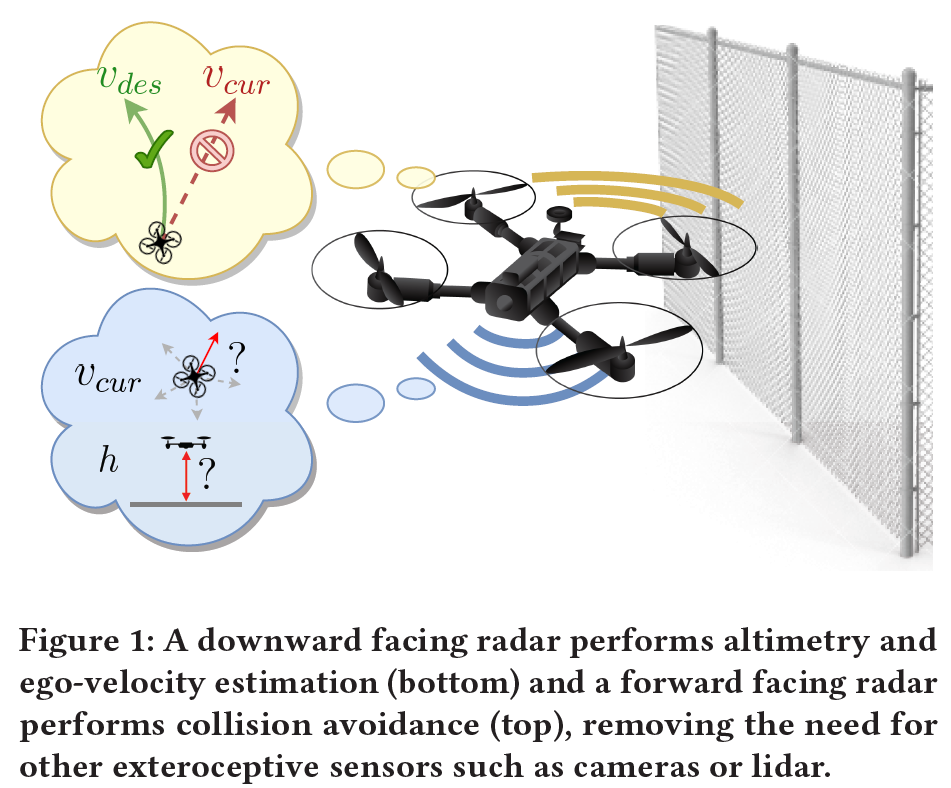
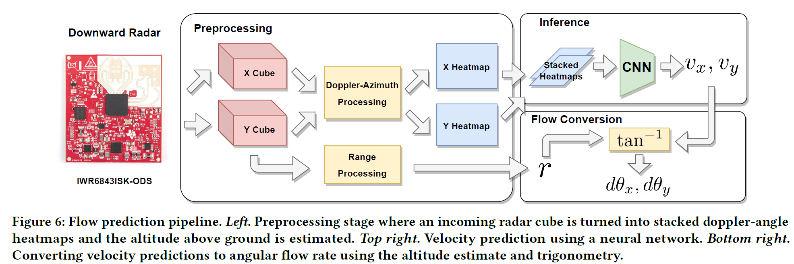
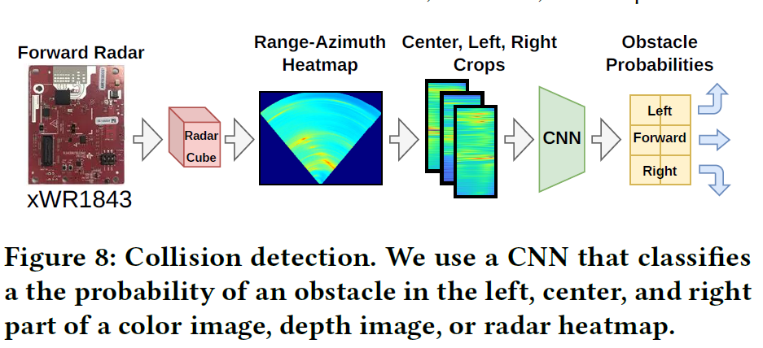
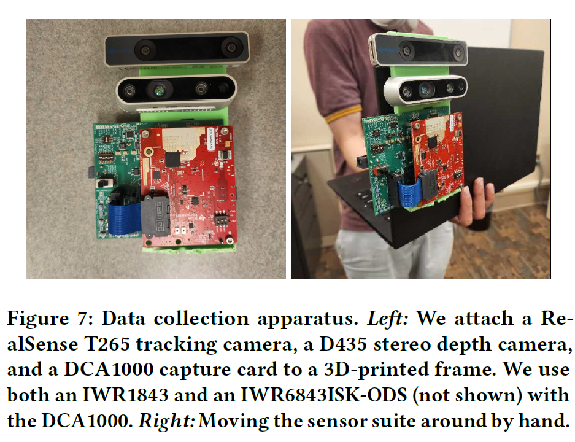

## [BatMobility: Towards Flying Without Seeing for Autonomous Drones](https://arxiv.org/abs/2307.11518)

* Emerson Sie, Zikun Liu, and Deepak Vasisht.

* MobiCom 2023 

* https://batmobility.github.io

### Motivation and Problem Formulation

* What is the high-level problem?
  * Is it possible to fly without relying on optical sensors?

* Contributions
  * Surface-parallel dopplershift phenomenon at mmWave
  * Train CNN to uncover the motion of the UAV with respect to the ground
  * Explore system design tradeoffs and optimizations
  * Evaluate the use of radar as a collision avoidance sensor

* Key Challenges
  * Lack of doppler shift parallel to radar
  * Reduced system overhead

* What is missing from previous works?
  * Optical sensors (camera, LIDAR)
  * Radar point clouds with IMU

* What are the key assumptions? 
  * Max operating range  (3-5m)
  * Max unambiguous velocity (1.5-2m/s)

### Method

* Two MMW Radars (Texas Instruments) 
  * Downward facing - altimetry & ego-velocity estimation
  * Forward facing - collision avoidance
  
    
* Flow-Prediction Pipeline
  
    
* Obstacle Avoidance
  

* Data Collection
  

### Results

* Experiment Description
  * 6x6 m indoor arena 
  * Textureless foam floor
  * VICON capture system
  
  
  

### Pros and Cons (Your thoughts)

* Pros: 
  * Proof of concept for MMW only collision avoidance
  * Useful for optically challenging environments

* Cons: 
  * Updates limited to 40Hz
  * Collisions not completely avoided
