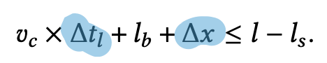
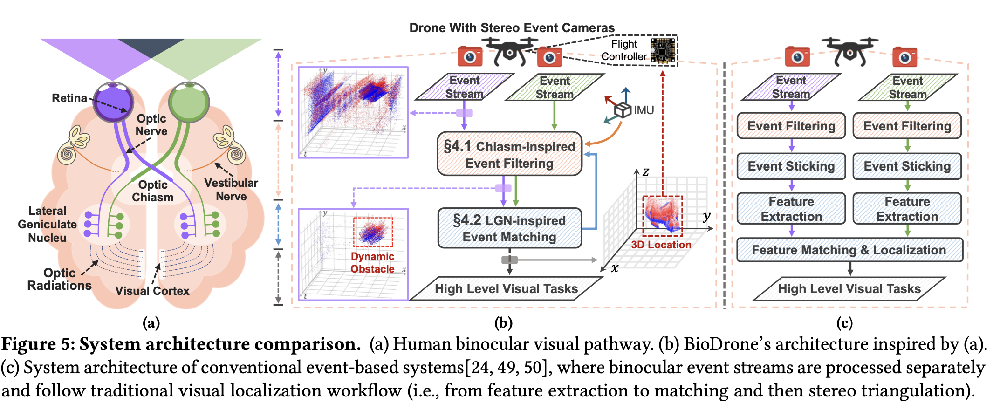
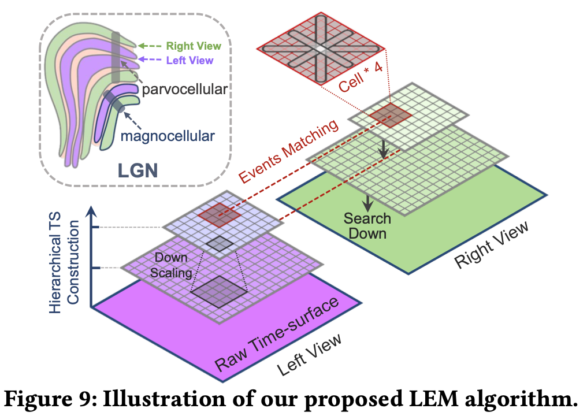
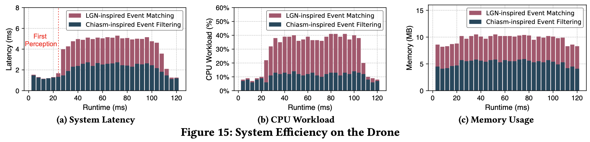

## [Taming Event Cameras with Bio-Inspired Architecture and Algorithm: A Case for Drone Obstacle Avoidance](https://arxiv.org/pdf/2106.09685)

* Jingao Xu, Danyang Li, Zheng Yang, Yishujie Zhao, Hao Cao, Yunhao Liu, Longfei Shangguan. Tsinghua University & University of Pittsburgh

* MobiCom'23

* https://github.com/MobiSense/BioDrone

### Motivation and Problem Formulation

* What is the high-level problem?

  * Fast and accurate obstacle localization in drones, especially high-speed (30m/s) drones
  * **Note: obstacle detection vs. obstacle localization** are two different problems

* Why is it important?

  * Important for drone safety

* What are the challenges?

  * Being fast and accurate at the same time

* What is missing from previous works?

  * Frame-based cameras, depth cameras, mmWave radar, LiDAR or VIO
    * Cons: long latency; require static or quasi-static obstacles

  * Event-based algorithms and systems
    * Cons: only consider obstacle detection; long latency in obstacle localization

  

  

* What are the key assumptions?

  * Drone hardware: similar as Jetson TX2

### Method

* Background

  * Drone obstacle localization problem
    * Two phases: localization and action
      

    * How to understand the problem from a math perspective?
      

  * Event cameras: 
    * Different from normal cameras **(frame-based)**, event cameras sense the pixel-wise intensity changes asynchronously **(event-based)**
    * Event streams format: ek = (x, tk, pk), representing pixel location, time and polarity (moving closer or farther)

* What are the major contributions?

  * Systematically study conventional sensor- and event-camera-based drone obstacle avoidance systems, and reveal the fundamental limitations of these solutions

  * Demonstrate a bio-inspired design, BioDrone, for drone obstacle localization with a stereo event camera setup

  * Fully implement on an industrial drone, and conduct a head-to-head comparison with two SOTA systems

* **Contribution 1**: Challenges and limitations of existing event-based solutions

  * **C1:** Event burst impairs drone obstacle detection under high speed
    

  * **C2:** Event sticking delays drone obstacle localization

    * Conventional vision algorithms cannot directly process event streams, hence existing solutions **stick** all generated events within a time window to an image and them apply these algorithms

    

* **Contribution 2:** BioDrone

  

  * Chiasm-inspired event filtering

    * **Goal:** filter out environment noises, not obstacles

    * Input: event streams from stereo camera, **imu sensors**

    * Output: event streams (hopefully only contains obstacles)

    * Two steps

      * Event filtering based on ego-motion instruction
      * Event filtering based on binocular consistency

      

  * LGN-inspired event matching

    * Inspired by LGN, they use a **hierarchical** event matching algorithm for fast processing

      

    * Given e^l in the left view, use the following constraint to find its matched event e^r

      

* **Contribution 3:** System implementation

  * Xilinx Zynq-7020 FPGA

  * Design PL circuits for acceleration

  * Core isolation for #A1 and #A2

  * DMA for data transfer

    

### Evaluations

* Field study setup: 

  * Indoors and outdoor, 3 flight modes

  * 4 volunteers throw 6 different types of obstacles toward the drone during the drone’s movement

    

* Metrics

  * End-to-end localization latency and error
  * How to obtain ground-truth locations of obstacles?
    * Indoor: use the OptiTrack motion capture system
    * Outdoor: cannot use OptiTrack; Run an advanced yet heavy event-based neural network offline

* Baselines: event-based algorithms and systems

  * Baseline-I [Science Robotics’20]
  * Baseline-II [IROS’18]

* Major results

  * End-to-end localization error

    * BioDrone (7.5cm) is better than Baseline-I (15.9cm) and Baseline-II (20.4cm)

  * End-to-end latency

    * BioDrone (5.1ms) is better than Baseline-I (6.1ms) and Baseline-II (6.3ms)

    

  * System robustness evaluation (e.g., obstacle types)

  * Ablation studies (e.g., contribution of each module)

  * System efficiency study

    * At the beginning 24ms, LEM is not triggered
    * During the 24-110 ms, the drone detects an obstacle and adjusts its own trajectory
    * Memory usage of CEF and LEM are within 5.8 MB and 4.9 MB throughout the process

    

### Pros and Cons (Your thoughts)

* Pros: why you think this paper could get in?
  * Very interesting and solid work
  * I learn a lot in how to put together a high quality paper
* Cons: unrealistic assumptions, missing elements, missing experiments, etc.
  * At least in Baseline-I, their system uses monocular camera, while BioDrone leverages binocular cameras → not exactly fair?
  * Both Baseline-I and Baseline-II are relatively old
  * Did not compare with SNNs