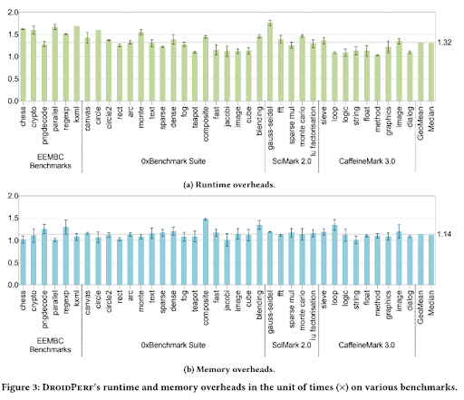
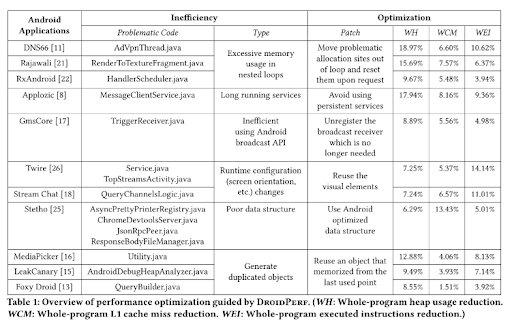

## [DroidPerf: Profiling Memory Objects on Android Devices](https://dl.acm.org/doi/pdf/10.1145/3570361.3592503)

* Bolun Li, Qidong Zhao, Shuyin Jiao, Xu Liu.

* MobiCom 2023 

* https://github.com/Xuhpclab/DroidPerf

### Motivation & Problem Formulation
* What is the high-level problem?
    * To avoid insufficient memory usage.
* Why is it important?
    * Insufficient memory usage increase the runtime of the program.
* What is the major contribution of the paper?
    * They built an Android profiler that allow to point out the problematic memory usage. (Tell the user exactly which objects cause the problem)
* What is missing from previous works?
    * Previous Android profiler cannot.

### Method
* Use the functions from PMU (Hardware Performance Monitoring Unit is on ARM)
    * perf_events(_open)
        * CPU’s measurement counter
            * Instructions retired, Cache miss, 
        * Kernel counters
            * Context switch
            * Page fault
* Use the functions from ART TI (Android Runtime Tooling interface)
    * VMObjectAlloc: return object pointer, type, size
    * ObjectFree: return the pointer and size of the freed object
    * GetStackTrace: return method ID for each stack frame (line mapping)
    * GetLineNumberTable: line mapping table for each method 
    * MethodEntry: returns the method that was entered
    * MethodEntry: returns the method that was exited
* Rank the object list by allocation time or size
* Droidperf can be start with a program / or being applied with the program is running (Interrupt Java threads, then install call back functions to monitor the performance)

### Results
* How they evaluation their method? Dataset, baselines, metric, etc

### Pros: 
* They did reduce the memory usage and runtime. (Save energy)
* What they use is all build-in functions of the PMU and ART TI
* Code on github – open source

### Cons:
* Root access 
* How did they optimize the Benchmark?

