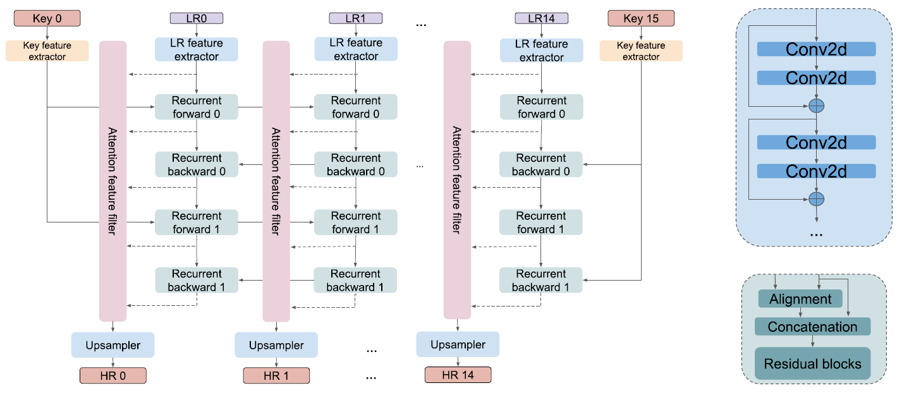
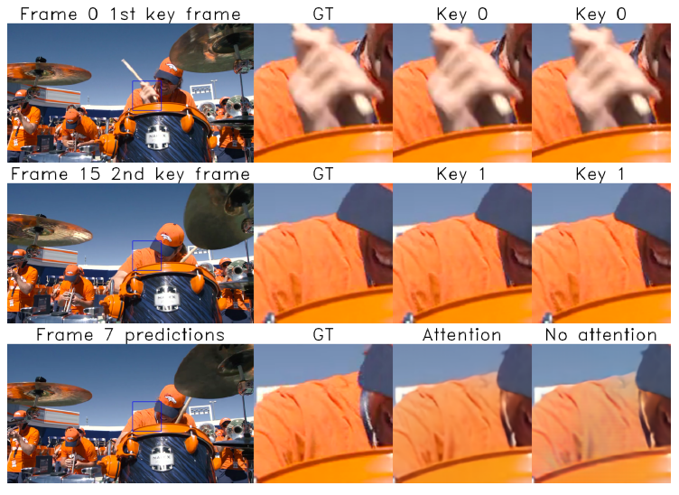
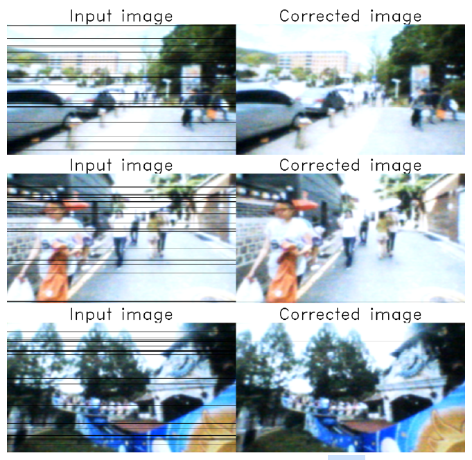
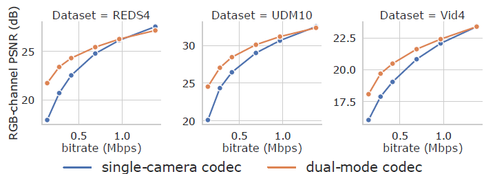
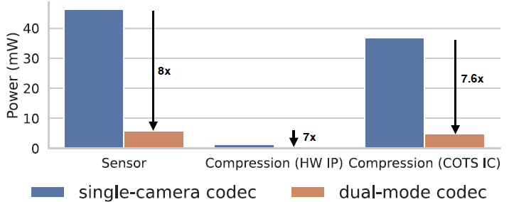
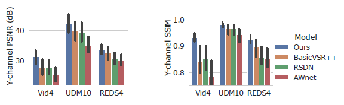
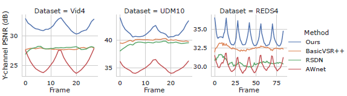

## [NeuriCam: Key-Frame Video Super-Resolution and Colorization for IoT Cameras](https://arxiv.org/abs/2207.12496)

* Bandhav Veluri, Collin Pernu, Ali Saffari, Joshua Smith, Michael Taylor, Shyamnath Gollakota.

* MobiCom 2023 

* https://github.com/vb000/NeuriCam

### Motivation and Problem Formulation

* What is the high-level problem?
  * How to achieve energy efficient video capture

* Key Challenges
  * Reconstruction
  * Mobility
  * Packet Loss

* What is missing from previous works?
  * Energy savings during capture
  * Key frame based projection

* What are the key assumptions? 
  * Edge server not power constrained

### Method

* Two Camera Modes 
  * Low power (1.1 mW) greyscale, low resolution, and noisy
  * High power (100 mW) color, high resolution
    
* Gateway
  * Nearby non-power constrained (plugged in)
    
* Algorithm
  * Neural Network Decoder 
    
  * Attention Mechanism 
    
  * Packet Loss Correction 
    

### Results

* **Dataset:** REDS4, UDM10, Vid4
  
* Metrics
  * Performance evaluation of method with h.264 codec 
    
  * Comparison of sensor and compression power 
    
  * Y-Channel Model Comparison 
    
  * PSNR versus frame number 
    

### Pros and Cons (Your thoughts)

* Pros: 
  * Promising energy savings
  * Low cost
  * Open source

* Cons: 
  * Trust due to lost frames
