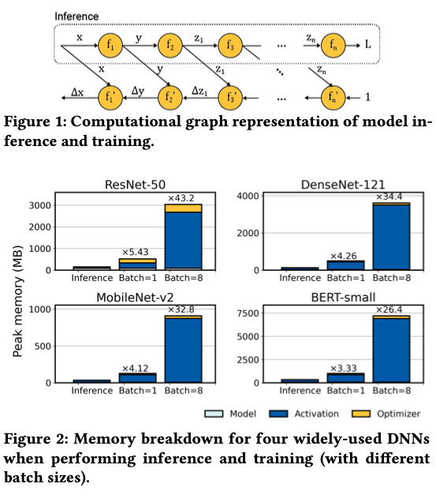
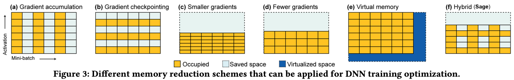
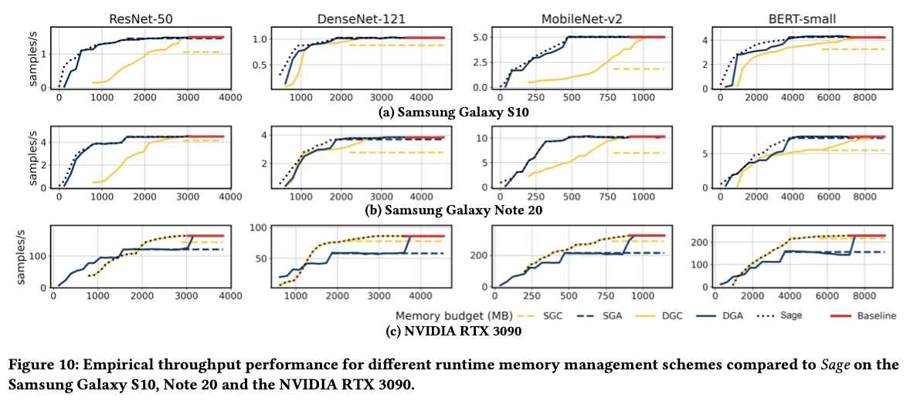
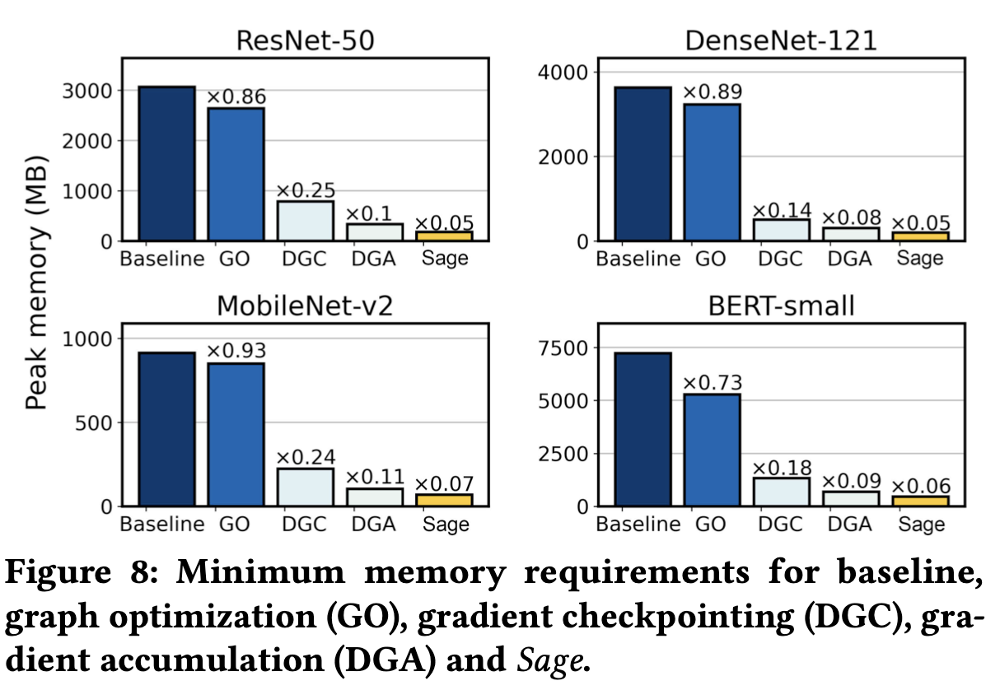

## [Memory-Efficient DNN Training on Mobile Devices](https://dl.acm.org/doi/abs/10.1145/3498361.3539765)

* In Gim and JeongGil Ko, Yonsei University

* MobiSys 2022

* https://github.com/eis-lab/sage

### Motivation

* What is the high-level problem?
  * Limited memory is the major bottleneck for DNN training on mobile devices

* Why is it important
  * Benefits for on-device training: Privacy protection, personalized finetuning, communication savings, etc.

* What are the challenges?
  * (1) Mobile devices are more heterogeneous compared to servers
  * (2) Server-grade GPUs and mobile GPUs exhibit different levels of processing power and memory bandwidth
  * (3) Mobile memory resources are extremely limited and can show high levels of dynamics

* What is the major contribution of the paper?
  * SAGE, a novel framework for memory-efficient on-device DNN training
  * First work to explore graph-level optimization for low-memory training

* What are the key assumptions?
  * They assume training is performed when the device is power-plugged, so energy is not a major concern

### Background

* On-device inference vs. training
  * DNN training is an iterative process **(Automatic Differentiation)**, while inference is not
  * Memory usage can be 5 to 100 times more compared to inference operations depending on the input and batch size
  * *“Roughly, the memory requirement for inference is determined by the largest-sized activation in the network, whereas memory requirements for training are determined by the sum of all activation sizes”*

### Previous Works

* Previous works have attempted various memory reduction methods for DNN training
  * **Gradient accumulation:** Split the mini-batch into smaller units, compute sub-mini-batch, and accumulate them
  * **Gradient checkpointing:** only retin a subset of activations, and re-compute the rest
  * The rest are intuitive from the figure below

### Method

* SAGE optimizes training operation via 4 core techniques

* Separate nodes in automatic differentiation
  * Separate nodes into differentiable operations (DO) and computable operations (CO)
  * This enables the 2nd step

* Graph-level optimization
  * **Operator fusion:** fuse appropriate CO operators
  * **Subgraph reduction:** recompute certain values instead of storing them in memory **-> this is the philosophy of the work, trade latency for memory savings!**

* Operator-level optimization
  * The memory footprint of computation-heavy CO nodes (matrix multiplication and convolution), are manually optimized
* Run-time memory management
  * Based on empirical observation made for mobile GPUs, SAGE prioritize dynamic gradient accumulation until reaching the GPU under-utilization point.
  * Then, SAGE employs gradient checkpointing for further memory reduction

### Evaluations

* Implementation: ~15K lines of Rust code

* DNN models: ResNet-50, DenseNet-121, MobileNet-v2, BERT-small

* Mobile devices:

  * Samsung Galaxy S10 (Exynos 9820) with MaliG76 GPU and 8 GB RAM
  * Samsung Galaxy Note 20 (Snapdragon 865) with Adreno 650 GPU and 8 GB RAM
  * NVIDIA RTX 3090

* Baselines and Methods

  * No mem optimization
  * Static gradient checkpoint (SGC)
  * Static gradient accumulation (SGA)
  * **Dynamic gradient checkpoint (DGC) and dynamic gradient accumulation (DGA)** - proposed in this paper and integrated in SAGE

* No dataset is specified

* Metric: memory throughput (samples/sec), memory budget (MB), latency

* Results

  * DNN training performance

    * Performance in an emulation environment

    * Performance on real devices

      

  * Ablation studies
    

### Pros and Cons (Your thoughts)

* Pros: why you think this paper could get in?
  * Very solid system research
  * I learn a lot about memory engineering in system-level mobile computing research
* Cons: unrealistic assumptions, missing elements, missing experiments, etc.
  * When referring to “empirical observations”, there is no reference
  * Since I’m not familiar with this area, it is hard for me to judge the importance of their novelty