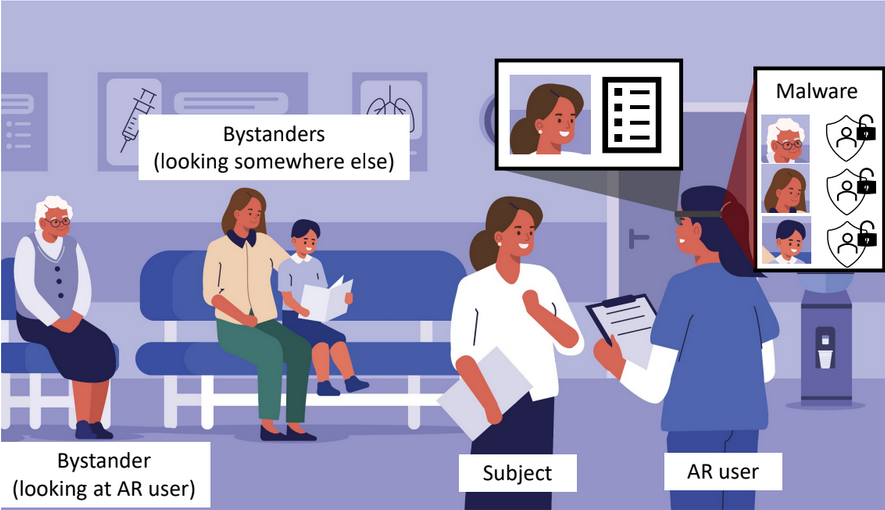
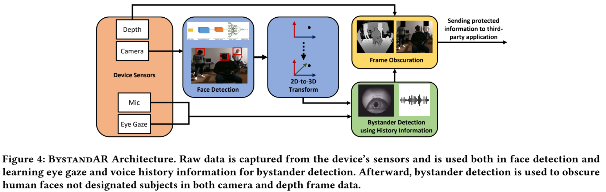
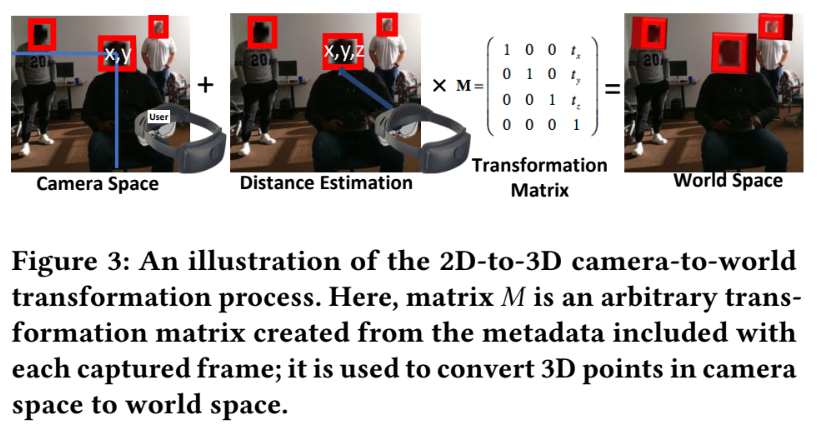
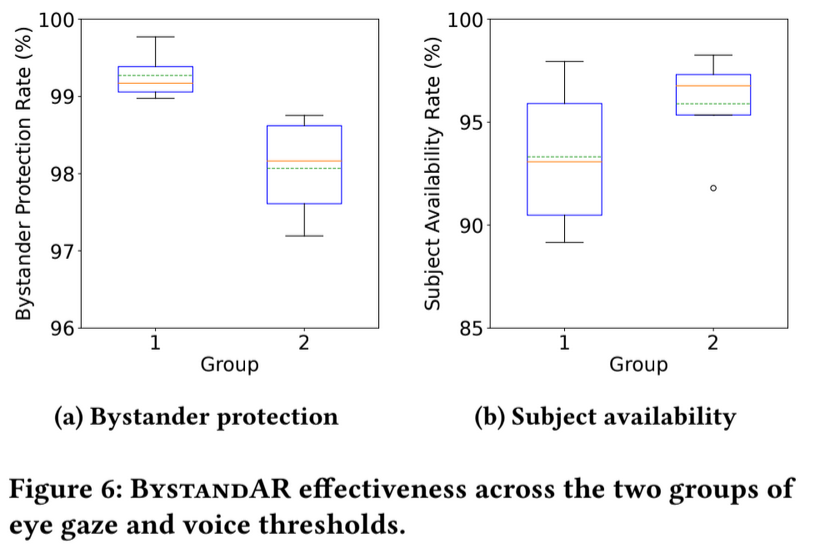
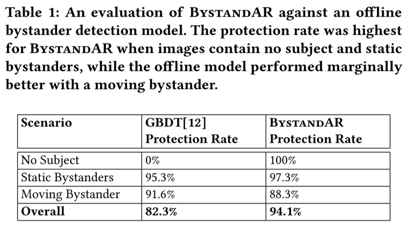
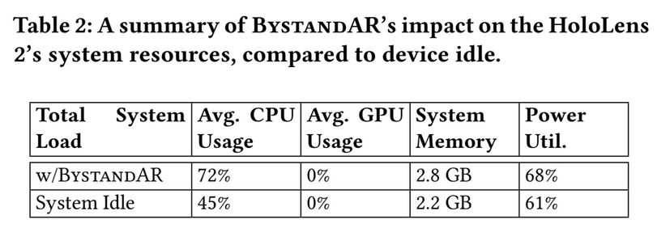

## [BystandAR: Protecting Bystander Visual Data in Augmented Reality Systems](https://dl.acm.org/doi/10.1145/3581791.3596830)

* Matthew Corbett, Brendan David-Jhon and Bo Ji from Virginia Tech, Jiacheng Shang from Montclair State University and Y.Charlie Hu from Purdue University

* MobiSys 2023

* Code not provided

### Motivation and Problem Formulation

* Problem and Importance:
  * AR devices capture data about bystanders -> identify sensitive information (like age, gender, emotion, etc).
  * Unease in Bystanders due to data leaks for malicious intent (BPP: Bystander Privacy Problem).
  * Understanding the problem:
    * AR User: Person wearing the AR device.
    * Subject: People directly interacting with AR User.
    * Bystander: People in the frame of camera and depth of the AR device but not interacting with the AR User.

    

* Contributions:
  * BystandAR: Novel bystander privacy protection system that uses the AR user’s eye gaze and voice data to determine the subject.
  * Leverage spatial awareness and eye gaze tracking, to locate faces -> Don’t need to infer location of the faces at every frame.
  * Experiment to test accuracy, which lead to good results.
* Challenges:
  * User’s gaze may wander off the subject
  * 4 tasks: **Face detection**, eye gaze tracking, subject identification and obscuration, on-device face detection for every frame is too costly.
* Previous Works
  * Explicit Systems: Bystander or user to possess an item, perform a gesture or enroll in a system to expect privacy.
    * Bystander is aware of AR.
  * Implicit Systems: Detect bystanders with implicit information.
    * Bystanders have to presented in frame as expected in the captured image (i.e. looking away of the device).
    * Off-device -> Attack vulnerability when moving info from device to remote location
  * Psychology works:
    * 41%-73% of the time looking at partner. (Lower when listening, higher while talking)
    * < 3.3 sec. looking at strangers before it becomes uncomfortable.
* Assumptions
  * User and subject is making meaningful contact and moving slowly.
  * BystandarAR would need to be implemented at OS level.
  * Users have good intentions.

### Method

* BystandAR: practical solution that protects bystander privacy (preventing malicious AR applications running on AR devices from collecting sensitive information by passing obscured frames) without compromising user experience.

* At each frame:
  * Tracks user eye-gaze and voice.
  * Track face in which the user is currently focused on.
  * Maintain a history of all currently detected faces.
  * If attention > threshold = Subject
  * Face obscuration for faces bellow threshold
* Camera and depth frames are continuously captured.
* Each sampling interval:
  * Face detection for 2D location of faces.
  * Locate the faces in 3D -> 3D bounding box -> 3D anchor for detection.
  * Default: bystanders.
  * Updates binding box (if the faces overlap marks it as the same face).
* Implementation:
  * Unity + Microsoft Mixed Reality Toolkit.
  * Microsoft HoloLens 2.
  * FaceDetector class (built-in library from Microsoft) to detect faces.
  * Sampling Rate = 8 frames.
  * Complete mask for obscuration because blurring can be undone.
* Two thresholds:
  * Eye gaze contact.
  * Eye gaze contact + simultaneous voice contact (Lower).
* Monitor total amount of eye/voice contact for every detected face.
* Allows labeling of multiple subjects and subject has to remain above a threshold.
* Skip every N frames for face detection:
  * Challenge: History of eye-gaze and voice information needs to be accumulated for the same person across frames but faces may move -> Keep track of movements.
  * Lightweight motion tracking technique (optical flow) if the device doesn’t move.
  * SLAM: can be used to track the location of a detected face when the device moves.
  * Estimate the amount of movement and create a bounding box.
* 3D - 2D transformation

  

  * Must locate each face using absolute spatial reference (world coordinate system).
  * If a face overlaps then update the location of the face.
* Face Obscuration
  * Method compares existing facial detections and labels to the current frame.
  * Transforms 3D location to 2D space in the camera -> Obscure both the camera and the depth frame.

### Evaluations

* Dataset: Personalized experimentation with 16 participants
* Metric:
  * Effectiveness:
    * Bystander Protection Rate: Amount of correctly obscured faces compared to the total # of faces corresponding to bystanders.
    * Subject Availability Rate: Total # of subjects faces properly unobscured compared to the total # of subjects faces.
  * Performance: Frame rate.
* Baselines: DeepFace for face detection of bystanders (after the models) and Gradient Boosted Decision Tree (highly accurate offline bystander detection model).
* Offload every 10 obscured frame.
* Fig. 6: Lower thresholds results in lower rates of BPR but higher SAR

* Table:
  * Better overall.
  * GBDT can’t support no subject (person didn’t interact).
  * Both performed worst when the bystander is moving.

* Using sampling interval of 8 frames:
  * Runs at 52.6 FPS  while not requires to obscure frames (apply masks).
  * 60 FPS is recommended by Microsoft.
  * 33.6 FPS when releasing obscuring frames -> Expected because Microsoft’s standard sensor data logging API wll drop to 30 FPS.
    * BystandAR switches between offloading frames based on requests.

* Table 2:
  * CPU load increases 27%.
  * Minimal increase in memory footprint and power consumption.

### Pros and Cons (Your thoughts)

* Pros:
  * Novelty in on-device functionality which adds another layer of security, which is good.
  * Well written and nice discussion of the paper.
  * Variety of experiments even survey to investigate the effect of the model in bystander perception of security.
* Cons:
  * Experiments with very few people (1-3 bystanders) and static (relatively same environment).
  * Test/upgrade in moving environment, because it does really bad in moving environment.
  * Obscuring frames is not lightweight, which goes on the opposite of what is trying to achieve.
  * Missing implementation of OS (right now is developed as a 3rd. party aplication so it can't run in paralel with any other app).
  * Only applied in device-less bystanders, while device bystandars create variability in the results.

