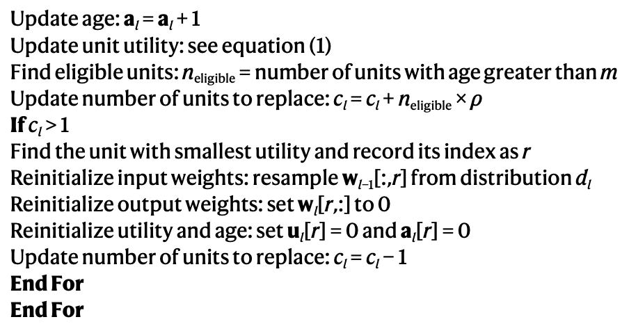

## [Loss of plasticity in deep continual learning](https://www.nature.com/articles/s41586-024-07711-7) [Nature 2024]

* Shibhansh dohare, J. Fernando Hernandez-Garcia, Qingfeng Lan, Parash Rahman, A. Rupam Mahmood, Richard S. Sutton

* Nature 2024

* https://github.com/shibhansh/loss-of-plasticity

### Motivation & Problem Formulation

* What is the high-level problem?
  * Continual learning: deep learning has difficulty adapting to changing data
  * Not well understood: the effect of new data is either too large or too small, and not properly balanced with the old data

* Why is it important?
  * A wide range of real-world applications require adapting to change
  * E.g., Gaming, logistics and control systems

* What are the challenges?
  * **Loss of plasticity:** NN lose their ability to learn from new experiences
  * Different from **catastrophic forgetting**: forget important experiences in the past

* What is missing from previous works?
  * Not effective enough in handling loss of plasticity

* What are the implicit key assumptions?
  * Focus on traditional settings of task incremental and class incremental continual learning
  * Experiments on ImageNet and locomotion simulation is sufficient to study the problem

### Method

* What are the major contributions?

  * A new continual learning algorithm called **continual backpropagation**

    

    

  * Continual backpropagation

    * **Key idea:** re-initialize a tiny proportion of less-used units on each step

    * Some important techniques

      * Definition of utility of the weights

        * Magnitude of the product of units’ activation and outgoing weight

        * Units with smallest utility are re-init

          

    * Other important hyperparam

      * Maturity level m: do not re-init weights in m number of updates
      * Fraction of units to re-init: \rho=1e-5

### Evaluations

* Experimental Setup

  * Datasets: Continual ImageNet, class-incremental CIFAR-10, RL in an ant locomotion simulator

    

    

    

  * Baselines

    * Normal backpropagation
    * L2 regularization
    * Shrink and Perturb [NeurIPS’20]: L2 regularization plus small random changes in weights at each step

  * Metrics: accuracy for ImageNet, reward for RL

* Key takeaways

  * Continual backpropagation is able to learn continually with more neurons that are “active”

    

    

### Pros and Cons (Your thoughts)

* Pros: why you think this paper could get in?
  * Very interesting insights and discussion
  * Learn how to write a Nature paper
  * The use of ImageNet dataset, rather than a LLM-relevant task, is well justified