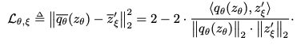
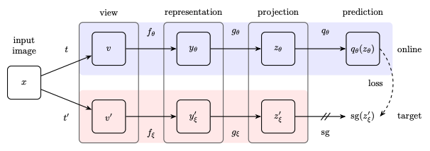
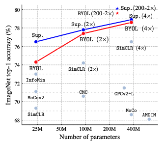
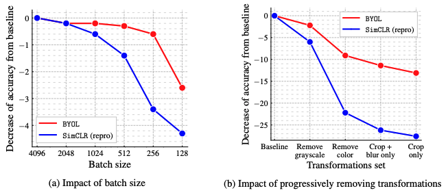
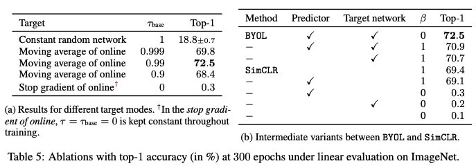

## [Bootstrap Your Own Latent - A New Approach to Self-Supervised Learning](https://proceedings.neurips.cc/paper/2020/hash/f3ada80d5c4ee70142b17b8192b2958e-Abstract.html)

* Jean-Bastien Grill , Florian Strub , Florent Altché , Corentin Tallec , Pierre H. Richemond, Elena Buchatskaya , Carl Doersch, Bernardo Avila Pires, Zhaohan Daniel Guo, Mohammad Gheshlaghi Azar, Bilal Piot, Koray Kavukcuoglu, Rémi Munos, Michal Valko

* NeurIPS 2020

* https://github.com/deepmind/deepmind-research/tree/master/byol

### Motivation and Problem Formulation

* What is the high-level problem? Self-supervised Learning using contrastive Learning
* Previous works
  * Generative methods: auto encoding, adversarial learning
  * Computationally expensive (on pixel space)

* Discriminative methods
  * Contrastive learning: enhance similarity between “positive pairs”, discriminating over “negative pairs”
  * Existing contrastive learning methods need careful treatment of negative pairs, relying on **large batch sizes (SimCLR), memory bank (MoCo), augmentation techniques**

### Method

* Bootstrap Your Own Latent (BYOL)
  * Use a moving average of online parameters as the teacher network, which avoids collapsed solutions
  * Use a predictor to the online network
  * Loss function: the MSE loss between predicted representation (online) and the given representation (target) from the moving-average model
    

* Key motivation: **inspired from deep RL From a given representation, referred to as target, we can train a new, potentially enhanced representation, referred to as online, by predicting the target**
  

### Evaluations

* Pretrain on ImageNet, evaluate on other datasets (Cifar10, Cifar100, Caltech101, etc.)

* Metric: top-1 and top-5 accuracy

* Baseline: SimCLR, MoCo

* Accuracy results under linear evaluation, semi-supervised training and transfer learning
  

* Ablation studies

  * Robustness under various batch sizes and augmentations

    * Why? The “variation” does not come from negative samples and augmentations. It comes from the moving-average teacher network

    

  * Contributions of various components: Insights and discussions on why each component is needed
    

### Takeways

* **Very fast development of self-supervised learning methods**
  * SimCLR (2020), MoCo (2020) → SwAV (2020), BYOL (2020) → Siamese (2021), Barlow Twins (2021), HSIC (2021) → ?
  * Most methods use a combination of positive over negative pairs, stop gradient, moving average update…Siamese, BYOL in fact have very “trivial” technical contributions
* **How to write an impactful paper in spite of “trivial” technical contributions?**
  * Provide insights on why the “trivial” addon is important
  * Comprehensive ablation studies to support the argument