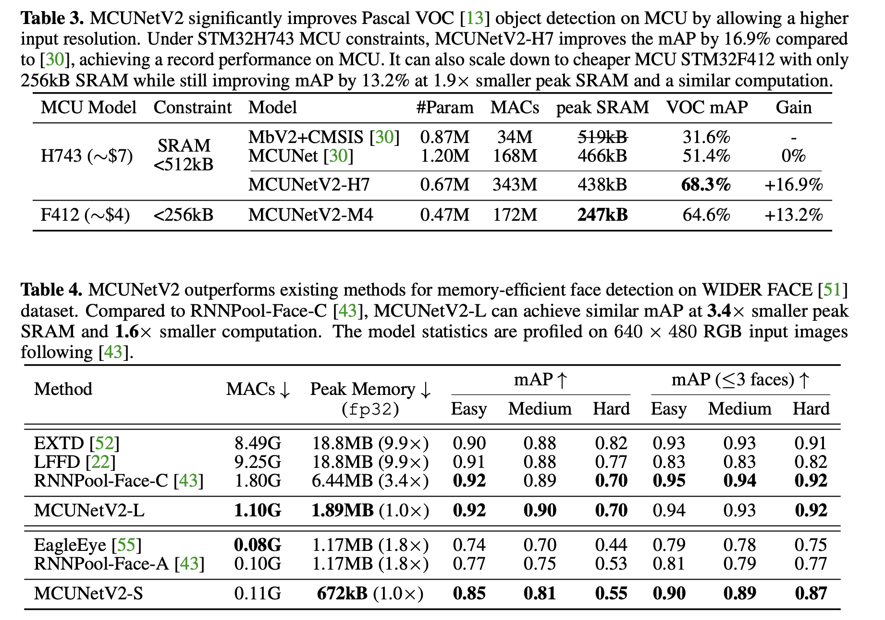

## [MCUNetV2: Memory-Efficient Patch-based Inference for Tiny Deep Learning](https://arxiv.org/abs/2110.15352) 

* Ji Lin, Wei-Ming Chen, Han Cai, Chuang Gan, Song Han

* MIT, MIT-IBM Watson AI Lab

* NeurIPS, 2021

* https://github.com/mit-han-lab/tinyengine

### Motivation and Problem Formulation

* What is the high-level problem?
   * Memory bottleneck on MCU inference
* Why is it important? 
   * Can’t perform memory-intensive task such as object detection
* What are the challenges?
   * The memory bottleneck of inference greaetly exceeds the MCU memory
* Missing in previous works:
   * Memory optimization method on inference doesn't focus on MCU's memory bottleneck
*  High-level goal:
   * inference on MCU with low peak memory
* What are the key assumptions?
   * Only the first few blacks have high peak memory

### Method

* What are the major contributions?
    * Propose patch-by-patch execution
    * Proposed receptive field redistribution to avoid computation overhead
    * Design the model and its inference scheduling with neural architecture search
* What is the technical problem? What are the input and output of the problem?
    * Memory bottleneck on inference bigger than MCU memory
    * Input: classification models
    * Output: optimized memory efficient inference models
* What they propose to solve the problem?
    * They propose patch-by-patch inference, redistribution of the receptive field, and joint Neural architecture & inference scheduling. 
* Why this works?
    * These methods work because they directly split computation into chunks to cut the peak memory. They also reduce the number of computation in memory intensive stage and compensate it in later stages. They also integrate those methods to find the optimal architecture. 
* Algorithm, architecture, solution
    * Patch-by-patch Inference
        * For the initial stage store the activation of one patch & activation of the output activation
    * Redistribute Receptive Field
        * Reduce the receptive field of the patch-based initial stage
        * Increase the receptive field of the later stage 
    * Joint Neural Architecture & Inference Scheduling
        * Backbone optimization, inference scheduling optimization, joint search

### Evaluations

* Implementation Platform: STM32F412 (Cortex-M4, 256kB SRAM/1MB Flash), STM32F746 (Cortex-M7, 320kB SRAM/1MB Flash), STM32H743 (Cortex-M7, 512kB SRAM/2MB Flash)

* Dataset: ImageNet, Virsual Wake Works, PascalVoc, WIDER FACE

* Metric: MACs, peakSRAM, VOC mAP, Gain, peak memory

* Baseline: EXTD, LFFD, RNNPool-Face-C, EangleEye, RNNPool-Face-A

* Key improvemets of MCUNetV2 compared with the baselines

  
   

### Pros and Cons (Your thoughts)

* Pros: Inference scheduling robust at reducing computation overhead
* Cons: Vague about how is joint search actually implemented. 

