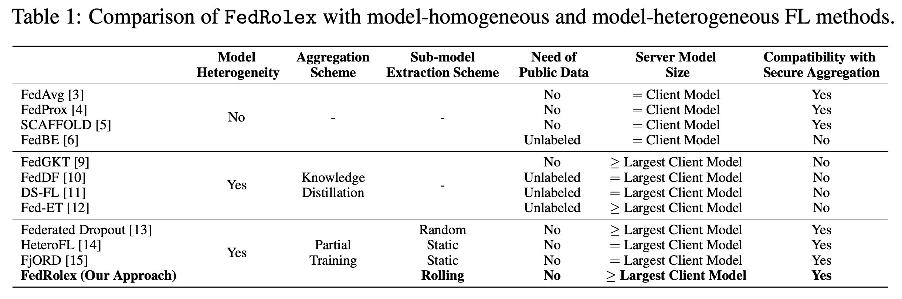
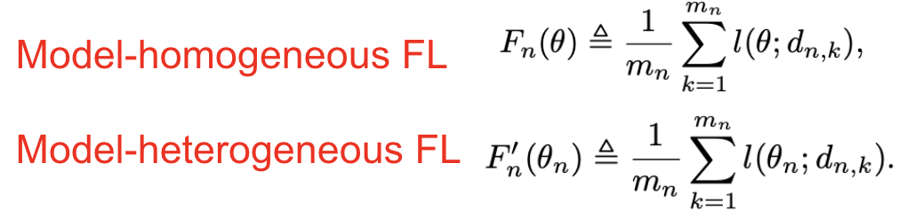
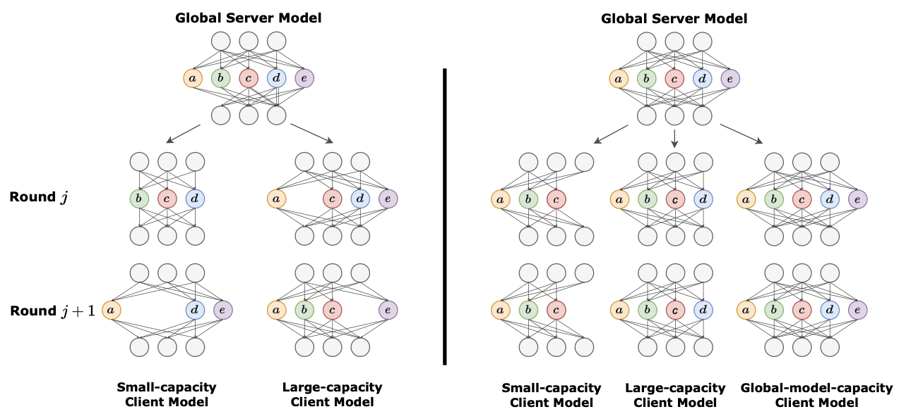
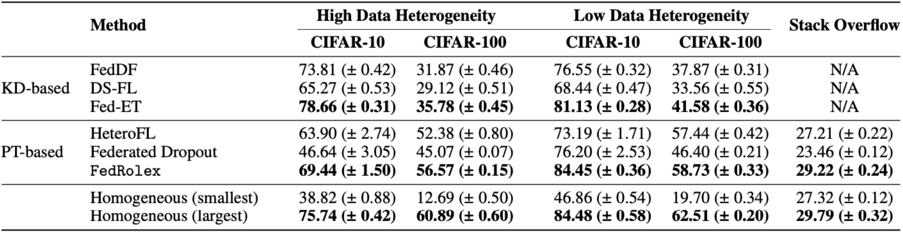
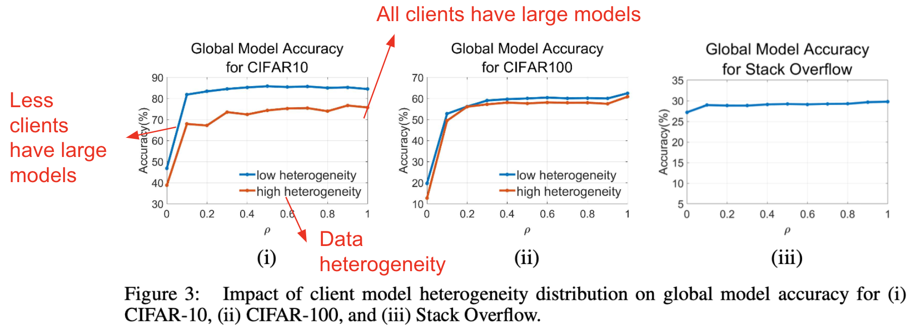

## [FedRolex: Model-Heterogeneous Federated Learning with Rolling Sub-Model Extraction](https://arxiv.org/abs/2212.01548)

* Samiul Alam, Lauyang Liu, Ming Yan, Mi Zhang. Michigan State University, The Ohio State University, Google Research, The Chinese University of Hong Kong, Shenzhen.

* NeurIPS 2022

* https://github.com/AIoT-MLSys-Lab/FedRolex

### Motivation and Problem Formulation

* What is the high-level problem?

  * Model heterogeneity in FL problem (as a result of device heterogeneity and prevalence of large models)

* What are the challenges?

  * Distributed and collaborative training under model heterogeneity; resource constraint

* What is missing from previous works?

  * Previous works attack the problem using knowledge distillation-based method and partial training-based method

    * **Knowledge distillation-based method:** original proposed for model compression (distill knowledge from a large teacher model to a small student model)
      * Although having multiple variants, logits matching is one common form [[Hinton 2015\]](https://arxiv.org/abs/1503.02531)
        
        * **Pros:** require no label (in some cases), allow completely different models
        * **Cons:** require public dataset; need to send logits -> violate secure aggregation protocols in FL (?)

    * Partial training-based method: each client trains a smaller sub-model extracted from the larger global server model
      * Previous works: Federated Dropout (random sub-model extraction), HeteroFL, FjORD (static sub-model extraction)
      * **Cons:** the parameters of global server model are not evently trained -> this makes the server model vulnerable to the inconsistency between client model and server model (data heterogeneity + model heterogeneity)

  

### Method

* Formulation of the model-heterogeneous FL problem

  * Key param: \beta_n: proportion of nodes extracted from each layer in \theta to form \theta_n

    

  * FedRolex: rolling window-like sub-model extraction
    

  * Compare with random and static sub-model extraction
    

### Evaluations

* **Dataset:** 
  * CIFAR-10, CIFAR-100 (PreResNet-18, preactivated ResNet-18, non-IID), 
  * Stack Overflow (next-word prediction, 342K clients, 3-layer transformer)

* **Baselines:** Federated Dropout, HeteroFL; FedDF, DS-FL, Fed-ET
* Implementation: PyTorch + Ray, 8 NVIDIA A6000 GPUs
* What are the key improvements & takeaways
  * **Performance comparison with SOTA model-homogeneous and model-heterogeneous FL**
    * FedRolex outperforms the baselines in the majority of cases (except Fed-ET on CIFAR-10 under high data heterogeneity), and reduces the gap between model-hetero and upper-bound model-homo settings
      
    * **Impact of client model heterogeneity & data heterogeneity**
      * CIFAR-10 shows larger gap between high and low data heterogeneity -> global model accuracy is bottlenecked by the level of data heterogeneity
      * Having a small fraction of large-capacity models boots the global model accuracy
        

### Pros and Cons (Your thoughts)

* Pros: 
  * Nice review on the related works, and nice discussion (knowledge distillation vs. partial training)
  * Very comprehensive experiments
* Cons: 
  * Some explanations are missing: what does secure protocol mean? What is FL inclusiveness?
  * Idea is simple and the key novelty is relatively weak