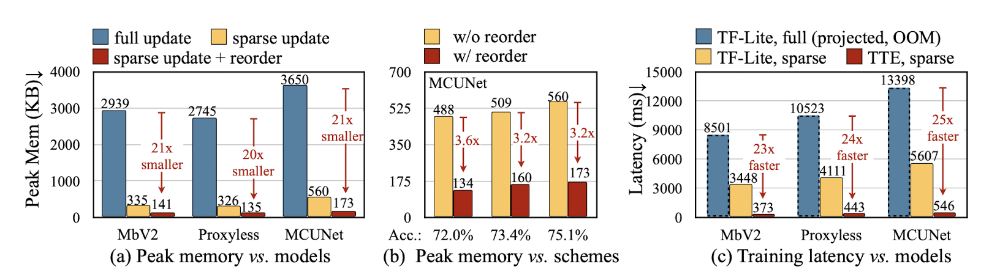

## [On-Device Training Under 256KB Memory](https://arxiv.org/pdf/2206.15472)

* Ji Lin, Ligeng Zhu, Wei-Meing Chen, Wei-Chen Wang, Chuang Gan, Song Han
* MIT, MIT-IBM Watson AI Lab
* NeurIPS 2022
* https://github.com/mit-han-lab/mcunet?tab=readme-ov-file

### Motivation and Problem Formulation

* What is the high-level problem?

  * On-device fine-tuning has a large memory footprint on memory-constraint MCU

* What are the challenges?

  * Edge deep learning inference frameworks don’t support back-propagation
  * Current low-cost transfer learning algorithms have low arraucy
  * MCU doesn’t have an operational system

* What is missing from previous works?
  * Quantized graphs of neural networks are hard to optimize due to low bit-precision and lack of normalization
  * Limited hardware resource does not allow full back-propagation

### Method

* Quantization-Aware Scaling (QAS)
  * Automatically scale the gradient of tensors with different bit-precisions

* Sparse Update
  * Skip the gradient computation of less important layers and sub-tensors
  * Develop an automated method based on contribution analysis to find the best update scheme under different memory budgets

* Tiny Trianing Engine(TTE)
  * Offloads auto-differentiation to the compile-time
  * Support advanced graph optimization: graph pruning and reordering

### Evaluations

* Dataset
  * Cars, CIFAR 10, CIFAR-100, CUB, Flowers, Food, Pets, VWW dataset

* Baselines
  * Optimized on MbV2, Proxyless, MCUnet

* Implementation
  * STM32F746 MCU (320KB SRAM, 1MB Flash)

* Major Results
  * Their method reduces peak memory usage by 21x compared to all original baselines with sparse update and reorder
  * With MCUnet, under the same accuracy their code could reduce peak memory to about 3x
  * Training latency is low with Tiny Training Engine and sparse update
  
  

### Pros and Cons (My Thoughts)

* Pros
  * Pruning gradient and frozen weights sound practical and easy to implement

* Cons
  * Missing some details for the implementation of things such as how the evolutionary search works with sparse update

