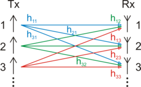
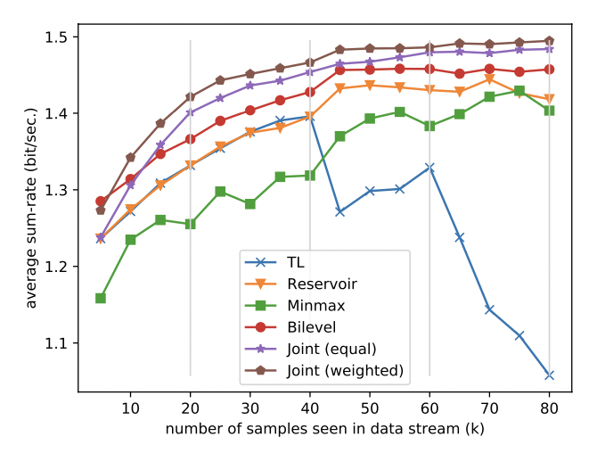

## [Learning to Continuously Optimize Wireless Resource in a Dynamic Environment: A Bilevel Optimization Perspective](https://arxiv.org/abs/2105.01696)

* Haoran Sun, Wenqiang Pu, Xiao Fu, Tsung-Hui Chang, and Mingyi Hong

* MLWiNS funding

* Extension of their paper in ICASSP 2021

* Link to code: https://github.com/Haoran-S/TSP_CL

### Motivation and Problem Formulation

* **Motivation:** In wireless communication applications, traditional DNN does not adapt to dynamic environments (underlying distribution shift) and suffers from catastrophic forgetting; also, the training can be time and memory consuming
  

* **Challenges:** efficiently, seamlessly, quickly, continually

* **Previous works**

  * Deep learning for wireless communication

    * **End-to-end learning, like a black-box model:** WMMSE, a classical optimization algorithm; convolutional neural networks, graph neural networks, reinforcement learning

    * **Deep unfolding:** unfold existing optimization algorithms iteration by iteration and approximate the per-iteration behavior by one layer of the neural network. Existing works include:

      * Unfolding of the iterative soft-thresholding algorithm (ISTA)
      * Unfolding of the non-negative matrix factorization methods
      * Unfolding of the alternating direction method of multipliers (ADMM)

      Recently, unfolding has been used in MIMO detection, channel coding, resource allocation, channel estimation, and beamforming problems.

  * **Continual learning:** existing works can be classified into the following categories
    * Regularization-based methods -> **introduce trade-off between the performance of old and new tasks**
    * Architecture expansion -> **require the knowledge of task boundaries**
    * Memory-based methods -> usually require task boundaries. Recent works proposed boundary-free methods by reservoir sampling, or diversity-based sampling
  * Related methods
    * Online learning: adapt to most recent data and is likely to suffer from catastrophic forgetting
    * **Transfer learning:** by applying the gained knowledge from the original dataset, the goal is to let the model adapt to the new dataset quickly with a few samples (few-shot learning). However, the knowledge from the original model may be altered or overwritten

### Method

* **Technical problem:** power control in MIMO as an example
  

  

  * Suppose there are K transmitter and receiver pairs, h_{ij} denotes the channel degradation between transmitter i and receiver j
  * **Variables:** the transmission power at each transmitter, p_1, …, p_K
  * **Objective:** maximize the weighted sum-rate (data rate)
  * We can solve the optimization problem using ML techniques, by defining a neural network \Theta, and a MSE loss function. This is a supervised learning problem, using the reference solution generated by WMMSE algorithm.
    

* Solution:

  * Formulate the optimization and memory selection in to a bilevel optimization problem
    * **Key idea:** assign higher weights to “hard” samples, and keep the “hardest” samples in memory
    * **Assumption:** If the model can perform well on “hard” samples, it should work well for the rest
    * Similar to the idea of robust optimization

  * Relax the bilevel optimization problem into an **unconstrained** and non-convex problem
  * Reformulate the bilevel problem into a compositional optimization problem
  * Solve the reformulated problem with stochastic gradient descent
  * Provide theoretical analysis on the convergence, under gounded gradients and unbiased sampling assumptions

### Evaluations

* Implementation: Python 3.6, PyTorch 1.6.0 and MATLAB R2019b
* **Dataset:** Randomly generated channels, DeepMIMO (power control), beamforming dataset
* **Baselines:** Transfer Learning, Continual Learning+Reservoir sampling, Mini-max (Robust Optimization), Joint training (assume having access to all training data)
* **Metrics: ** accuracy at various episodes, training time of all episodes
* Results
  * Their proposed fairness based method obtains reasonable sum-rate for all three episodes, while the performance of both TL and reservoir sampling degrades when encountering test data from old episodes
  * Their proposed method approaches the joint training method that has access to all data. It could even surpass the joint training method, which can be attributed to the slow adaptation to new episodes of the joint training baseline (treat all samples equally)
    

### Pros and Cons (Your thoughts)

* **Pros:** nice theory and problem formulation
* **Cons:**
  * Did not evaluate the adaptation time, but only offline training time
  * Use a supervised learning method. Is WMMSE time-consuming? -> This may make the method not suitable for online adaptation
  * The assumption of "hard" samples will remain "hard" samples need to be verified. This might not be true for general lifelong learning problem, but might be true for this specific wireless communication task

### Takeaways

* To apply HD on this type of optimzation problem, we need to understand HD from an optimization view
* While the authors mentioned there is an unsupervised version of solution, they did not provide any analysis or results on its performance