## [Enhancing Autonomous Driving Systems with On-Board Deployed Large Language Models](https://arxiv.org/abs/2504.11514) [RSS’25]

* Nicolas Baumann, Cheng Hu, Paviththiren Sivasothilingam, Haotong Qin, Lei Xie, Michele Magno, Luca Benini

* RSS'25

* https://github.com/ForzaETH/LLMxRobot

### Motivation and Problem Formulation

* What is the high-level problem?

  * Autonomous driving following human’s instructions

* Why is it important?

  * Fully autonomous vehicles is a fundamental problem starting 2010s

* What are the challenges?

  * Traditional robotic algorithms for perception, planning and control
    * Cons: sensitive to heuristics and parameters tuning
  * Data-driven ML approaches rely on extensive training data
    * Cons: edge-case scenarios are underrepresented in datasets

* What is missing from previous works?

  * Existing robotics+LLM works either focus only on low-level controls and lack robotic reasoning, or limited to discrete action space ([29])

  * Existing works rely on cloud-based GPT4

    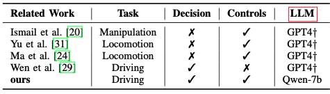

### Method

* What are the major contributions?

  * **Knowledge-based decision making:** proposed a framework for leveraging LLMs to interpret robotic data conditioned on human desired driving behavior

  * **Human-Machine Interaction:** two LLMs, one for identifying whether the driving behavior is adhering to human prompts, the other for adjusting cost and constraint parameters in the low-level Model-Predictive Control (MPC) controller

  * **Embodied AI on the Edge:** Deploy LLMs on the edge after quantization

    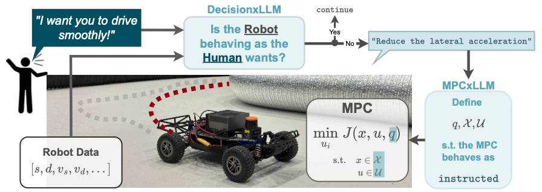

* What they propose to solve the problem?

  * **DecisionxLLM - Decision Making with Robotic Data**
    * Input: robotic data and human-defined driving behavior prompt
    * Output: whether the robot adheres to the specific behavior

  * **MPCxLLM - Controller Interaction**
    * Input: natural language instructions
    * Output: MPC parameters

* **DecisionxLLM - Decision Making with Robotic Data**

  * Enhanced with RAG and LoRA finetuning

    * Retrieval Augmented Generation
      * Some safety-critical and robot-specific information, such as speed limits and distance threshold

    * Both using synthetic data generated from GPT-4o

    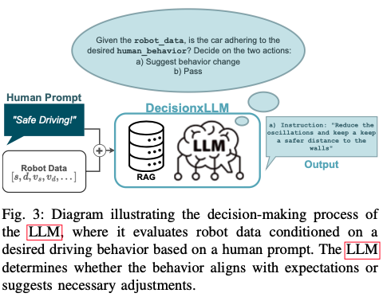

* **MPCxLLM - Controller Interaction**

  * Enhanced with RAG and LoRA finetuning

  * MPC formulation

    * LLM adjustable parameters
      * Weight parameters q
      * Constraints on states X
      * Control inputs U, including steering angle difference and longitudinal acceleration
      * Boundary inflation \epsilon, ensuring the vehicle is driving within the road boundaries

    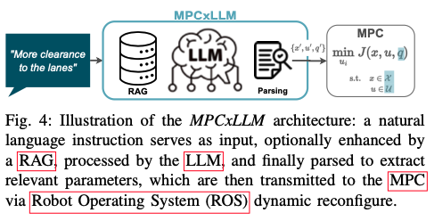

* Examples

  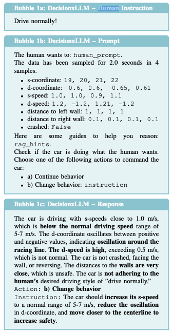

  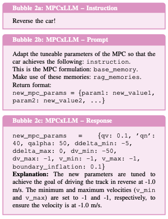

### Evaluations

* Experimental Setup

  * Open-source hardware implementation with simulator

    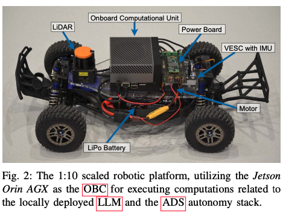

  * Evaluating DecisionxLLM

    * **Dataset:** 200 labeled data according to 8 example human prompts, by humans
    * **Metric:** binary classification accuracy
    * **Baseline:** GPT4o, Phi3-mini, QWen2.5

  * Evaluating MPCxLLM

    * **Dataset:** closed-loop simulation environment of the open-source hardware
    * **Metric:** RMSE compared to the desired path
    * **Baseline:** MPC (baseline), GPT4o, Qwen2.5, Phi3-mini

  * Computational efficiency

    * **Hardware:** RTX 3090 & Jetson Orin AGX
    * **Metric:** latencyPhysical deployment

* Main results

  * DecisionxLLM

    * Decision-making accuracy is improved by up to 10.45% on local LLMs

      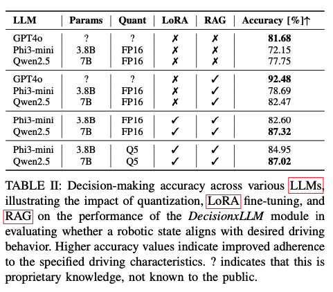

  * MPCxLLM

    * Enable an increase in control adaptability by up to 52.2%

      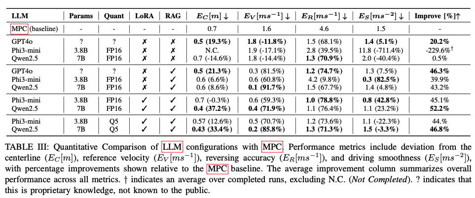

  * Latency

    * With Q5 quantization, inference latency is around 4.8s on Jetson Orin AGX

      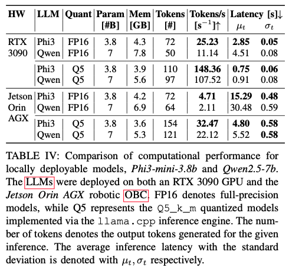

* Physical deployment

  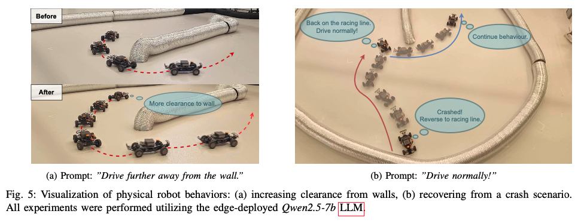

### Pros and Cons (Your thoughts)

* Pros: why you think this paper could get in?
  * Interesting paper, being the first of a comprehensive study of LLM+robotics
  * Key philosophy: driving is not solely a data-driven problem but partially relies on knowledge-driven reasoning
* Cons: unrealistic assumptions, missing elements, missing experiments, etc.
  * They evaluated each component individually, but not end-to-end
    * In end-to-end, the error can accumulate
    * Particularly, in the decision making part, only LLM baselines are compared. The highest accuracy achieved by their method is 87.02%. How do you deal with the 13% wrong decisions?
  * Human prompts are simple, limited to 8 example prompts
  * Some parts in writing are inconsistent (no DeepSeek results)