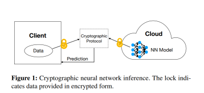
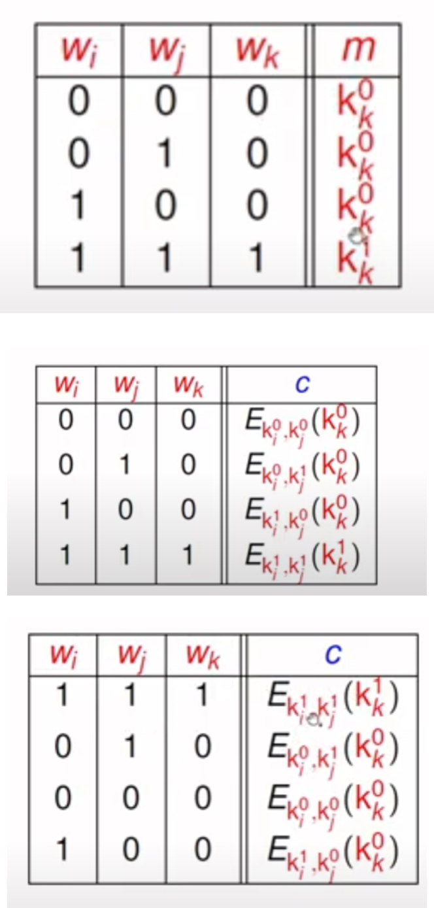
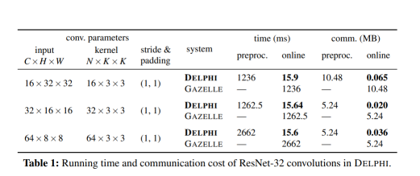
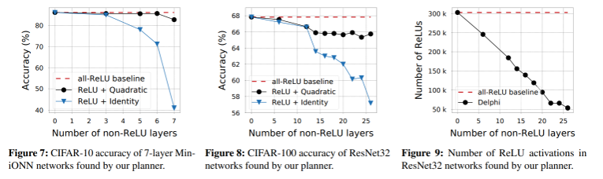

## [DELPHI: A Cryptographic Inference Service for Neural Networks](https://www.usenix.org/system/files/sec20-mishra_0.pdf)

* UC Berkeley

* USENIX-Security 2020

* https://github.com/mc2-project/delphi

### Motivation and Problem Formulation

* **Motivation**: 
  * DNN are widely used, but privacy concerns are increasing. 
  * Either personal information or proprietary model is leaked.

* **Related Works**
  * Multiparty communication (MPC)
  * Homomorphic encryption or secure sharing
  * Problems: computationally expensive and big communication overhead
* **Contributions:**
  * Co-design of cryptography and ML
  * Planner to adjust ML algorithm and balance performance-accuracy tradeoffs

### Background
* Background on the problem
  * Each NN layer is made of (at least) a linear and a non-linear sublayer
  * Traditionally, we use homomorphic encryption for linear sublayer
  * Use garbled circuits for non-linear sublayer

* Additional explanation of garbled circuits
  * Consider a simple example of an AND gate
  * We encrypt both inputs and the output
  * We encrypt the (input+output) as a ciphertext using double-key symmetric encryption
    * You can only decrypt one row with one key
  * We permute the ciphertext randomly so that the receiver does not know the order
  * We send the c and our decision (Ki) to receiver, so that the receiver can only decrypt those with Ki
    * But since receiver does not know what Ki represents, he does not know our data
  * Reference: https://www.youtube.com/watch?v=S4CP1MHCE2Q

### Method
* **Security+ML**
    * To reduce the overhead from Linear Homophobic Enncryption (LHE) on linear sublayer, the authors introduce a preprocessing stage:
	* For input x, generate some noise r in the preprocessing stage and send LHE(r) to the server
        * Server returns w*r
        * Whenever the client needs to send real information, it does not need LHE.
        * Directly send x-r to the server, and get w*(x-r) back.
        * Now add w*(x-r)+w*r to retrieve w*x

    * To reduce the overhead from non-linear layer, the authors proposed to use a ReLu approximation (quadratic)
      * Not going into details because it's shown to be not effective on (most) models
    * Planner to adjust ML algorithm and balance performance-accuracy tradeoffs
      * Inspired by neural architecture search (NAS)
      * Basically try to find an optimal solution to replace some ReLU with approximation
      * I'm not going over in details because it's outdated and mostly engineering

### Evaluations

* Platform: AWS c5.2xlarge instances possessing an Intel Xeon 8000 series machine CPU at 3.0GHz with 16GB of RAM

* 4 thread Tesla V100 GPU

* Dataset: CIFAR10, CIFAR100

* Model: ResNet-32

* Proposed architecture shifts the overhead to preprocessing stage, thus having a signifcant less time consumption during online inference.

  
* Pro: 
  * Classical paper, well written
  * One of the first steps in MPC acceleration 

* Con: 
  * Minor limitations on the usage (requires preprocessing and resynchronization) 

