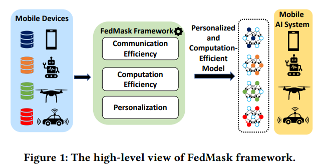
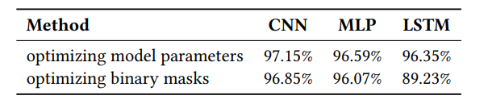
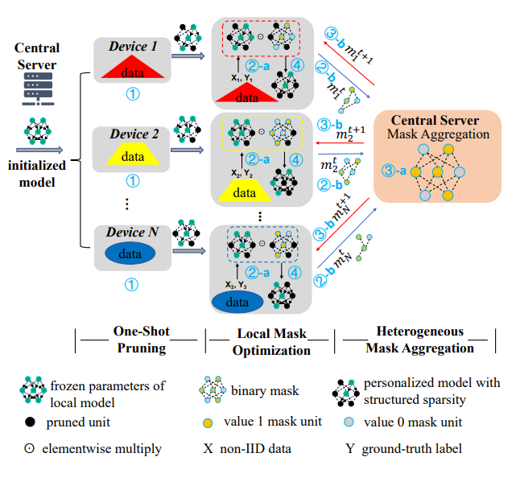
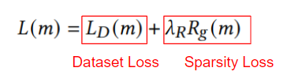
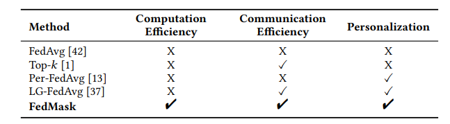
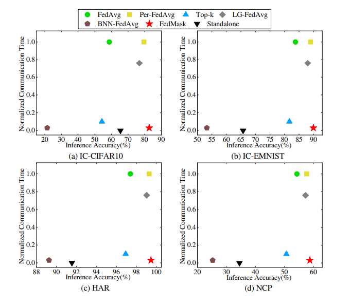
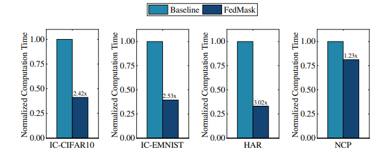

## [FedMask: Joint Computation and Communication-Efficient Personalized Federated Learning via Heterogeneous Masking](https://dl.acm.org/doi/10.1145/3485730.3485929)

* Duke University

* SenSys 2021

* Code Not Provided

### Motivation and Problem Formulation

* **Motivation**: Communication in FL can be costly especially when the task requires large DNN networks. Due to the large size and number of parameters in DNN networks, it is both hard to train and transfer which is bad in FL settings.
* **Related Works**
    * Efficient FL system: Optimizing FL on computational and communication cost. Past works focus on simpler on device model or data compression, both of which can casue accuracy degradation.
    * Personalized FL: Due the data heterogeneity on different FL clients, sometime it is hard or impossible to learn a global model that can generalize to all clients. Personalized FL focus on learn a unique model for each client with shared knowledge.
* **Challenges**
    * Improve computational and comunication cost without compermising model performance.
    * Learn a personalized model onm top of global model with little to no additional cost.

### Method
* **Main Idea**
  
    * The core idea of proposed high efficiency FL system is to learn a sparse binary mask on top of a DNN.
      * Computational-wise, sparse DNN ensures only a fraction of units are active during computation thus computation can be done faster and more friendly for low-power IoT devices.
      * Communication-wise, Binary mask only takes one bit to store information for one unit whereas real valued network parameters takes 32-bit per unit.
      * Aggregation are done on binary masks.

      * Result above show that train on binary mask can achieve compariable results compare to training the network weights directly.
      * Training mask is more efficient.

* **Proposed solution**
  
  * Train binary mask, so a weight is either on or off.
  * Server initialize a set of random parameters as initial network, freezed initially.
  * Can be almost as effective as directly training weights.
  * Local mask update:
    * Uses a real valued mask for training the binary mask for back prop.
      
    * Dataset loss measure performance on local dataset given binary mask.
    * Sparsity loss ensure model efficiency but deactivate most of network units.
      * Sparsity loss is designed so that top feature extraction layers are relatively dense with very sparse bottom classification layers.
  * Aggregation are done between overlapping parts of masks.
    * The goal is to maximumly retain personalized knowledge
  * After n round of mask aggregation:
    * Apply mask on weights.
    * Unfreeze active units and train on local dataset.

### Evaluations

* Comparsion between FedMask and other proposed FL frameworks.

* Aim: General task FL framework on wide range of devices.
* Setput:
  * Datasets(Non-iid): Shakespeare, EMNIST, CIFAR, HAR
  * Device: Rpi4s, Jetson TX2, Jetson TX2 Nano

* Baseline: FedAvg, Top-K, BNN-FedAvg, Per-FedAvg, LD-FedAvg

* Metric:
  * Training Metric: Inference Acc, Comm/comp cost
  * Runtime Metric: Memory, inference time, Energy consumption

* Training time Result
  * SOTA comm cost/acc trade off
  * 2x times less comp cost

* Runtime Result
  * 1.56× inference speedup
  * Reduces the energy consumption by 1.78×
  * Less memory usage.

  
* Pro: Masking is a very interesting idea.
* Con: How aggregation help training

