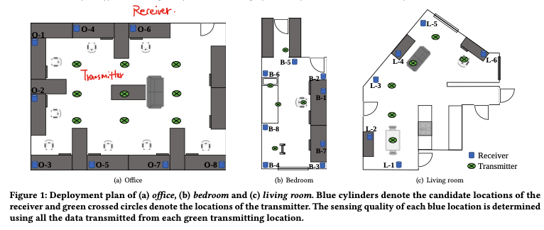
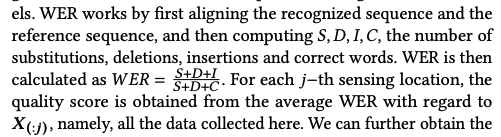
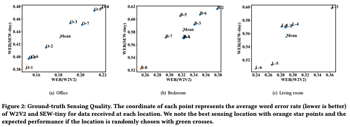
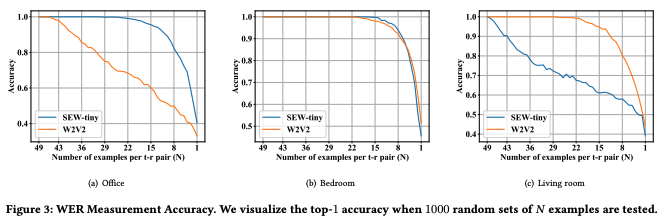
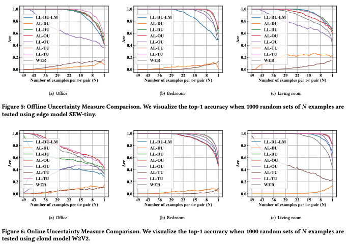

## [SQEE: A Machine Perception Approach to Sensing Quality Evaluation at the Edge by Uncertainty Quantification](https://dl.acm.org/doi/abs/10.1145/3560905.3568534)

* Shuheng Li, Jingbo Shang, Rajesh Gupta, Dezhi Hong

* SenSys 2022

* Code is not provided

### Motivation and Problem Formulation

* What is the high-level problem?
  * Sensor placement problem: find the best location to deploy sensors
  * In this paper, they seek an **efficient sensing quality metric** for machine perception on edge devices with only a **limited amount of data, focusing on audio and speech recognition applications**

* What are the challenges?
  * The most straightforward and accurate way to find the best sensing location with regard to **machine perception** (the ML problem associated with the sensing modality) is exhaustive search among all possible solutions, which is impractical

* What is missing from previous works?
  * Traditional audio sensing quality metric are not designed for NN-driven machine perceptionMore details later
  * NN Uncertainty Evaluation: Most works follow a Bayesian formalism, and focus on applications like machine translation and time series regressions. 
    * **This paper is the first attempt to use uncertainty to study the quality of sensing data**

  * IoT data quality: There are multiple sensing quality metrics for IoT data, but this work targets at measuring sensing quality for **sophisticated pretrained NN models**

### Method

* Establish a framework for evaluating sensing quality
  * 3 different indoor environments, including 148 different deployments in total and more than 7000 examples
  * Transmitters and receivers. Use transmitters to play the samples from audio dataset
    

* Study the effectiveness of traditional signal quality evaluation approaches
  * Ground-truth sensing quality metric: word error rate
    
  * List of existing audio sensing quality metrics
    * Signal-to-noise ratio
    * Structural similarity measure
    * Short-time objective intelligibility (STOI): objective alg measures the average intelligibility
    * Perceptual Evaluation of Speech Quality (PESQ): as perceived by human
    * DNSMOS
  * Major takeaways
    * The ground-truth sensing quality at different transmitter-receiver locations can be very different (21.5%-26.6%)
      
    * The accuracy of location rank drops when number of examples per t-r pair is less than 22
      
    * Existing methods cannot figure out the best sensing locations (the ranking is very different from using the ground-truth WER). Because existing methods are not designed to evaluate sensing quality in NN-based machine learning perception algorithms
* Present SQEE, a sensing quality evaluation for NN models that approximates total uncertainty using MC-dropout model
  * High-level idea: propose a sensing quality metric based on Bayesian uncertainty measurement
  * Offline and online scenario
  * According to a PhD thesis on speech [28], they consider the following uncertainties:
    * Data uncertainty: the expected model conditional entropy with regard to theta (model parameters)
    * Knowledge uncertainty: mutual information between y (ground-truth symbols) and theta (model params)
    * Output uncertainty: Edit distance
  * Specifically, for speech recognition models, they consider two methods to compute data and knowledge uncertainty:
    * CTC-based uncertainty (assume conditional independence)
    * CTC-LM-based uncertainty (consider the dependence on the previous n tokens)
  * Because Bayesian NN are computationally expensive, they consider
    * **Deep Ensembles:** generate each model using random weight init accompanied with randomly shuffled training data. But they did not adopt it because deep ensembles is not applicable to large-scale NN model like W2V2
    * **MC-dropout:** cheaper. They experiment all-layer and last-layer dropout

### Evaluations

* **Dataset:** collected using their own setup
* **Deep NN model:** W2V2 and SEW-tiny model
* **Metric:** accuracy of the t-r location pair rank
* **Platforms:** edge - RPi 4B with 4GB RAM, cloud - GPU server with RTX A6000
* Experiment methods:
  * All-layer (AL) and last-layer (LL) dropout
  * CTC and CTC-LM uncertainty computing methods
  * Three kinds of uncertainty metrics: total uncertainty (TU, data + knowledge), data uncertainty (DU), output uncertainty (OU)

* What are the key improvements & takeaways
  * In general, LL-TU and LL-DU are the best measures for sensing quality evaluations
    
  * In general, higher dropout rates includes more uncertainty and improves performance, but under LL-TU, the curve is not monotonic
  * Efficiency can be improved

### Pros and Cons (Your thoughts)

* Pros: 
  * The idea of include NN model in sensing quality metric is interesting
  * I learn about the Bayesian NNs in uncertainty evaluation
* Cons: 
  * The writing is a little unorganized and can be confusing
  * Multiple unrealistic assumptions
    * Finite possible sensor deployment locations: microphones can only be placed at locations where AC power sockets are available
      -> With battery-powered device, this is not true
    * “Given a trained machine learning model, the only source of uncertainty in the system is sensing data quality imperfection, which suggests that sensing quality can be represented by model uncertainty on sampled data”
      -> this does not consider the environmental contexts
    * “SQEE can be applied to other sensing modalities, but under the assumption that the trained NN model to be deployed should be reasonable performance in the new environment”
      -> this might not be the case
    * Why the models can not be trained after deployment to adapt to the environment?