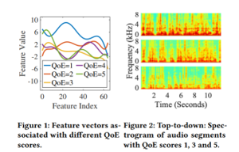
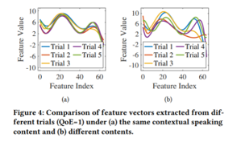
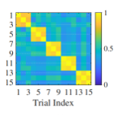
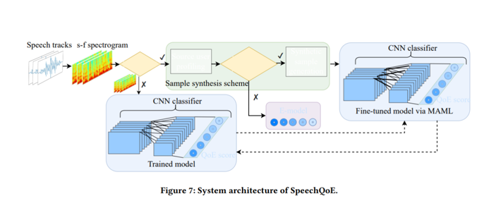
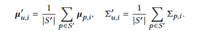
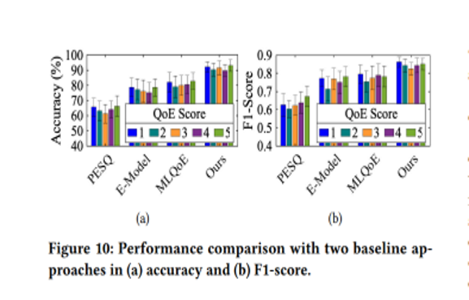
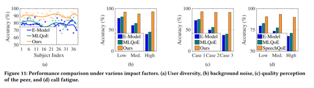

## [SpeechQoE: A Novel Personalized QoE Assessment Model for Voice Services via Speech Sensing](https://dl.acm.org/doi/10.1145/3560905.3568502)

* The University of Texas at Arlington

* SenSys 2022

* Code Not Provided

### Motivation and Problem Formulation

* **Motivation**: During pandemic, there is increasing need for audio/video communication. It is important for the companies to know: is user satisfactory with the Quality of Experience (QoE)?

* **Related Works**
    * parametric models: QoE ~ QoS
    * QoS: packet loss, latency, jitter etc.
    * Previous works use one-for-all evaluation metrics
* **The author argues that below factors are also important:**
    * Human factors (mood, expectation)
    * Contextual factors (background noise)
    * Personalization
* ** Motivation for method and contributions **
    * Inspired from neurophysiology: “a speaker’s speech can reflect her subjective feelings”
    * Use speech sensing to predict personalized QoE
    * Claimed contributions:
      * Investigate the relationship between QoE and speech signals
      * Propose personalized QoE assessment model using speech-based features
      * Enhance few-shot learning with data synthesis
      * Present a new dataset on this area

### Relationship between QoE and speech signals
* The authors study the relationship between QoE and speech signals
* They use a popular standard that separates QoE into 5 levels
* Figure 1 and 2 shows that feature vectors of different QoE scores are different, while they are similar for same QoE scores.
* Figure 4 shows that the relationship between QoE scores and speech features are consistent.
* Figure 5 shows that the relationship between QoE and speech within the same individual is consistent.

### Method
* **Architecture**
  
    * The authors propose to use short-time-fourier-transform (STFT) to preprocess the data.
    * The details of the CNN model is not specified.
    * Personalization: each user has their own model fine-tuned.
    * The authors propose to use MAML as a few-shot learning framework to deal with few-sample problem on new users.
    * Challenge: QoE samples from new users are heavily unbalanced, low scores are less frequent.
    * Solution: Enhance few-shot learning with data synthesis.
      * Generate synthetic data in unbalanced classes
      * Each user has a profile that is represented as a Gaussian distribution for each QoE level
      * After obtaining a few (3-5) samples from the new user, find the closest neighbors for this new distribution from the existing user profiles, and:

      
      * In the case there are not enough neighbors, parametric model with QoS factors serves as a backup
      * Experiments show that the synthetic data are consistent with real data:

      

### Evaluations

* Real person experiments: 38 recruited subjects, two per group, 200 calling sessions, QoS controlled by experimenter. 
* Baselines:
  * PESQ [2001]: speech quality approach
  * MLQoE[2016]: map QoS to QoE
  * E-model[2005]: analytical parametric model
* Proposed model outperforms the baselines.

* Proposed model also outperforms the baselines on personalization criteria.

  
* Pro: 
  * Very well-written motivation, tells a great story
  * The synthetic data generation for MAML with unbalanced dataset is noteworthy
    * Might be useful for some of our work?

* Con: 
  * Baseline outdated, lack details on model/architecture, which makes the paper unconvincing
  * Really ugly figure for the architecture, obvious mistake on the figure
  * Seems a little off topic from the conference…

