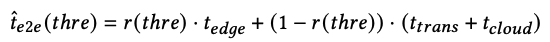

## [EdgeFM: Leveraging Foundation Model for Open-set Learning on the Edge](https://arxiv.org/abs/2311.10986)

* Bufang Yang, Lixing He, Neiwen Ling, Zhenyu Yan, Guoliang Xing, Xian Shuai, Xiaozhe Ren, Xin Jiang

* SenSys 2023

* Code is not provided

### Motivation and Problem Formulation

* What is the high-level problem?
  * **Open-set recognition:** “aims to recognize any classes described in a natural language manner without finetuning”

* Why is it important? 
  * An enhanced version of transfer/lifelong learning problem

* What are the challenges?
  * Only foundation models (FM) can have good results in open-set recognition, but they are too resource intensive to run on the edge

* What is missing from previous works?
  * Open-set recognition: semantic-based approaches and GAN-based approaches
    * Cons: performances are not comparable to FMs

  * FMs on the Edge: MLC-LLM [2023], Tabi [2023], FrugalGPT [2023]
    * Cons: cannot work with multimodal sensor data, or static compressing techniques

  * Edge-cloud collaboration: SPINN [MobiCom’20], DeepCOD [SenSys’20], AgileNN [MobiCom’22]
    * Cons: closed-set, not open-set

* What are the key assumptions?
  * Edge device has network connection and fairly good networking conditions

### Method

* What are the major contributions?

  * EdgeFM is the first edge-cloud cooperative system with open-set recognition capability using FMs

  * **(1) Semantic-driven customization:** customize domain-specific knowledge and model architectures

    * Query FM or run on edge? If query FM, then send selected unlabeled data to the server

  * **(2) Dynamic model switching:** consider both uncertainty of semantic features and the network

    * Small model selection and training are done in the cloud

    

* Knowledge query and customization

  * **Query FM:** select the closest text embedding from the text embedding pool
  * **Customization:** MSE and contrastive loss
  * **Small model selection:** MobileNet, and EfficientNet seriesAccuracy-resource look up table

* Dynamic edge update

  * **Uncertainty quantification:** Highest and 2nd highest similarity

    

  * **Context aware data uploading:** upload uncertain data to the cloud

  * **User profiling**

* Edge inference engine

  * **Dynamic model switching:** define r(x) to decide adaptively whether to query FM or run on edge

    

    

  * **Dynamic network adaptation:** find appropriate threshold depending on the network latencies

    

    

### Evaluations

* Datasets: 5 datasets, including 2 self-collected datasets

  

* Baselines

  * Efficient on-device inference: adapted to ImageBind and CLIP
    * **PersEPhonEE [MobiSysW’21]:** edge-only NN acceleration based on early exit
    * **SPINN [MobiCom’20]:** edge-cloud collaboration, using model splitting and early-exit
    * **Cloud-centric**

  * Open-set recognition
    * **Semantic-based:** DUS-VAE [CVPR’22], ER-ZSAR [ICCV’21], VGGishZSL [2021]
    * **GAN-based:** TF-VAEGAN [ECCV’20]

* Metrics: Accuracy, latency

* Platforms

  * Cloud: desktop server with two RTX 3090
    Edge: NVIDIA Jetson Nano and Jetson AGX Xavier

* FMs: ImageBind and CLIP

* Key results

  * Accuracy improvements and shorter latency compared to open-set recognition baselines (non-FM)

    * Concerns: unfair comparison, as EdgeFM uses FM but these baselines did not

    

  * Shorten latency and similar accuracy compared to FM-adapted on-device inference

    

  * Adaptive data uploading upon environment change

    

### Pros and Cons (Your thoughts)

* Pros:
  * Open-set recognition is a challenging scenario
  * Their evaluation is quite comprehensive (except that they don’t have energy and memory footprint evaluation), and can serve as an example of how to do evaluations
* Cons:
  * Formal definition of open-set recognition is missing (when to introduce new classes?)
  * The term "Uncertainty Quantification" is misleading