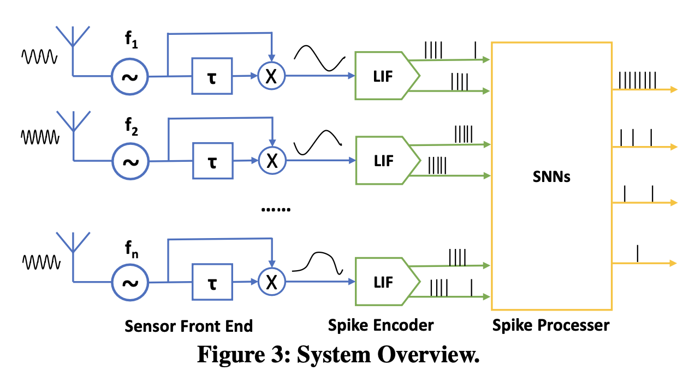
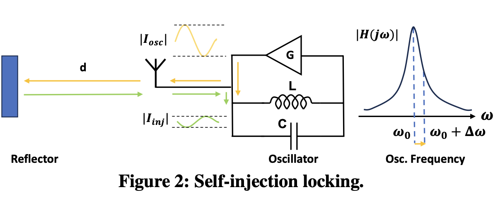
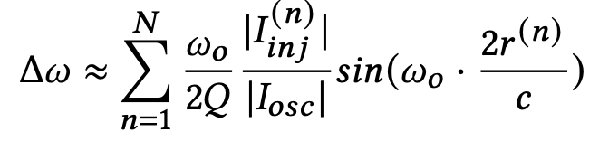
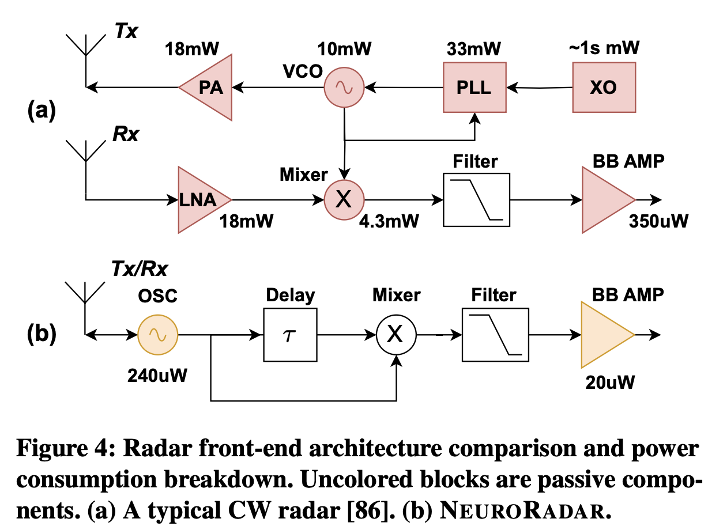
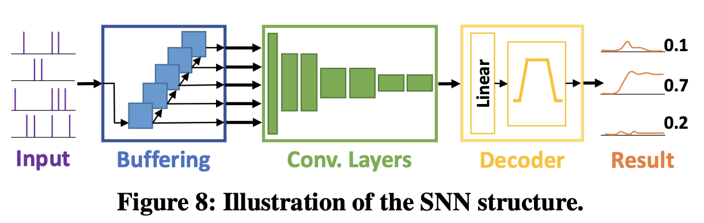
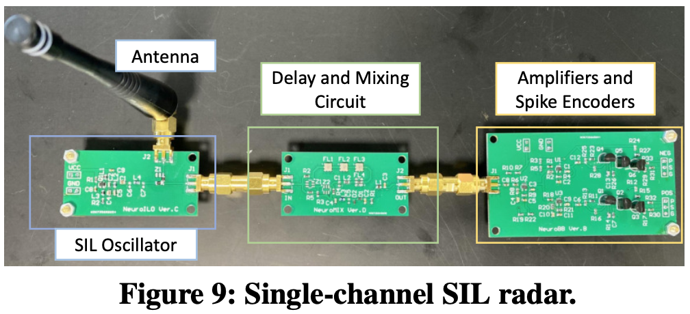
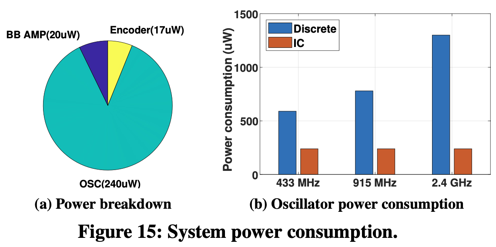
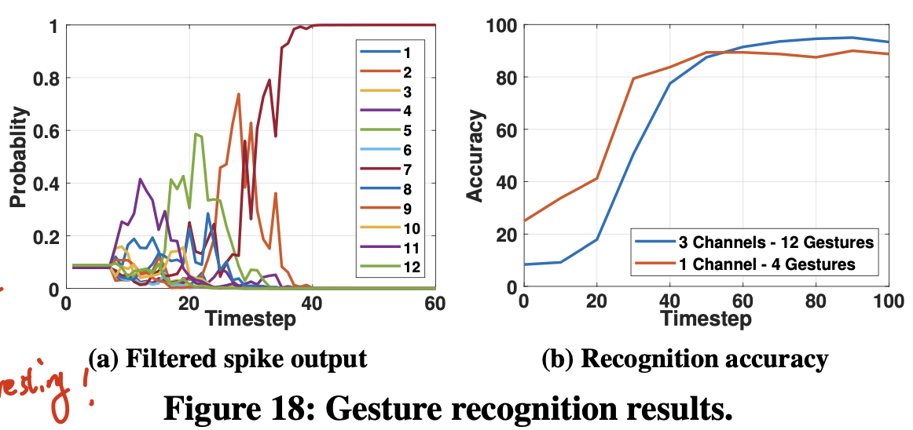
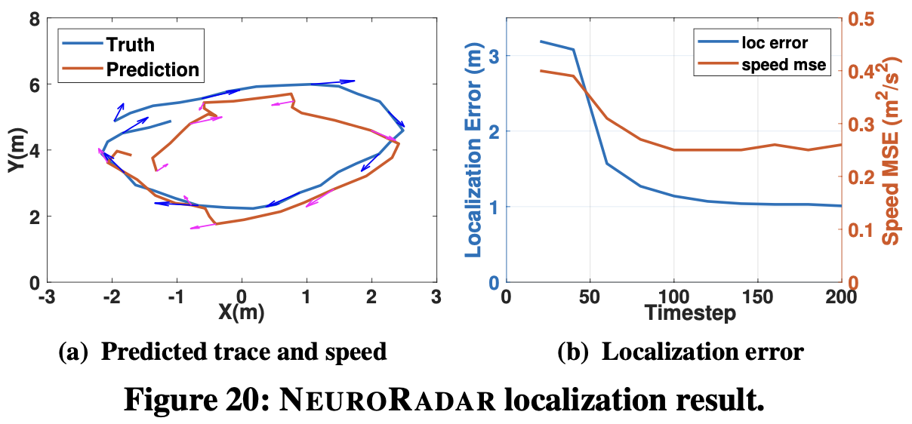

## [NeuroRadar: A Neuromorphic Radar Sensor for Low-Power IoT Systems](http://xyzhang.ucsd.edu/papers/Kai.Zheng_SenSys23_NeuroRadar.pdf)

* Kai Zheng, Kun Qian, Timothy Woodford, Xinyu Zhang, UCSD

* SenSys 2023

* Code is not available

### Motivation and Problem Formulation

* What is the high-level problem?
  * Radars are widely used, but both radar sensors and ANNs consume a lot of energy
  * Neuromorphic computing and hardware present new opportunities for low-power systems

* What is missing from previous works?
  * Existing radar-SNN systems do not incorporate a full-fledged neuromorphic hardware arch
    **[conventional radar front-end (analog) -> ADC -> (map to spikes) CPU/DSP]**
    * The conventional raddr front-end can demand tens to hundreds of mW
    * ADCs is needed to sample radar signals which consume a lot of energy, too

  * To achieve low-power radar sensing, previous works have studied (1) high power density amplifiers, (2) radar waveform design, (3) passive radars (use existing radio sources)
    * No neuromorphic engineering

  * What are the key assumptions?
    * Short-range, low-velocity (toleration longer latencies) sensing applications

### Method

* Major contributions

  * NeuroRadar: end-to-end neuromorphic sensing and computing (no ADC!)

  * Low-power, low-complexity radar front end based on self-injection locking (SIL) principle

  * Implement the neuromorphic radar system through a PCB prototype and carry out simulations for the IC version

  * Note: SNN part is not claimed as novelty and contribution
    

* Background

  * **Self-injection locking (SIL):** The frequency of a self-injection-locked oscillator (SILO) is dependent on the amplitude and phase of the reflected signal
    

    

* Radar front end

  * Compare conventional radar front end arch and NeuroRadar
    

  * NeuroRadar: event-based, only responds to changes in the radar channel (caused by motion) and produces async spike signals

  * **Challenge:** A single SIL radar can give ambiguous range information, w/o angular information

  * **Solution:** Use frequency-diverse SIL sensor array, choose to use 6 sensors based on simulation

* SNN encoding and training

  * Buffer: flattening the temporal dimension
  * Decoder: convert spikes to continuous wave
    E.g., for classification, use low-pass filtering
  * Train with [ANN-SNN conversion](https://www.youtube.com/watch?v=7TybETlCslM)
    

### Evaluations

* System implementation
  * Front-end -> FPGA for sampling -> NengoDL for SNN simulation
    

* Microbenchmark evaluation
  * Separately evaluate the SIL oscillator, the motion demodulation circuit and the spike encoder in a controlled setting
  * Power consumption of the front end
    * Total power < 300uW
      

* Case study 1: gesture recognition
  * 12 gestures, 200 samples for each gesture, each sample contains spikes in an 1.5s window
  * NeuroRadar uses 1 or 3 sensors in the SIL array
  * 3 conv layers, 3 dense layers
  * 90% (1Tx/Rx) / 94.58% (3Tx/Rx) Acc, need 80ms to produce reliable results
    

* Case study 2: moving target localization
  * Max distance: 6m, angle of view: 90 degrees
  * 6 segments of 10-minute continuous data for training and testing, partition the data into 2s sliding window with 75% overlap
  * NeuroRadar uses 6 sensors in the SIL array
  * 3 conv layers, 3 dense layers
  * Localization error < 1m, a tracking delay of 150ms
    

### Pros and Cons (Your thoughts)

* Pros:
  * Well deserved for best paper award
    * A radar front end generating spikes is a very novel design
    * Solid work and comprehensive experiments
      * Two case study, each can be a research topic
* Cons:
  * The resolution is very limited, and the delays may not be acceptable
  * Only simulations for the SNN part