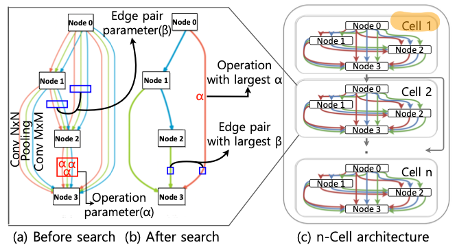
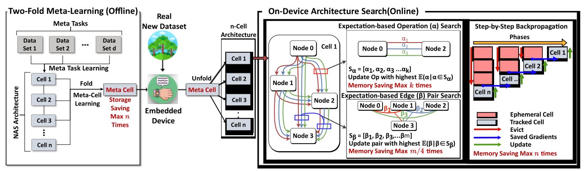
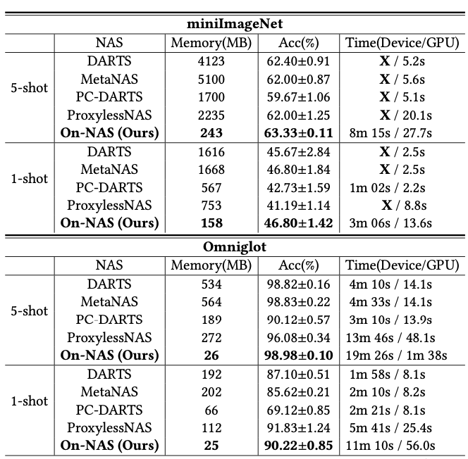
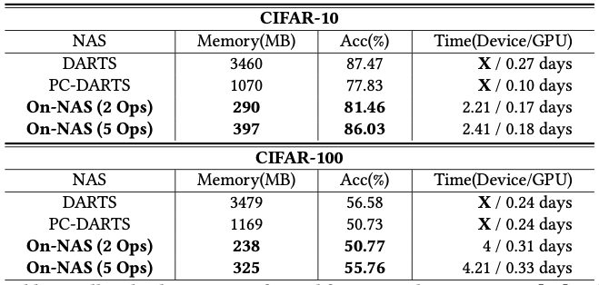
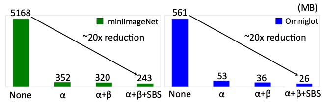

## [On-NAS: On-Device Neural Architecture Search on Memory-Constrained Intelligent Embedded Systems](https://drive.google.com/file/d/1MDK5BPrEYZUFUhWmLGSKI2uxeoiNfsK_/view)

* Bosung Kim and Seulki Lee, UNIST

* SenSys'23

* https://github.com/eai-lab/On-NAS

### Motivation and Problem Formulation

* What is the high-level problem and why is it important?
  * On-device Neural Architecture Search (NAS) is needed to adapt to dataset shift in a real environment
  * NAS emphasizes adjusting the model architecture, different from updating the model’s weight parameters which is limited

* What are the challenges?
  * NAS costs huge memory usage
  * Recent works have alleviated the computational complexity of NAS, but memory remains as the biggest bottleneck

* What is missing from previous works?
  * Recent works studied computational and memory efficient NAS
    * PC-DARTS [arXiv’19], ProxylessNAS [arXiv’18]
    * But they either limit only to convolution, or is not stable

  * Meta-Learning-applied NAS (MetaNAS [CVPR’20])
    * On-NAS further reduces memory usage than MetaNAS

* “On-NAS is the first on-device NAS, that entirely runs on the devices without relying on external systems”

### Method

* Key ideas
  * To reduce memory usage, they combine cell-based motif [arXiv’18] and differential architecture search (DARTS) [arXiv’19]

  * They use meta learning (in the first offline stage) to find the best initial architecture for faster and better model architecture adaptation (in the second on-device stage)

* Differential architecture search
  * How to formulate architecture search as a differentially trainable problem
    

* On-NAS includes two stages
  * Offline meta learning: meta task learning and meta cell learning
    * Having only 1 cell reduces the memory to 1/n

  * On-device architecture search
    * (1) Expectation-based operation search, (2) expectation-based edge pair search, (3) step-by-step back propagation
    * Various techniques to reduce memory usage

### Evaluations

* **Dataset:** MiniMageNet/Omniglot (for few-shot learning), CIFAR-10/CIFAR-100 (for full-task adaptation)

* **Baselines:** DARTS [arXiv’18], MetaNAS [CVPR’20], ProxylessNAS [arXiv’18], PC-DARTS [arXiv’19]

* **Implementations:** NVIDIA RTX 3090 for offline stage, NVIDIA Jetson Nano for on-device stage

* **Search space:** a 4-cell structure, consisting of normal cells and 2 reduction cells

* Key results: improved accuracy with ~20x memory savings
  

  

  

### Pros and Cons (Your thoughts)

* Pros: why you think this paper could get in?
  * On-device NAS is a difficult problem
  * Claiming as the first one, the impact of On-NAS is there
* Cons: 
  * Simply combining existing techniques is not a good way of research
    * Writing problem, they actually did multiple changes, but they kept using “employ existing techniques” and “combine existing techniques” in the paper
  * It seems that On-NAS still has an offline stage, so it is not a pure on-device NAS solution?? I’m suspicious of their argument
  * Outdated baselines