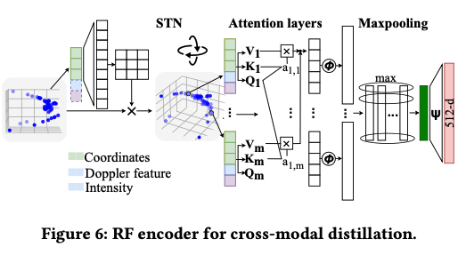

## [Large Model for Small Data: Foundation Model for Cross-Modal RF Human Activity Recognition](https://dl.acm.org/doi/pdf/10.1145/3666025.3699349) [Sensys’24]

* Yuxuan Weng, Guoquan Wu, Tianyue Zheng, Yanbing Yang, Jun Luo. SUST, Sichuan University & NTU

* SenSys'24

* Code not provided

### Motivation and Problem Formulation

* What is the high-level problem?
  * Radio Frequency (RF)-based Human Activity Recognition (HAR)

* Why is it important?
  * Why RF - minimal resource for data processing and inference, better privacy then image-based, free of visual constraints such as low light or haze

* What are the challenges?
  * **Key research question: can FMs be harnessed to interpret RF-HAR data?**
  * Challenge 1: existing FMs are for CV and NLP and cannot be directly applied to RF
  * Challenge 2: the image and RF modalities have inherent feature discrepancies
  * Challenge 3: FMs need finetuning for optimal use, but is hindered by the lack of labeled data
* What is missing from previous works?
  * FM-Fi vs prior works: open-set capability of FM-enabled HAR, not limiting itself to HAR
  * Lack of latest work discussions, such as MM-Fi and TENT etc.
* Assumption: a well-aligned multimodal dataset is needed, i.e., image & RF data are collected exactly at the same time

### Method

* What are the major contributions?

  * FM-Fi: first cross-model distillation system specifically designed from vision FMs to RF model for zero/few-shot HAR tasks

    

  * (1) **cross-modal contrastive knowledge distillation (CKD)**, enabling an RF encoder to inherit the knowledge of vision FMs (pretrained CLIP model from OpenAI)

  * (2) **feature elimination methods** for image and RF modalities for better feature alignment

  * (3) a **metric-based few-shot learning mechanism** to finetune the RF encoder, for adapting it to specific closed-set HAR tasks

  * **Key idea:** approximate the performance of pretrained vision-based CLIP in HAR

  * **Cons:** cannot do better than CLIP

* System design

  * Data format: start from RF point clouds

    * Each sample contains coordinates xyz, Doppler frequency (movement) and intensity (reflection characteristics, material-specific)

      

  * RF encoder design

    * Start from PointNet, include a spatial transformation network (STN)
    * Concat the Doppler frequency and intensity to xyz

* Contribution 1: cross-modal CKD

  * **Goal:** distill the knowledge from vision-based CLIP model to the RF encoderMethod: Optimize the mutual information between modalities

  * Rewrite the log(p) term based on cosine similarity of image & RF samples, to obtain the loss function

    * Similar to contrastive loss
    * **Intuition:** use knowledge distillation to “approximate” the similarity between image & RF samples, no label is needed

    

* Contribution 2: feature elimination

  * **Image modality:** build an HAR saliency map and filter out the background

    

  * **RF modality:**

    * Remove static points sensed by RF, by frequency shift = 0 (Doppler effect)
    * A self attention-based module to learn point of interests within a global context
      * Q, K, V across all points

* Contribution 3: metric-based few shot learning

  * **Predict labels in the query set based on a weighted sum of true labels in the support set**

  * Not clear to me how to obtain the support set, and why it is few-shot….

    

### Evaluations

* Experimental Setup

  * DatasetThey collect a dataset of their own using TI IWR1443 Boost mmWave radar
    * Operate within the 76-81 GHz frequency, offering a bandwidth of 4GHz

  * They use a Microsoft Kinect V2 RGB camera
    * 90K video samples (each 200ms in length), ~5 hours
    * 10 different environments, e.g., kitchen, living room
    * Focus on 10 classes, e.g., waving hands, squatting

  * Baselines
    * Few-shot learning: RF-Net [SenSys’20], MetaSense [SenSys’19]
    * Supervised: PointNet++ [NeurIPS’17] and Point Transformer [ICCV’21]
    * The teacher CLIP model

  * Metrics
    * Accuracy under zero-shot and few-shot settings
    * RAM usage

* Key results

  * Compared to the RF baselines: Better accuracy than baselines

    

  * Compared to the teacher CLIP: Closely match accuracy while being more efficient:

    * CLIP: 140M params
    * FM-Fi: 6.9M params

    

  * Ablation studies

    * CKD is better than other knowledge distillation methods
    * Feature elimination is helpful

  * Hyperparameter experiments

### Pros and Cons (Your thoughts)

* Pros: why you think this paper could get in?
  * Comprehensive results
* Cons: unrealistic assumptions, missing elements, missing experiments, etc.
  * Performance in HAR
    * They focus on zero-shot HAR, and their performance cannot be better than CLIP
    * But CLIP is not trained for HAR
  * Missing related work discussion
  * Relatively old baselines