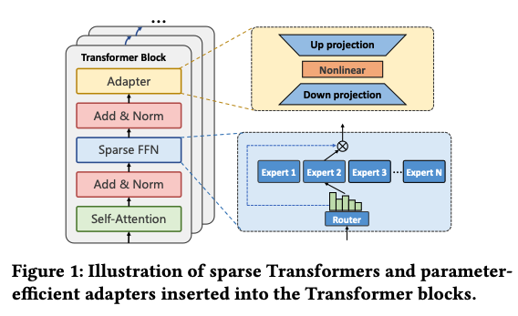
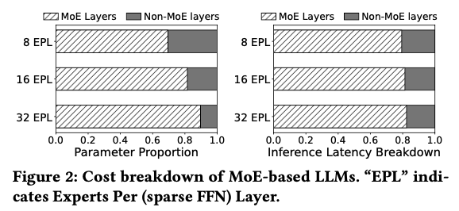
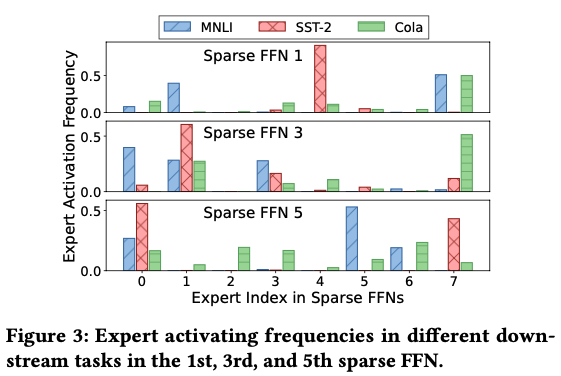
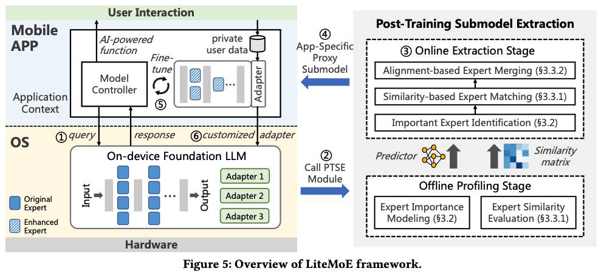
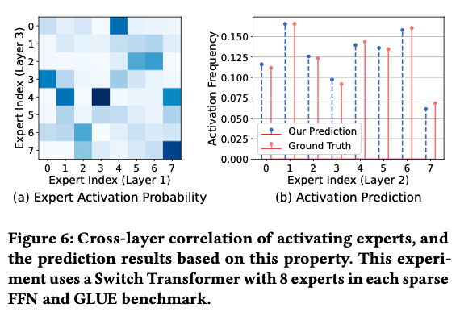
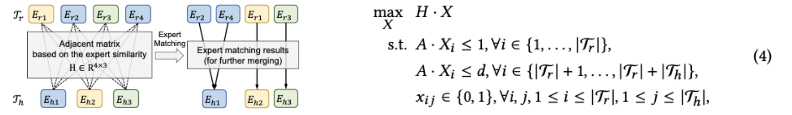
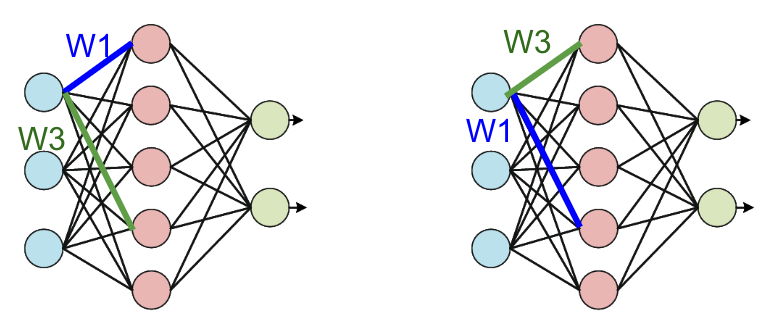
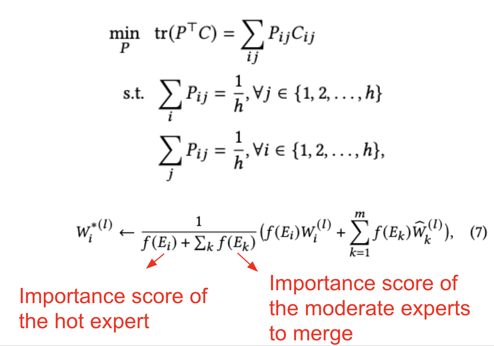
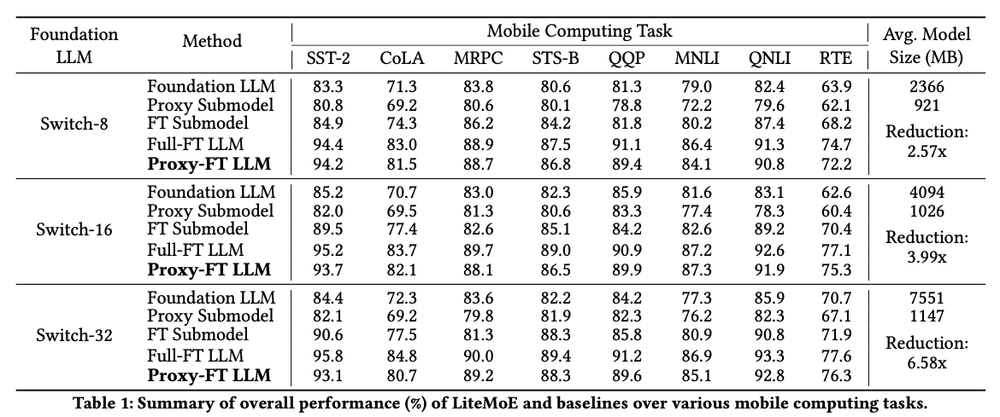

## [LiteMoE: Customizing On-device LLM Serving via Proxy Submodel Tuning](https://dl.acm.org/doi/pdf/10.1145/3666025.3699355) (SenSys 2024)

* Yan Zhuang, Zhenzhe Zheng, Fan Wu, Guihai Chen, Shanghai Jiao Tong University

* Sensys 2024

* Code not provided

### Motivation and Problem Formulation

* What is the high-level problem?
  * Deploy an LLM on the mobile device
  * **LLM-inference-as-a-system-service:** only one LLM is deployed, shared by various mobile apps

* Why is it important?
  * LLM provide power capabilities
* What are the challenges?
  * Apps require tuning adapters to customize their services
  * On-device finetuning is hindered by limited on-device resources

* What is missing from previous works?
  * Small LLMs: Gemma, TinyLLaMA (1B), MobileLLM [ICML’24] (125M)
  * Prior work to scale down LLMs: model pruning, distillation, quantization, etc
    * Cons: these works are not designed for on-device finetuning with limited resources

* What are the key assumptions?
  * LLM usually adopts sparsely activated architectures (i.e., mixture of experts, MoE)
  * Each expert has the same model architecture
  * Each export is a dense fully connected layer, with one hidden layer

### Background

* MoE-based LLMs architecture
  * LLM is a stack of transformers
  * MoE: only activates a small subset of parameters for inference at a time instead of the entire LLM
  * MoE is typically employed to replace dense Feedforward Network (FFN) layers inside Transformer blocks of LLMs
  * Two components in MoE
    * A set of experts, each of which is a FFN (fully connected network in this paper)
    * An independent router (some called gating network)
  * **Sparsity:** only a small set of experts is activated

* Observations

  * 1. Sparse experts dominate resource costsDevice is hard to hold all params
      -> high I/O costs for loading expert params from disks

    

    2. Expert activating frequencies are unbalanced and dynamic

    -> Different per expert per task

    

* Opportunities in generating lightweight proxy submodels via expert removing
  * Cold vs. moderate vs. hot experts

### Method

* What are the major contributions (as listed in the introduction)?
  * **LiteMoE:** a proxy submodel tuning framework for mobile apps to access and tune submodels of the system-level foundation LLM
  * LiteMoE is a post-training submodel extraction approach, without additional model trainingImportant expert identificationSelective expert merging
  * They prototype LiteMoE on RPi and Jetson Nano and comprehensively evaluate its performance

* Important expert identification

  * **Intuition:** use router outputs as the importance score

    

  * **However**, inferring through all routers in all layers in LLM is costly

  * **Solution:** train a lightweight predictor, i.e., two-layer MLP

    * Input: 1st layer’s router results
    * Output: layer 2-L’s router outputs
    * Only the first layer and the predictor need to be executed during inference -> less than 1%
      Of total LLM parameters

    

* Selective expert merging

  * **Intuition**

    * Identify cold, moderate, hot experts according to the importance score
    * Remove code experts
    * Match moderate experts to hot experts, and merge moderate experts to hot experts

  * Step 1: Similarity-based expert matching

    * Formulate as a bipartite graph matching problem

      * Offline similarity evaluation based on router outputs
      * Solved by a linear program solver

      

  * Step 2: Alignment-based expert merging

    * **Assumption:** Each expert has the same model architecture
    * Each export is a dense fully connected layer, with one hidden layer
    * **Intuition**: you cannot directly add two experts because the “hidden layer” could shift

    

    * Step 2.1: Find the optimal permutation between two experts
      * Formulate and solve an optimal transport problem

    * Step 2.2: Merge aligned experts by importance-aware weighted averaging

    

### Evaluations

* How they evaluation their method (experimental setup)? 

  * System
    * Server: 4 NVIDIA 3090 GPUs for offline profiling
    * Edge device: NVIDIA Jetson Nano and Raspberry Pi 4B

  * Dataset: NLP tasks from the BLUE benchmark
    * 9 classification or regression tasks

  * Model: Switch Transformers
    * Baselines
      * Full-FT LLM: performance upperbound
      * Foundation LLM: w/o adapters
      * Proxy submodel: Proxy model extracted with their method, w/o finetuning
      * FT submodel: proxy submodel are finetuned
      * **Proxy-FT LLM: LiteMoE, finetuned proxy submodels are integrated back into the foundation LLM**

    * Metric
      * Accuracy for classification, Pearson correlation metric for regression task

* What are the key improvements & takeaways

  * LiteMoE achieves 12.7% accuracy improvement and 6.6x memory reduction compared with operating on the original foundation LLM

  

### Pros and Cons (Your thoughts)

* Pros: why you think this paper could get in?
  * Interesting idea
  * Comprehensive experimentsI learned a lot
  * Mobile LLM becomes a system problem
* Cons: unrealistic assumptions, missing elements, missing experiments, etc.
  * Questions
    * Why MoE if they traditionally have low parameter efficiency?
    * Not very clear: adapter vs. experts, which one is really tuned?
    * Why Switch Transformer, given that there exists [LLaMA-MoE code](https://github.com/pjlab-sys4nlp/llama-moe/tree/main)?
  * Proposed method is limited to experts having the same model architecture as a fully connected network
  * Code not open sourced