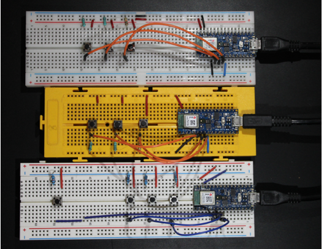
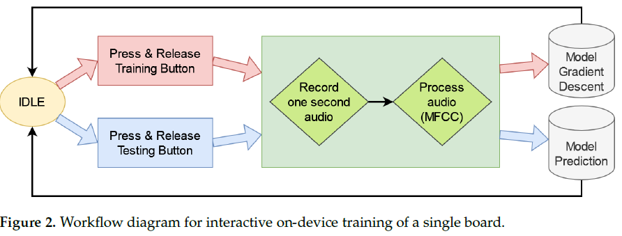
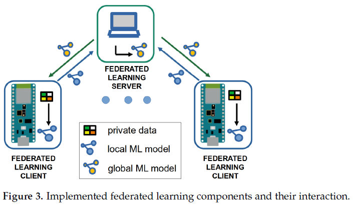
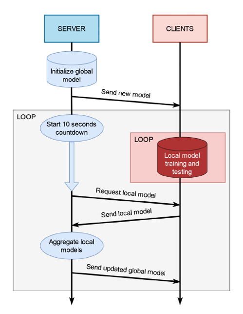
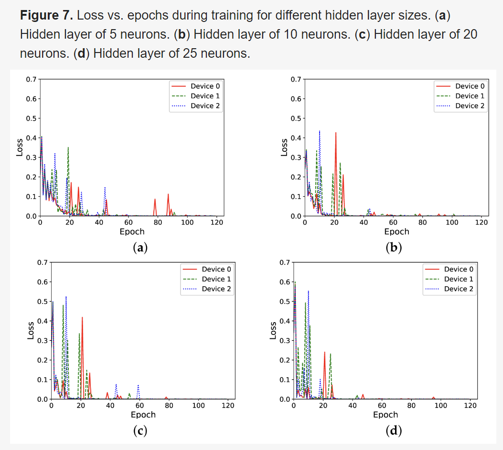

## [On-Device Training of Machine Learning Models on Microcontrollers with Federated Learning](https://www.mdpi.com/2079-9292/11/4/573/htm)

* Nil Llisterri Giménez, Marc Monfort Grau, Roger Pueyo Centelles and Felix Freitag
* Technical University of Catalonia
* Electronics 2022
* Code Not Provided

### Motivation and Problem Formulation
* **Motivation**
    * Most of the TinyML solutions currently present in the literature assume that embedded and Internet of Things (IoT) devices only support the inference of ML and deep learning (DL) algorithms, while the training process is performed in more powerful systems. In this off-device training approach, it is not possible to modify the model once it has been deployed.
    * While many research works deal with the theoretical foundations of federated learning, still very little is known about the application of federated learning in on-device training for TinyML.
* **Previous Works**
    * Disabato and Roveri introduced an incremental algorithm based on transfer learning and k-nearest neighbor to support not only inference but also on-device learning of ML and DL solutions on embedded devices and IoT units.
        * Con: Their approach required the availability of the pre-trained feature extractor.
    * In the work of Fedorov, progress in developing models for specific needs has been shown with pruning techniques that reduce the memory consumption of a convolutional Neural Network (CNN) in order to fit into microcontrollers.
        * Con: The application of the proposed technique, is a step in the toolchain that takes place off-device, i.e., before flashing the optimized model on the microcontroller, and not when the model is trained on the device
    * Transfer learning in combination with federated learning is explored in the work of Kopparapu et al., who proposed TinyFedTL
        * Content: Only a subset of the total layers of the neural network is trained.
        * Pro: The technique takes advantage of the training already performed on previous models to produce a new one.
    * Federated learning on higher-end edge devices such as Android phones, Raspberry Pi, and NVIDIA Jetson was presented in the work of Mathur.
        * Con: The models must be trained off-device and only after training the optimized static model is flashed to the device for inference

### Method
* **Proposed solution to aforementioned challenges**
    * They propose to train the model directly on the microcontroller. They implement an approach for a keyword spotting task. Then, they extend the training process using federated learning among microcontrollers.
* **Hardware Setup**
    * Arduino Nano 33 BLE board
	* Integrated microphone to record the keyword
	* The white LED is used to visualize the application state (e.g., IDLE, busy)
	* RGB LED is used to show the output class of the keyword spotting model
	* Three buttons
    
* **Solution**
    * Workflow Interactive Application
        * Their application starts when the program is flashed to the boar. In their implementation, every time the board is powered on, a new model is created. The weights of the model are initialized to random numbers. 
        * After the model is initialized, the user can start training their own model using any of the three training buttons. Each button will be used to train one keyword. When one of the training buttons is pressed, the RGB LED will light up with a color identifying the button (red, green, or blue). When the button is released, the board’s built-in microphone will start recording audio for one second. The keyword must be spoken within this second. The recorded audio is then processed to obtain the feature vector. The model is trained in a way with the feature vector. It will give a label based on the recorded word(the label is known from the button pressed). The fourth button has the same workflow as the three training buttons, but it does not train the model. Instead, in inference mode, it lights up the RGB LED with the corresponding color upon keyword recognition.
        
    * Software Implementation
        * They implement the keyword spotting application for the federated learning components shown in Figure 3. It has a central server and several clients. The central server calculates the model averaging with the received local models after a determined number of training epochs at the client nodes. The model averaging leads to a new global model. The updated global model is sent back to the client nodes, which train their local model again with the data available at each node.
        
    * Federated Learning Training
        * After the configuration, the server creates a neural network model and initializes it with random parameters. This model is sent to all the clients. As soon as the clients receive the model, they start training it with their local data. 
        * The local data are generated by the user saying the keywords. In the independent and identically distributed (IID) data case, all the clients must use the same keywords. At the same time, the server starts a timer and sets a ten-second countdown for the first federated learning round. 
        * When the countdown ends, the server tries to connect with all the clients and asks them to send their trained model. The clients have five seconds to accept the request, or they will be discarded for this iteration. The models that are received from the connected clients are integrated to create a new global model. This global model will be sent back to the connected clients to be trained again, and the server will restart the countdown for the next round.
        
### Evaluations
* **Evaluation Setup**
    * Dataset:
        * They create a dataset with several voiced keywords
        * The spoken keywords are captured with the microphone of an Arduino Nano 33 Bluetooth Low Energy (BLE) board
        * The recording of the keywords took place in a quiet room in a city location
        * They create a dataset consisting of 180 samples for each of the keywords
    * Model Training without Federated Learning
        * Goal: Assess on-device training performance, using the dataset for keywords Montserrat and Pedraforca. Each board trains its own model independently without exchanging any information.
        * Each board received 120 samples for training, containing 60 samples of each of the keywords.
        * Figure 5a shows the separation of the keywords visually in a three-dimensional space, obtained using UMAP, to reduce the 650 features obtained with MFCC to only 3 artificial features.
        * Figure 5b shows the evolution of the model training process. We can observe an overall trend indicating that the training error decreases as the number of training epochs grows.
        
    * Evaluation of the Number of Federated Learning Rounds
        * Goal: Assess the influence that the number of federated learning rounds has on the training of the models. 
        * They perform several repetitions, each time using a different number of rounds, ranging from very frequent federated learning rounds to very infrequent ones.
        
    * Evaluation of the Influence of the Hidden Layer Size
        * Goal: Assess to what extent that model training performance is influenced by the size of the hidden layer of the neutral network.
        * They tried to reduce the model’s size by using a smaller hidden layer.
        * They conducted this experiment with federated learning training, with a round taking place every 10 local training epochs.
        * The result shows the loss during the training process decreases with the 120 training samples.
        * However, in those experiments with bigger hidden layers, loss is reduced much earlier than in those experiments with smaller ones
        
    * Training with Non-IID Data
        * Goal: Explore the case of model training with non-IID data
        * They used the third keyword vermell(red color, in Catalan), to train a different keyword on each of the three clients. For the training process,they used a dataset of 120 samples per keyword
        * Figure 8a - each device became quickly trained to the specific keyword
        * Figure 8b-d - the new global model received by each client produced a high loss when trained again, locally, with the specific keyword
        * Figure 8d - suggest that for these very frequent federated learning rounds, the loss for each local model decreased as more of the training epochs were carried out

### Pros and Cons
* Pros:
    * Clear environment setup
    * Detailed and comprehensive dataset
* Cons:
    * Are five datasets really necessary and strong enough to show their implementation work? Could less work?
