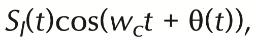
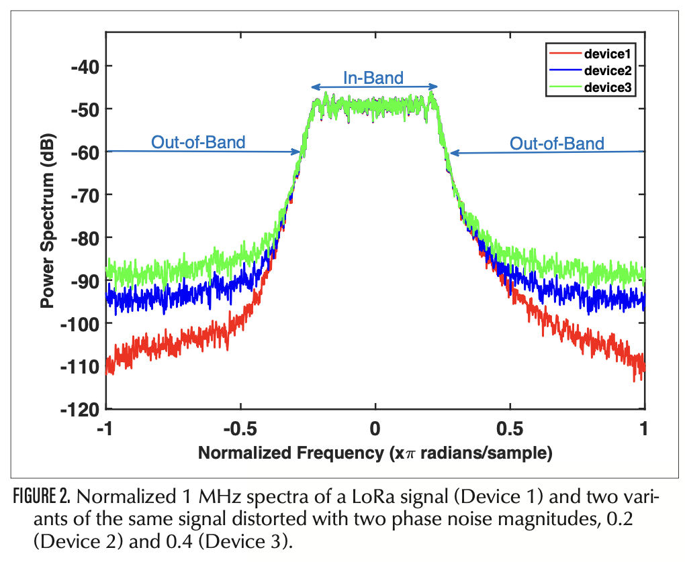
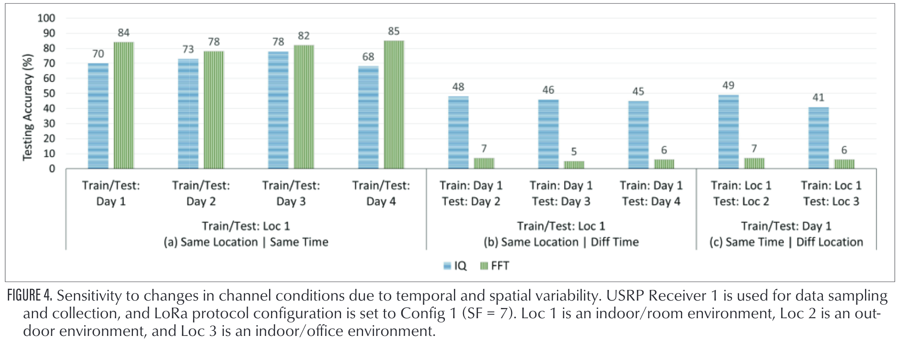
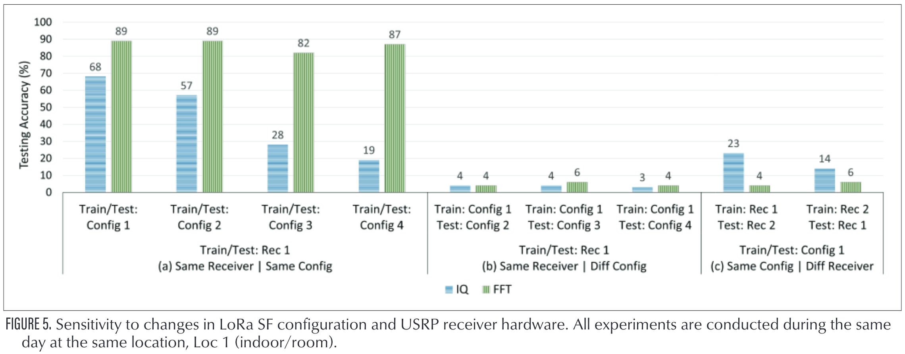

## [Deep-Learning-Based Device Fingerprinting for Increased LoRa-IoT Security: Sensitivity to Network Deployment Changes](https://dl.acm.org/doi/abs/10.1109/MNET.001.2100553)

* Bechir Hamdaoui and Abdurrahman Elmaghbub, Oregon State University

* IEEE Network, 2022

* Datasets: https://research.engr.oregonstate.edu/hamdaoui/datasets

### Motivation and Problem Formulation

* What is the high-level problem?
  * Device fingerprinting: extracting features from the received RF signals and using them to uniquely identify the transmitting devices

* What is missing from previous works?
  * Phase 1: select feature manually based on domain expertise
  * Phase 2: deep learning which does not require domain expertise
  * Previous works were limited to WiFi, ADS-B and ZigBee data, and focused on changes along the time and location dimensions only

* Open Challenges
  * The development of radio technology decreases the variation in the impairments across different devices
  * The randomness and unpredictability of the wireless channel (distribution shift)
  * To gain transparency into what these DL-based models actually learn
  * RF classification in the “open set” (semi-supervised learning, meta learning)
  * Security against adversarial attacks

### Method

* Release massive RF datasets collected from 25 LoRa devices

  * Cover indoor and outdoor scenarios
  * Varying time and location
  * Varying LoRa protocol configurations
  * Different receiver hardware
  * Data representation: IQ and FFT representation, both as two 1D real-valued vectors

* Present a new technique that exploits out-of-band distortion information caused by hardware impairments to provide unique device-specific signatures

  * **Where does the impairments come from:** signal instability of local oscillator

    

    

    It can be seen that, a distorted phase leads to very different out-of-band pattern

  * Only requires a slightly higher sampling rate at the receiver side

  * Increase test accuracy

* Conduct an experimental study on the sensitivity of CNN to various network deployment changes

  * When use IQ data as input, these models exhibit moderate sensitivity changes to channel condition, and severe sensitivity to protocol configuration & receive hardware changes
  * When use FFT data as input, they perform poorly under any change

### Evaluations

* Dataset: their collect LoRa dataset
* Tested method: use IQ vs. FFT representations as input
* Metric: test accuracy
* Key results
  * FFT representation leads to higher testing accuracy than the IQ representations, under the same domain
  * However, FFT representations has poor “generality” to all changes. IQ representations adapts better under time & location changes, but poorly under other changes.

This is a visuallization of how the frequency pattern differs under various SF configurations. This explains why the DNN model using frequency representations will degrade largely if shifting SF configurations - they are too different!

### Pros and Cons (Your thoughts)

* Pros
  * Nicely written, easy to read
  * Have thorough evaluation and discussion on various representations and various settings
  * Act as a “challenge paper” which solicits a research question
* Cons
  * Did not compare recent baselines that aim to address similar issues
  * Some latest works are missing (data augmentation, 2022)
* What we can do
  * Can HD achieves better results on this “out-of-distribution adaptation” or generality problem using the “robustness”?
  * Why not use both IQ and FFT representations? Ensemble model?